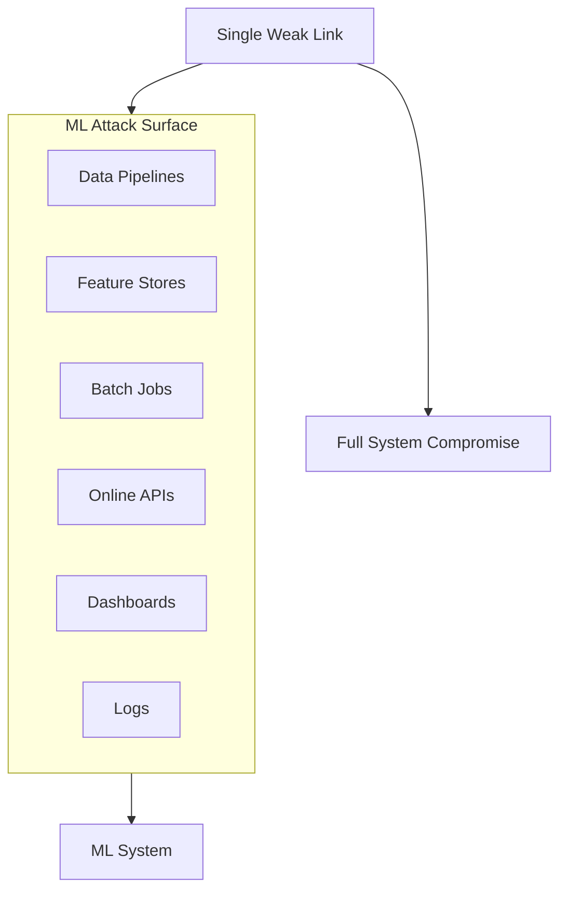

# Why Machine Learning Systems Are Attractive Attack Targets

## The Asymmetry of Offence and Defence

ML systems combine high-impact decisions with opaque behaviour and a wide attack surface. Attackers exploit the gap between what engineers can predict and what the model actually does under novel inputs. Understanding *why* ML is targeted shapes where to invest defensive effort.

---

## Four Reasons ML Systems Draw Attackers

### 1. Proximity to High-Stakes Decisions

ML models often sit close to decisions involving **money, access, safety, and reputation**:

- Loan and credit approvals
- Fraud and AML screening
- Hiring and admissions scoring
- Medical triage and diagnosis support
- Dynamic pricing and insurance underwriting

A successful attack on any of these has **outsized impact** — financial loss, denied opportunities, safety incidents, or public scandal.

### 2. Complex, Non-Intuitive Behaviour

Even well-resourced engineering teams struggle to enumerate every edge case. Models learn high-dimensional boundaries that humans cannot fully visualise.

Attackers exploit this by **systematically probing** with carefully chosen inputs, learning from each response. The defender must protect all boundaries; the attacker needs only one weakness.

### 3. Broad Attack Surface

An ML system is not a single model file. It is an ecosystem:

A vulnerability in any component — an unauthenticated feature store, a misconfigured S3 bucket, an exposed Jupyter notebook — can compromise the whole pipeline.

### 4. Slow Recovery from Immature Processes

Without mature CI/CD, monitoring, and rollback:

- Fixes take days or weeks to reach production.
- Bad models remain serving after a breach is detected.
- Incident response lacks runbooks and audit trails.

Attackers benefit from prolonged exposure windows.

---

## Comparison: Rule-Based vs ML Systems

| Dimension | Rule-based system | ML system |
|-----------|-------------------|-----------|
| Behaviour predictability | High — logic is explicit | Low — learned boundaries |
| Attack surface | Application layer | Data + features + model + infra |
| Probe cost for attacker | Must understand business rules | Query API and observe outputs |
| Fix cycle | Change a rule | Retrain, redeploy, validate |
| Impact per exploit | Often localised | Can affect all users scoring through model |

---

## First-Line Defensive Practices for Model Engineers

You do not solve security alone, but you **design with defence in mind**:

| Practice | What it does |
|----------|--------------|
| **Input validation and rate limiting** | Reject obviously bad and excessive traffic before it reaches the model |
| **Least privilege** | Restrict production data access, feature store permissions, and model download rights |
| **Monitoring** | Watch for anomalies in inputs, outputs, and traffic patterns (building on observability from earlier modules) |
| **Secure defaults** | Debug endpoints off by default; minimal error messages; versioned, auditable CI/CD deployments |

These practices do not eliminate risk. They **raise the bar** — increasing attacker cost and reducing blast radius.

---

## Security as Part of MLOps, Not a Silo

ML security is not separate from MLOps discipline. The same automation, monitoring, and operational rigour that improve reliability also improve security:

- **Deployment patterns** control who can invoke the model.
- **Logging and alerting** surface probing and drift.
- **Retraining pipelines** enable recovery from poisoned data.
- **Feature governance** limits which sensitive attributes enter models.

---

## Common Pitfalls / Exam Traps

- Assuming security is "the infosec team's problem" after the model is trained.
- Hardening only the prediction API while leaving the feature store and training pipeline open.
- Believing high accuracy makes a model uninteresting to attackers — high-stakes decisions are the attraction, not model quality.
- Skipping rate limits because "our users are trusted partners."
- Treating security and MLOps as competing priorities — they share infrastructure and practices.

---

## Quick Revision Summary

- ML systems are attractive targets because they control high-stakes decisions with opaque behaviour.
- Attackers probe inputs and observe outputs — they do not need to understand your architecture upfront.
- Attack surface spans data pipelines, feature stores, batch jobs, APIs, dashboards, and logs.
- Immature deployment processes prolong exposure after vulnerabilities are found.
- First-line defences: input validation, rate limiting, least privilege, monitoring, secure defaults.
- ML security is an extension of MLOps discipline — automation and observability serve both reliability and security.
- Design defensively from the start; do not bolt security on after launch.
