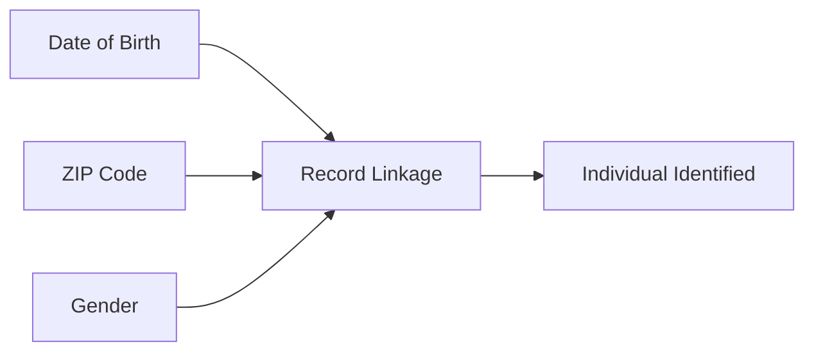

# PII and Sensitive Attributes in Machine Learning

## Privacy as a Non-Functional Requirement

Most production ML systems process personal data. Privacy is therefore not optional — it sits alongside latency, uptime, and cost as a **non-functional requirement** that shapes architecture, features, logging, and monitoring.

A useful mental model: you are **borrowing** users' data to provide value, not owning it outright. Every design decision should answer:

- What data are we collecting?
- How long do we keep it?
- Who can access it, and for what purpose?

These answers propagate into feature stores, data pipelines, logging, and monitoring from day one.

---

## Personally Identifiable Information (PII)

### Direct Identifiers

Unambiguously identify a specific individual:

- Full name
- Email address
- Phone number
- Government ID (Aadhaar, SSN, passport number)
- Exact street address

### Quasi-Identifiers

Harmless alone but identifying when combined:

- Date of birth
- ZIP / postal code
- IP address
- Device ID
- Precise timestamps

**Re-identification risk:** A combination of quasi-identifiers can pinpoint individuals even without a direct name field. This is the foundation of linkage attacks.

---

## Sensitive Attributes

Beyond identification, certain data categories carry heightened risk:

| Category | Examples | ML context |
|----------|----------|------------|
| Health | Diagnoses, prescriptions, vitals | Features or labels in triage models |
| Financial | Income, debt, transaction history | Credit and fraud scoring |
| Biometric | Fingerprints, facial geometry | Authentication models |
| Protected characteristics | Race, religion, political views, sexual orientation | Often legally protected; may appear as features or proxies |

In ML, sensitive attributes frequently appear as **features** or **labels**. They are powerful predictors but carry legal, ethical, and fairness risks requiring special handling.

---

## PII Hiding Inside Features

PII is not confined to columns labelled `name` or `email`. It hides in:

- **User IDs** used to join transaction histories — linkable back to identity tables.
- **Granular location history** — GPS traces, cell-tower sequences.
- **Detailed transaction logs** — purchase patterns unique to one person.
- **Fine-grained health measurements** — rare conditions identify individuals in small populations.

### The Model Engineer's Habit

For every feature, ask:

> Could this feature help identify a person or expose something sensitive about them?

If yes — apply extra care: minimisation, access controls, aggregation, or exclusion.

---

## PII vs Sensitive Attributes

| Aspect | PII | Sensitive attributes |
|--------|-----|----------------------|
| Primary risk | Re-identification | Discrimination, harm, regulatory breach |
| Legal framework | Data protection laws (GDPR, DPDP) | Anti-discrimination law + sector rules |
| ML treatment | Pseudonymise, minimise, restrict access | Fairness evaluation, proxy detection, policy review |
| Can overlap | Health record is both PII and sensitive | Race encoded via postcode proxy |

---

## Design-Time Privacy Checklist

1. Inventory all features against PII and sensitivity classifications.
2. Document lawful basis and purpose for each data element.
3. Define retention windows — do not hoard indefinitely.
4. Separate raw PII storage from model-ready feature stores.
5. Apply RBAC so only authorised roles touch identifiable data.

---

## Common Pitfalls / Exam Traps

- Assuming anonymisation of user IDs is sufficient — join keys in separate tables re-identify.
- Treating only "obvious" columns as PII while ignoring location history and transaction sequences.
- Using sensitive attributes as features without legal review and fairness analysis.
- Believing aggregate statistics eliminate privacy risk — small group sizes enable reconstruction.
- Deferring privacy design until "after the model works" — retrofitting is expensive and error-prone.

---

## Quick Revision Summary

- Privacy is a non-functional requirement equal to latency and uptime in production ML.
- **PII** includes direct identifiers (name, email) and quasi-identifiers (DOB, ZIP, device ID).
- **Sensitive attributes** (health, financial, biometric, protected characteristics) need special handling as features or labels.
- PII hides inside features — user IDs, location traces, and transaction logs are highly identifying.
- Quasi-identifier combinations enable re-identification without any single direct identifier.
- Ask for every feature: "Could this identify or harm a person?"
- Design privacy into pipelines, logging, and feature stores from the start.
