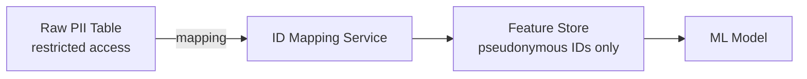
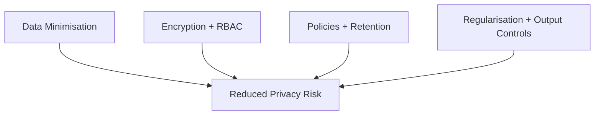

# Data Minimisation and Anonymisation Techniques

## The Core Principle: Collect Only What You Need

Data minimisation means resisting the instinct to hoard data "just in case." Collect only what is required for the specific task and metric you are targeting. Less data means:

- Smaller **attack surface**
- Simpler **compliance** obligations
- Lower risk of **accidental misuse**

It is one of the simplest and most powerful privacy tools available to model engineers.

---

## Minimisation in Practice

Ask these questions during feature design:

| Question | Alternative when answer is "no" |
|----------|--------------------------------|
| Do we need raw identifiers? | Internal surrogate ID |
| Can we use aggregated features? | Age band instead of exact age |
| Can we drop data after a window? | Archive or delete beyond retention period |
| Do we need full transaction history? | Rolling 90-day summary statistics |

**Example — credit scoring:**

- Instead of storing full address → use city-level or postal-sector bucket.
- Instead of exact income → use income decile.
- Instead of email → use hashed internal customer ID with restricted mapping table.

---

## Technical Privacy Techniques

### 1. Masking and Redaction

Hide portions of sensitive fields:

- Store only last four digits of a card or account number.
- Redact name segments in logs: `J*** D**`.

### 2. Aggregation and Bucketing

Replace precise values with coarser groups:

- Age 34 → age band 30–39.
- GPS $(lat, lon)$ → city or census tract.
- Timestamp → hour-of-day or day-of-week.

### 3. Pseudonymisation

Replace direct identifiers with internal IDs or one-way hashes. The mapping table lives in a **separately restricted** system.

Pseudonymisation is **not** anonymisation — re-identification remains possible via the mapping.

---

## Why Full Anonymity Is Hard

### The Tension with ML Utility

Many ML tasks require:

- Detailed behavioural histories
- Rare event capture
- Fine-grained temporal context

Aggressive bucketing **destroys signal**. A fraud model using only city-level aggregates may miss individual transaction anomalies.

### Linkage Attacks

Data that appears anonymous within your system becomes identifying when **cross-referenced with external datasets** (voter rolls, public records, social media). This is how the Netflix Prize dataset was famously de-anonymised.

### Model Artefact Leakage

Even "anonymised" training data can leak through model weights if the model **memorises** rare examples. Anonymisation of inputs does not guarantee privacy of outputs.

---

## Layered Privacy Strategy

Do not rely on anonymisation alone. Combine:

| Layer | Control |
|-------|---------|
| **Data** | Minimisation, aggregation, pseudonymisation |
| **Technical** | Encryption at rest and in transit, access controls |
| **Organisational** | Policies, retention schedules, purpose limitation |
| **Model** | Regularisation, differential privacy (advanced), output coarsening |

---

## When "We'll Just Anonymise It" Fails

Common failure modes:

- Pseudonymous IDs joined back to identity via a separate table with weak access controls.
- Aggregates over groups smaller than $k = 5$ individuals — each "group" is one person.
- Anonymised features that are **proxies** for protected attributes (postcode → ethnicity).
- Long retention of pseudonymised data that accumulates re-identification risk over time.

---

## Common Pitfalls / Exam Traps

- Treating pseudonymisation as equivalent to anonymisation — it is reversible with the mapping.
- Over-bucketing features and blaming poor model performance on the algorithm rather than destroyed signal.
- Assuming internal anonymisation survives external data linkage.
- Skipping minimisation because storage is cheap — compliance and breach cost are not.
- Believing anonymised training data prevents model memorisation leakage.

---

## Quick Revision Summary

- **Data minimisation:** collect only what the task requires; reduces attack surface and compliance burden.
- **Masking/redaction:** hide portions of sensitive fields (last four digits).
- **Aggregation/bucketing:** replace precise values with coarser groups.
- **Pseudonymisation:** swap identifiers for internal IDs; mapping stored separately and restricted.
- Full anonymity is hard — ML needs detail; external linkage and model memorisation undermine guarantees.
- Treat anonymisation as **risk reduction**, not magic.
- Combine minimisation, technical controls (encryption, RBAC), and organisational policies.
- Balance privacy techniques against model utility — aggressive coarsening destroys predictive signal.
