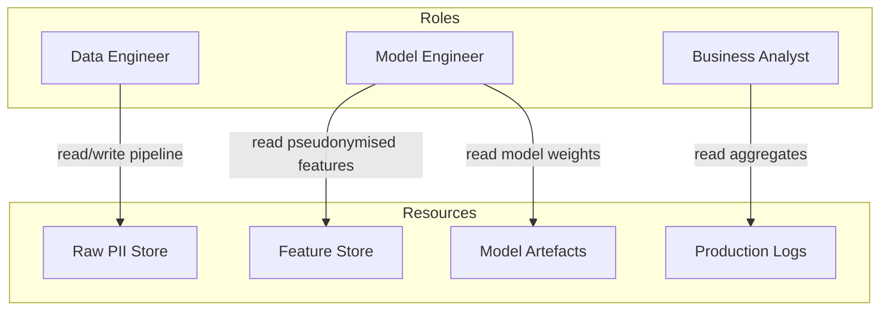
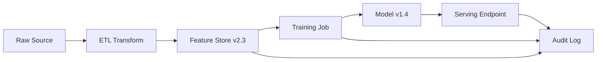

# Role-Based Access Control and Data Governance for ML

## Who Can See What?

Privacy depends not only on what the system does at runtime but on **how many people and services can directly touch sensitive data**. Access control ensures each role receives only the permissions required for its function — the **principle of least privilege**.

---

## Role-Based Access Control (RBAC)

Different roles need different data exposure:

| Role | Typical needs | Raw PII access |
|------|---------------|----------------|
| Data engineer | Pipeline construction, ETL | Often yes — but scoped to pipeline stage |
| Model engineer | Feature experimentation, training | Prefer pseudonymised or sampled data |
| Business analyst | Dashboards, aggregate reports | Aggregated metrics only |
| Auditor / compliance | Investigation, policy verification | Read-only, time-bounded, fully logged |

RBAC assigns permissions to **roles**, not individuals. A model engineer inherits "model engineer" permissions — not blanket production database access.

---

## Environment Separation

Maintain clear boundaries between environments:

| Environment | Data policy |
|-------------|-------------|
| **Development** | Synthetic data or heavily masked samples |
| **Staging** | Sampled production data with PII stripped or tokenised |
| **Production** | Full data — strictest access controls and logging |

**Never use full raw production data in dev notebooks by default.** A leaked laptop or mis-pasted Slack message exposes real users.

---

## Feature-Level Policies

Beyond dataset-level access, enforce policies on **individual features**:

- Some features restricted to specific use cases (e.g., health data only for triage models).
- Some features available only in aggregated form for certain roles.
- Policy hooks requiring approval before a restricted feature enters a new model.

This ties directly to **feature governance** — a catalogue that documents provenance, sensitivity classification, and approved use cases for each feature.

---

## Audit Logs and Data Lineage

### Audit Logs

Track:

- Who accessed which datasets or features, and when.
- Who deployed which model versions.
- Configuration changes to pipelines, feature stores, and serving endpoints.

When something goes wrong — a breach, a complaint, a regulatory inquiry — this history is essential for investigation.

### Data Lineage

Documents where each feature originated:

- Raw source tables
- Transformations applied
- Version of the feature computation code

Lineage answers: *"Why are we using this field?"* — critical for both debugging and privacy justification.

---

## Policy Hooks and Feature Governance

A mature system lets you **see, control, and justify** how data is used:

- Features tagged with sensitivity level and lawful purpose.
- New model proposals checked against feature policy before training starts.
- Restricted features require explicit approval workflow.

Governance is not bureaucracy — it prevents accidental inclusion of prohibited data in production models.

---

## End-to-End Privacy Architecture

| Component | Privacy function |
|-----------|------------------|
| Data minimisation | Reduce what exists to protect |
| Pseudonymisation / aggregation | Reduce identifiability of what remains |
| RBAC | Limit who can access sensitive stores |
| Environment separation | Prevent dev/staging leakage |
| Feature-level policies | Control feature use per model and role |
| Audit logs | Accountability and incident investigation |
| Data lineage | Transparency and justification |

---

## Common Pitfalls / Exam Traps

- Granting all engineers production database access "for convenience."
- Using production data in Jupyter notebooks on local laptops without encryption or policy.
- Logging raw PII in audit trails — audit logs themselves become a sensitive datastore.
- Implementing RBAC at the database level but not at the feature store or model artefact level.
- Treating audit logs as optional — they are required for compliance and incident response.
- Confusing staging "anonymisation" with true privacy if re-identification keys remain.

---

## Quick Revision Summary

- RBAC assigns least-privilege permissions by role — data engineer, model engineer, and analyst need different access.
- Separate dev, staging, and production environments; avoid raw production data in development.
- Enforce **feature-level policies** — some features restricted or aggregated per role and use case.
- **Audit logs** track data access, model deployments, and config changes.
- **Data lineage** documents feature provenance for debugging and privacy justification.
- Feature governance enables seeing, controlling, and justifying data use across the ML lifecycle.
- Privacy is organisational and technical — access control is as important as anonymisation.
