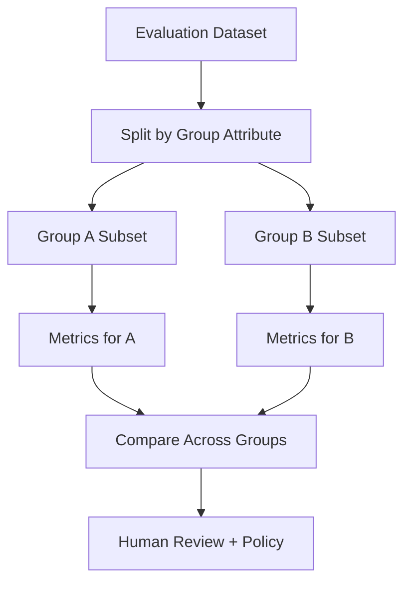

# Fairness and Bias: Evaluating Models Across Groups

## The Hidden Failure of Global Metrics

A model with strong overall accuracy can still **systematically harm specific groups**. Fairness analysis makes these disparities visible and measurable — a prerequisite for informed human decisions about deployment, mitigation, and policy.

**Working definition for this module:** Does the model behave consistently across groups? Are some groups receiving systematically worse errors?

Deciding what to do about disparities requires domain expertise, policy, and context. The model engineer's job is to **surface behaviour clearly**.

---

## Why Overall Accuracy Misleads

Consider a binary classifier:

| Group | Accuracy | Population share |
|-------|----------|------------------|
| Group A | 92% | 70% |
| Group B | 83% | 30% |
| **Overall** | **~90%** | 100% |

The 90% overall figure feels excellent. Split by group and Group B — potentially a vulnerable population or key customer segment — consistently receives worse predictions.

**Accuracy alone hides important details.** Always disaggregate.

---

## The Group Comparison Technique

### Step 1: Choose a Group Attribute

Examples:

- Region or geography
- Age band
- Product tier
- Language group
- Where legally and contextually appropriate: gender, ethnicity, or other sensitive attributes

### Step 2: Slice Evaluation Data

Create one subset per group value.

### Step 3: Compute Standard Metrics Per Group

For each subset, calculate the same metrics used globally:

- Accuracy
- Precision
- Recall
- F1
- AUC-ROC
- Calibration metrics

### Step 4: Compare and Assess

Ask: Are differences small and explainable by context, or large enough to worry about — especially for high-impact decisions?

---

## Error Types Matter More Than Accuracy

### Definitions

For a positive class (e.g., "fraud", "approved", "disease present"):

| Error | Definition | Example |
|-------|------------|---------|
| **False positive (FP)** | Predicted positive, actually negative | Legitimate transaction flagged as fraud |
| **False negative (FN)** | Predicted negative, actually positive | Fraudulent transaction missed |

### Domain-Specific Error Costs

| Domain | More costly error | Rationale |
|--------|-------------------|-----------|
| Fraud detection | Often FN (miss fraud) — but FP (block legitimate) harms UX | Tolerance for FP varies by policy |
| Healthcare screening | FN (miss disease) | Delayed treatment |
| Hiring / lending | FP or FN depending on framing | Denied opportunity vs bad hire/default |
| Content moderation | FN (miss harmful content) | Platform safety |

Fairness analysis often focuses on: **Are FP or FN rates significantly higher for one group?**

### Key Rates

$$\text{FPR} = \frac{FP}{FP + TN} \quad \text{(false positive rate)}$$

$$\text{FNR} = \frac{FN}{FN + TP} \quad \text{(false negative rate)}$$

$$\text{Recall} = \frac{TP}{TP + FN} = 1 - \text{FNR}$$

---

## Practical Fairness Questions

1. Is one group getting more **false negatives**? (e.g., qualified loan applicants disproportionately denied)
2. Does performance drop sharply for a **subpopulation**? (smaller language groups, certain age bands)
3. Is the model **calibrated** similarly? Does a score of 0.8 mean the same real-world probability for Group A and Group B?
4. Do thresholds or decision rules in practice **benefit one group** more than another?

---

## Visualisation Patterns

| Chart type | Shows |
|------------|-------|
| Bar chart | Accuracy, precision, recall per group |
| Grouped bars | FP and FN rates side by side |
| Calibration plot | Predicted probability vs observed frequency per group |
| Table with deltas | Raw values plus difference (e.g., "Group B accuracy 7 pp lower than Group A") |

Highlight cells where gaps exceed a chosen threshold (e.g., 5 percentage points) so disparities stand out immediately.

---

## Common Pitfalls / Exam Traps

- Reporting only overall accuracy in stakeholder presentations.
- Choosing group attributes without domain/legal guidance on which comparisons are meaningful.
- Ignoring calibration — equal accuracy with different calibration means scores are not comparable across groups.
- Assuming a single fairness metric exists — equal accuracy, equal FPR, equal FNR, and equal calibration can conflict.
- Treating fairness numbers as a pass/fail verdict without domain context.

---

## Quick Revision Summary

- High overall accuracy can mask systematic harm to specific groups.
- **Group comparison:** same model, same metrics, different group slices — the core fairness check.
- Choose a group attribute, slice evaluation data, compute metrics per group, compare.
- **FP and FN rates** often matter more than accuracy; domain determines which error is costlier.
- Check calibration: does score 0.8 mean the same thing for every group?
- Visualise disparities with bar charts, calibration plots, and tables showing deltas.
- Fairness metrics surface evidence for human decisions — they do not replace policy or ethics.
