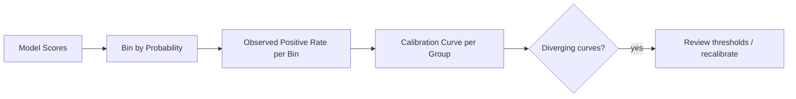

# Practical Fairness Questions and Visualisation

## From Fuzzy Concern to Observable Behaviour

Fairness becomes actionable when vague worries ("the model might be biased") transform into **specific, measurable questions** with numbers and charts that non-ML stakeholders can discuss. This note catalogues the questions worth asking and how to present answers.

---

## Four High-Value Fairness Questions

### 1. False Negative Disparity

> Is one group systematically getting more false negatives?

**Example:** Certain loan applicants are disproportionately denied despite meeting qualification criteria.

- Compute FNR or recall per group.
- A recall gap of 10 percentage points may mean one group misses 10% more legitimate positive outcomes.

### 2. Subpopulation Performance Drop

> Does model performance drop sharply for some subpopulation?

**Examples:**

- Smaller language groups in NLP models.
- Rural vs urban customers in a credit model.
- New users vs established users in a churn predictor.

Look at accuracy, AUC, and error rates per slice — not just the majority group.

### 3. Calibration Consistency

> Does a predicted score of 0.8 mean roughly the same real-world probability for every group?

**Calibration** means: among all instances scored 0.8, approximately 80% are truly positive — regardless of group membership.

Miscalibration across groups means:

- Thresholds tuned on one group mis-serve another.
- Risk rankings are not comparable across populations.

### 4. Threshold and Decision Rule Impact

> Do operational thresholds benefit one group more than another?

Even a well-calibrated model can produce disparate outcomes if:

- A single global threshold is applied without group-aware review.
- Business rules layered on top of model scores interact differently with group feature distributions.

---

## Comparison Table: What Each Question Reveals

| Question | Primary metric | Reveals |
|----------|----------------|---------|
| FN disparity | Recall, FNR | Denied opportunities, missed detections |
| Subpopulation drop | Accuracy, AUC per slice | Model simply works worse for some groups |
| Calibration | Reliability diagram, Brier score | Score interpretability across groups |
| Threshold impact | Outcome rates at fixed threshold | Policy-level disparate impact |

---

## Visualisation Toolkit

### Bar Charts — Overall Metric Comparison

Compare accuracy, precision, or recall across groups. Simple and immediately readable for executives.

### Grouped Bar Charts — Error Rates

Place FP rate and FN rate side by side for each group. Reveals *how* the model fails, not just *how much*.

### Calibration Plots

Plot predicted probability (binned) vs observed positive rate per group. Diverging curves indicate calibration disparity.

### Tables with Deltas

Show both raw values and differences:

| Group | Accuracy | Delta vs Group A |
|-------|----------|------------------|
| Group A | 92% | — |
| Group B | 85% | −7 pp |

Highlight cells exceeding a threshold (e.g., 5 pp gap) for immediate attention.

---

## Making Fairness Discussable

Numbers and charts convert fairness from a philosophical debate into an **evidence-based conversation**:

- Product teams see which user segments are affected.
- Legal teams assess regulatory exposure.
- Domain experts judge whether gaps are acceptable given stakes.
- Engineers identify whether the root cause is data, features, or model architecture.

---

## Context Determines Severity

A 7-percentage-point recall gap means different things in different domains:

| Domain | 7 pp recall gap | Likely response |
|--------|-----------------|-----------------|
| Movie recommendations | Low stakes | May be acceptable |
| Loan approval | High stakes | Requires investigation |
| Cancer screening | Very high stakes | Likely unacceptable |

The model engineer provides evidence; **policy and domain experts** determine acceptability.

---

## Common Pitfalls / Exam Traps

- Showing only accuracy bars without FP/FN breakdown — hides the direction of harm.
- Using calibration plots without enough per-group samples in each bin — noisy and misleading.
- Setting visual thresholds (5 pp) as universal — context determines what "large" means.
- Presenting fairness charts without defining the group attribute or sample size per group.
- Assuming stakeholders understand "recall" — label charts with domain language (e.g., "missed fraud rate").

---

## Quick Revision Summary

- Four key questions: FN disparity, subpopulation performance drop, calibration consistency, threshold impact.
- **False negative disparity** often maps to denied opportunities (lending, hiring, screening).
- **Calibration:** score 0.8 should mean ~80% positive rate in every group.
- Use bar charts, grouped error-rate bars, calibration plots, and delta tables.
- Highlight gaps exceeding chosen thresholds to focus attention.
- Fairness visualisation makes behaviour observable for non-ML stakeholders.
- Severity of gaps is domain- and stakes-dependent — metrics inform, humans decide.
