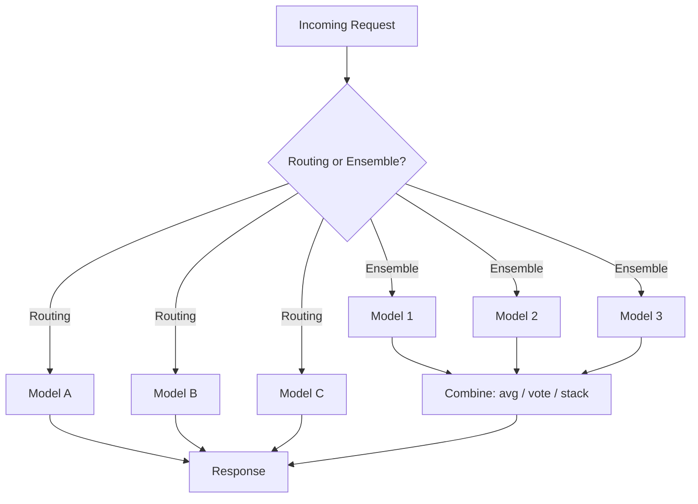

# Multi-Model Systems: Routing and Ensembles

## Why One Model Per Service Is Not Enough

Early ML serving tutorials often assume a clean architecture: one endpoint, one model, one version. Production platforms rarely look like that. A mature ML system typically hosts **many models simultaneously** — different versions, segments, languages, and task specialists — all behind shared infrastructure.

**Intuition**: A single model is like a general practitioner. A production platform is a hospital with specialists (fraud, credit risk, churn, recommendations), each tuned for a narrow domain, plus triage logic to route patients to the right expert.

---

## The Core Question: Which Model Handles This Request?

When a prediction request arrives, the platform must answer:

1. **Which model** (or models) should process it?
2. **How** should outputs be combined if multiple models are involved?

Two foundational patterns address this:

| Pattern | Definition | Goal |
|---------|------------|------|
| **Routing** | Select **one** model per request | Match request to the right expertise |
| **Ensembles** | Call **multiple** models on the same input, then combine outputs | Improve accuracy and robustness |

Both patterns aim to deliver better outcomes than a single monolithic model — but through different mechanisms.

---

## What This Module Covers

The module builds a complete mental model for operating many models at scale:

1. **Routing strategies** — rule-based, learned routers, fallbacks
2. **Ensembles** — averaging, voting, stacking, and their cost trade-offs
3. **Scaling patterns** — sharding, replication, caching
4. **Multi-tenancy** — isolation, SLOs, noisy-neighbour control
5. **RAG pipelines** — vector databases and retrieval-augmented generation as inherently multi-model systems
6. **Model registry and promotion** — versioned artefacts, `current_best.json`, dynamic serving

---

## Real-World Context

| Scenario | Multi-model need |
|----------|------------------|
| Global e-commerce | Country/language-specific recommendation models |
| Banking | Separate fraud, credit risk, and AML models |
| SaaS ML platform | Per-tenant models on shared infrastructure |
| LLM applications | Embedding model + retriever + reranker + generator |

Modern production ML is not "deploy a `.pkl` file." It is an **orchestrated system of models, data, and infrastructure** working together.

---

## Common Pitfalls / Exam Traps

- **Trap**: Routing and ensembles solve the same problem. **Reality**: Routing picks one expert; ensembles combine multiple opinions. They can coexist (route to an ensemble pipeline) but are distinct patterns.
- **Trap**: More models always means better accuracy. **Reality**: Each additional model adds latency, cost, and operational complexity. The accuracy–latency–cost trade-off must be justified per use case.
- **Trap**: Multi-model systems only matter at hyperscale. **Reality**: Even modest platforms need routing for A/B tests, canary deployments, and task-specific models.
- **Trap**: "Multi-model" means multimodal (text + image). **Reality**: In model engineering, "multi-model" means **multiple ML models** in one serving system, not necessarily multiple input modalities.

---

## Quick Revision Summary

- Production systems host many models — versions, segments, tasks — not one model per service
- **Routing** selects one model per request; **ensembles** call multiple models and combine outputs
- Routing strategies include rules, learned routers, and fallbacks
- Ensembles (averaging, voting, stacking) trade higher accuracy/robustness for cost and latency
- This module connects routing, scaling (shard/replicate/cache), multi-tenancy, RAG, and model registry patterns
- The central engineering question: how to match each request with the right model expertise at acceptable cost and latency
