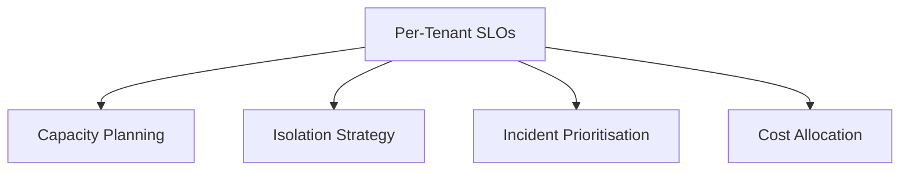
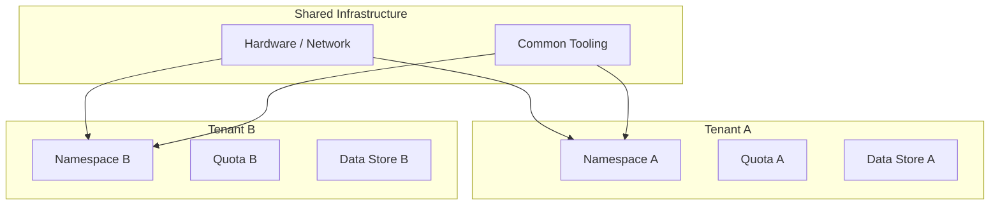

# Per-Tenant SLOs and Isolation Strategy Overview

## Why Per-Tenant SLOs?

In a multi-tenant ML platform, not every tenant deserves the same guarantees. A VIP external customer paying premium rates needs tighter latency and higher availability than an internal experimental team running best-effort batch jobs.

**Service Level Objectives (SLOs)** are measurable targets for system behaviour. Per-tenant SLOs make expectations explicit and drive engineering decisions.

---

## What Is an SLO?

An SLO is a target for a specific metric over a defined window:

| Metric type | Example SLO |
|-------------|------------|
| Latency | P95 inference latency < 150 ms |
| Availability | 99.9% uptime over 30 days |
| Error rate | < 0.1% of requests return 5xx |

SLOs are **not SLAs** (contracts with penalties). SLOs are internal targets that inform capacity planning, isolation design, and incident prioritisation.

---

## Per-Tenant SLO Examples

| Tenant | P95 Latency | Availability | Priority |
|--------|------------|--------------|----------|
| Tenant A (VIP external) | < 150 ms | 99.9% | High |
| Tenant B (internal batch) | < 400 ms | 99.0% | Low |
| Tenant C (experimental) | Best effort | 95.0% | Lowest |

### What SLOs Drive

1. **Capacity planning** — VIP tenants get dedicated GPU pools; batch tenants share spot instances
2. **Isolation strategy** — tighter SLOs justify stronger resource boundaries
3. **Incident response** — when the cluster is under pressure, protect high-SLO tenants first
4. **Cost allocation** — premium SLOs justify premium pricing



---

## Isolation Strategies at Multiple Layers

### 1. Logical Isolation

Separate namespaces, projects, or accounts so each tenant operates in its own scope.

- Kubernetes namespaces per tenant
- Separate cloud projects/accounts
- Distinct deployment pipelines

**Effect**: Configuration, secrets, and service discovery are tenant-scoped. Reduces accidental cross-tenant interference.

### 2. Resource Isolation

Quotas and limits on shared compute:

| Resource | Quota example |
|----------|--------------|
| CPU | Max 32 cores per tenant |
| GPU | Max 4 GPUs per tenant |
| Memory | Max 128 GB per tenant |
| Concurrency | Max 100 simultaneous inference requests |

**Effect**: No tenant can consume all cluster resources regardless of demand.

### 3. Data and Access Isolation

- Separate storage (buckets, schemas, databases) per tenant
- Strict access controls (RBAC, IAM policies)
- Tenant A credentials cannot read Tenant B data

**Effect**: Prevents data leaks and satisfies privacy/governance requirements.

---

## The Shared Platform, Clear Boundaries Principle

```
Shared hardware + shared tooling
    BUT
Clear logical, resource, and data boundaries per tenant
```

Tenants should **feel** like they are in their own environment, even though they share underlying infrastructure.



---

## SLO-Driven Incident Prioritisation

When resources are constrained (cluster overload, GPU shortage):

1. **Throttle or preempt** low-priority tenant workloads
2. **Protect** high-SLO tenant capacity
3. **Alert** tenants whose SLOs are at risk
4. **Escalate** if VIP tenant SLO is breached

This is why documenting per-tenant SLOs is not bureaucracy — it is the decision framework for triage under pressure.

---

## Connection to Broader ML Engineering

Per-tenant SLOs and isolation connect to:

- **Monitoring** (Module 5) — per-tenant dashboards and alerts
- **Retraining triggers** (Module 6) — tenant-specific drift thresholds
- **Feature governance** (Module 9) — per-tenant feature access and lineage
- **Security and fairness** (Module 11) — access controls and audit trails

---

## Common Pitfalls / Exam Traps

- **Trap**: One global SLO covers all tenants. **Reality**: Different tenants have different business criticality. Per-tenant SLOs enable fair prioritisation.
- **Trap**: SLOs are the same as SLAs. **Reality**: SLOs are internal targets; SLAs are contractual commitments (often with financial penalties).
- **Trap**: Logical isolation (namespaces) is sufficient. **Reality**: Namespaces prevent config leaks but do not prevent resource exhaustion. Quotas are also required.
- **Trap**: Resource quotas hurt efficiency. **Reality**: Quotas prevent noisy neighbours, which protects overall platform reliability. Unused quota can be shared via priority classes.
- **Trap**: P95 latency SLO means 95% of requests must be under the threshold. **Reality**: Correct — P95 means 95th percentile; 5% of requests may exceed the target.

---

## Quick Revision Summary

- **SLOs** are measurable targets (latency, availability, error rate) per tenant
- Not all tenants get the same SLOs — VIP vs internal vs experimental tiers
- SLOs drive capacity planning, isolation design, and incident prioritisation
- Three isolation layers: logical (namespaces), resource (quotas), data (access controls)
- Principle: shared platform with clear per-tenant boundaries
- Under pressure, protect high-SLO tenants first via throttling and preemption
