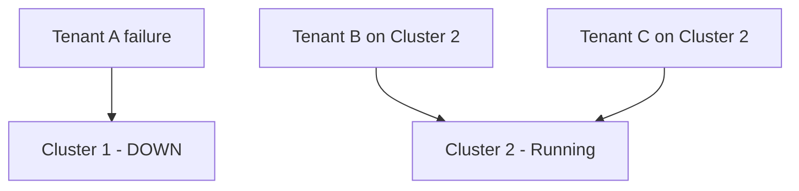
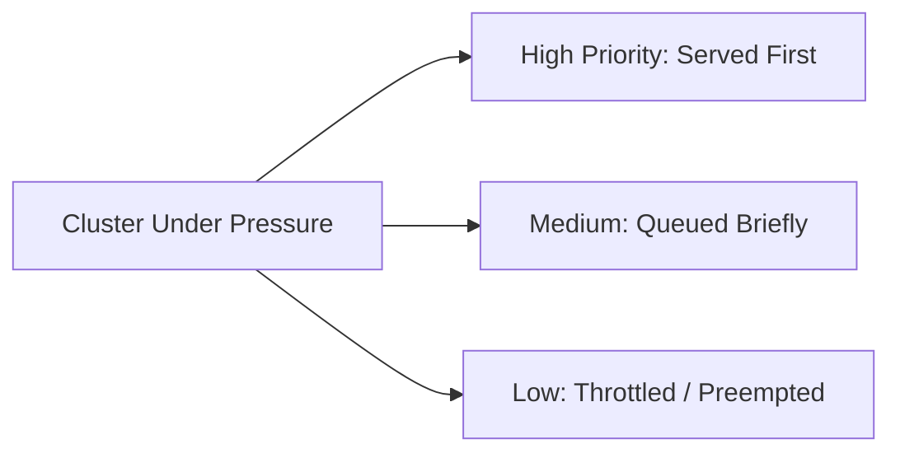
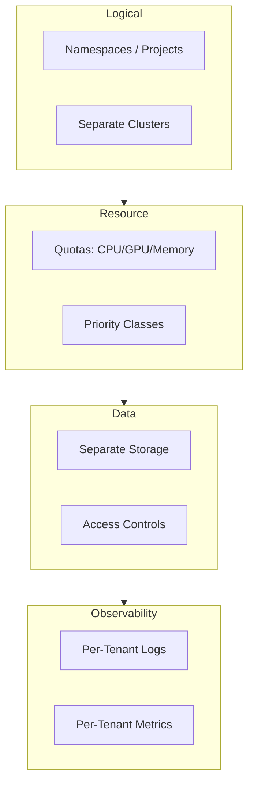

# Blast Radius, Resource Quotas, and Data Isolation

## Blast Radius: Limiting Incident Spread

**Blast radius** measures how far damage propagates when something fails. In multi-tenant ML platforms, the goal is to ensure one tenant's incident does not take down the entire platform.

**Intuition**: Firewalls in a building compartmentalise fire. Blast-radius controls compartmentalise failures.

---

## Logical Isolation: Namespaces and Clusters

### Namespaces / Projects

Group each tenant's services, configurations, secrets, and deployments into isolated scopes.

| Mechanism | What it isolates |
|-----------|-----------------|
| Kubernetes namespace | Deployments, services, config maps, secrets |
| Cloud project/account | IAM, billing, resource quotas |
| Separate deployment pipeline | CI/CD scope per tenant |

### Separate Clusters

For high-risk or VIP tenants, go further: dedicate entire clusters.

```
Cluster 1: Internal teams (search, recs, fraud)
Cluster 2: VIP external customers + regulated regions (EU GDPR)
```

**If Tenant A crashes Cluster 1, Cluster 2 keeps running.**



### When to Use Which

| Isolation level | Best for |
|----------------|----------|
| Namespace only | Low-risk internal teams, cost-sensitive |
| Namespace + quotas | Standard multi-tenant platform |
| Separate cluster | VIP customers, regulated data, high blast-radius risk |

---

## Resource Quotas and Priority Classes

### Quotas

Hard limits per tenant on shared resources:

| Resource | Example quota |
|----------|--------------|
| CPU cores | 32 cores max |
| GPU count | 4 GPUs max |
| Memory | 128 GB max |
| Concurrent requests | 100 simultaneous inferences |
| Batch job slots | 5 concurrent training jobs |

**Effect**: No matter how hard a tenant pushes, their impact on others is **bounded**.

### Priority Classes

Not all workloads are equal. Priority classes determine who gets resources first under pressure:

| Priority | Behaviour under cluster pressure |
|----------|--------------------------------|
| **High** (VIP real-time inference) | Resources guaranteed; never preempted |
| **Medium** (standard online serving) | May experience brief queuing |
| **Low** (batch scoring, experiments) | Delayed, throttled, or preempted |



**Real-world example**: A shared GPU cluster runs real-time fraud detection (high priority) alongside nightly batch retraining (low priority). When GPUs saturate, batch jobs are paused until inference load drops.

---

## Data and Logging Isolation

Isolation is not only about compute — data and observability must also be tenant-scoped.

### Data Isolation

| Mechanism | Purpose |
|-----------|---------|
| Separate buckets / databases per tenant | Prevent data co-mingling |
| RBAC / IAM policies | Tenant A credentials cannot access Tenant B data |
| Schema separation | Query boundaries in shared databases |

### Logging and Metrics Isolation

| Mechanism | Purpose |
|-----------|---------|
| Per-tenant log streams | Debugging without cross-tenant noise |
| Per-tenant metric namespaces | Dashboards scoped to one tenant |
| Access-controlled log viewers | Prevent sensitive data leakage via logs |

**Why it matters**: A log entry from Tenant A's fraud model should never appear in Tenant B's monitoring dashboard. This ties directly to privacy, governance, and audit requirements.

---

## Complete Isolation Stack



---

## Multi-Tenancy and Responsible AI

Multi-tenancy connects deeply to responsible AI practices:

- **Privacy** — data isolation prevents cross-tenant leakage
- **Governance** — per-tenant audit trails for model decisions
- **Fairness** — resource quotas prevent one tenant monopolising compute needed for bias monitoring
- **Compliance** — regulated tenants (healthcare, finance) may require dedicated clusters

---

## Summary Table

| Risk | Mitigation |
|------|-----------|
| Noisy neighbour | Resource quotas + priority classes |
| Blast radius too large | Namespaces → separate clusters |
| Data leak | Separate storage + RBAC/IAM |
| Cross-tenant log exposure | Per-tenant log/metric segregation |
| SLO breach during incident | Priority-based resource allocation |

---

## Common Pitfalls / Exam Traps

- **Trap**: Namespaces alone prevent noisy neighbours. **Reality**: Namespaces isolate configuration, not resource consumption. **Quotas** are required.
- **Trap**: Separate clusters are always necessary. **Reality**: Clusters are for high-risk/VIP tenants. Most internal teams are fine with namespaces + quotas on a shared cluster.
- **Trap**: Preemption is unfair to batch tenants. **Reality**: Preemption is the mechanism that **protects** high-priority tenants. Low-priority workloads are designed to be interruptible.
- **Trap**: Shared logging is fine for debugging. **Reality**: Shared logs risk exposing sensitive data across tenants. Per-tenant segregation is a governance requirement.
- **Trap**: Blast radius only applies to hardware failures. **Reality**: Software bugs, misconfigurations, and resource exhaustion also have blast radius — isolation limits their scope.

---

## Quick Revision Summary

- **Blast radius** = how far an incident spreads; limit it via namespaces and separate clusters
- **Resource quotas** cap CPU, GPU, memory, and concurrency per tenant
- **Priority classes** ensure high-priority tenants get resources first under pressure
- **Data isolation**: separate storage + RBAC/IAM per tenant
- **Logging isolation**: per-tenant log streams and metric namespaces
- Multi-tenancy isolation connects to privacy, governance, compliance, and responsible AI
