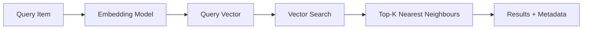
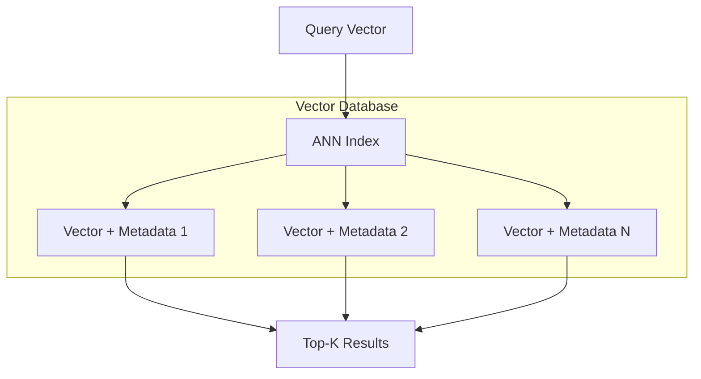

# Embeddings, Vector Similarity, and Vector Databases

## Beyond Standalone Models: Retrieval-Augmented Systems

Many modern applications cannot rely on a model's memorised weights alone. They combine **models with retrieval** — looking up relevant information from external knowledge bases at inference time. Vector search and retrieval-augmented generation (RAG) are the foundational patterns.

---

## What Is an Embedding?

An **embedding** is a dense numeric vector that represents an entity (text, image, item, user) in a way that captures **semantic meaning**.

### Key Property: Geometry Reflects Semantics

- **Similar items** → nearby vectors in embedding space
- **Dissimilar items** → far apart

Two sentences with similar meaning produce close embeddings even if they share few words:

```
"The cat sat on the mat"  → [0.12, -0.45, 0.78, ...]
"A feline rested on the rug" → [0.11, -0.43, 0.76, ...]  (close!)

"The stock market crashed" → [-0.89, 0.34, -0.12, ...]  (far away)
```

Embeddings are **learned** by models (BERT, sentence-transformers, CLIP, etc.) so that the vector space geometry reflects real-world semantics.

---

## Vector Similarity Search

Once items are embedded, finding similar items becomes a geometric problem:

### The Pattern

1. Compute embedding for the **query** item
2. Search the existing vector collection for **nearest neighbours**
3. Return the top-$K$ most similar items

### Similarity Metrics

| Metric | Formula (intuition) | Best for |
|--------|-------------------|----------|
| **Cosine similarity** | $\cos(\theta) = \frac{\mathbf{a} \cdot \mathbf{b}}{\|\mathbf{a}\| \|\mathbf{b}\|}$ | Normalised vectors; direction matters, not magnitude |
| **Dot product** | $\mathbf{a} \cdot \mathbf{b} = \sum_i a_i b_i$ | When magnitude carries information (e.g., relevance score) |
| **Euclidean distance** | $\|\mathbf{a} - \mathbf{b}\|_2$ | Absolute distance in space; smaller = more similar |

Cosine similarity is the most common choice for text embeddings because it measures directional alignment regardless of vector length.

---

## Use Cases for Vector Search

| Application | Query | Nearest neighbours |
|-------------|-------|-------------------|
| Semantic search | User query text | Relevant documents |
| Recommendations | User embedding | Similar users or items |
| Near-duplicate detection | New document | Existing near-copies |
| Clustering | Centroid | Group members |
| Anomaly detection | New data point | Distance to normal cluster |

**Core question vector search answers**: Given this thing, what else looks similar in embedding space?



---

## What Is a Vector Database?

A **vector database** is a specialised system designed to store embeddings and make similarity search **fast and scalable**.

### What It Stores

Each entry is a pair:

| Component | Content |
|-----------|---------|
| **Vector** | The embedding (e.g., 768-dimensional float array) |
| **Metadata** | Document ID, original text, tags, timestamps, tenant ID |

### What It Provides

- **Insert / update / delete** vectors
- **Query by vector**: "Here is my query embedding — give me the top-$K$ nearest neighbours"
- Specialised data structures (indexes) for fast search over millions or billions of vectors



### Popular Vector Databases

Pinecone, Weaviate, Milvus, Qdrant, pgvector (PostgreSQL extension), FAISS (library), Chroma — the specific tool matters less than the mental model.

---

## Why Not a Regular Database?

| Capability | Relational DB | Vector DB |
|-----------|--------------|-----------|
| Exact match queries | Excellent | N/A |
| Similarity search at scale | Poor (full scan) | Optimised (ANN indexes) |
| Metadata filtering + vector search | Limited | Native support |
| Billions of vectors | Impractical | Designed for it |

Regular databases can do vector search via brute-force comparison, but this does not scale to millions of vectors with low-latency requirements.

---

## Common Pitfalls / Exam Traps

- **Trap**: Embeddings are just feature vectors from tabular ML. **Reality**: Embeddings are **dense semantic representations** learned by neural models. Their geometry encodes meaning, not just raw features.
- **Trap**: Cosine similarity and dot product always give the same ranking. **Reality**: They differ when vector magnitudes vary. Cosine normalises; dot product does not.
- **Trap**: A vector database replaces the embedding model. **Reality**: The DB stores vectors **produced by** an embedding model. Both are needed.
- **Trap**: Vector search finds exact matches. **Reality**: Vector search finds **semantically similar** items, which may use completely different words.
- **Trap**: One similarity metric fits all. **Reality**: Cosine is standard for text; dot product when magnitude matters; Euclidean for spatial/geometric data.

---

## Quick Revision Summary

- An **embedding** is a dense vector capturing semantic meaning; similar items are nearby in vector space
- **Vector similarity search**: embed query → find top-$K$ nearest neighbours via cosine, dot product, or Euclidean distance
- Use cases: semantic search, recommendations, deduplication, clustering, anomaly detection
- A **vector database** stores (vector, metadata) pairs and provides fast similarity search APIs
- Vector DBs use specialised indexes (ANN) to scale to millions/billions of vectors
- Embedding model + vector database are complementary — model produces vectors, DB stores and searches them
