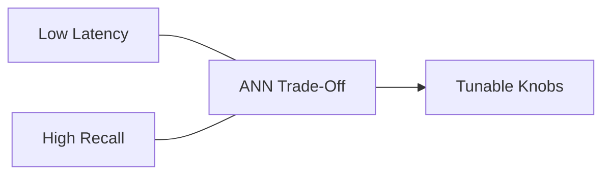
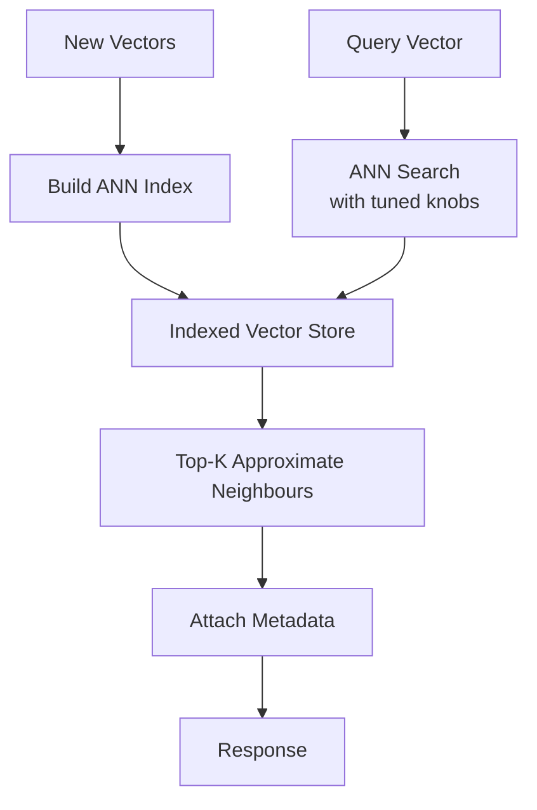

# Approximate Nearest Neighbour (ANN) Search

## The Scalability Problem with Exact Search

Vector databases must answer: "Given this query vector, find the top-$K$ nearest neighbours." The exact approach — comparing the query against **every** stored vector — works for small collections but fails at production scale.

| Collection size | Exact search latency | Production viable? |
|----------------|---------------------|-------------------|
| 10,000 vectors | ~10 ms | Yes |
| 1 million vectors | ~1–5 seconds | Borderline |
| 100 million+ vectors | Minutes | No |

For real-time systems (search, RAG, recommendations), exact nearest neighbour (ENN) search is too slow.

---

## Approximate Nearest Neighbour (ANN)

ANN algorithms return neighbours that are **good enough** — not guaranteed to be the exact nearest — but do so **orders of magnitude faster**.

$$\text{ANN: } \text{speed} \uparrow, \quad \text{exactness} \downarrow \text{ (slightly)}$$

**Intuition**: Finding the exact closest library book requires checking every shelf. ANN is like checking only the sections most likely to contain your book — you might miss the absolute closest, but you find a very good match in a fraction of the time.

---

## The Latency–Recall Trade-Off

The central tuning dimension for ANN systems:

| Term | Definition |
|------|-----------|
| **Recall@K** | Fraction of the true top-$K$ neighbours found by ANN |
| **Latency** | Time to return results |
| **Index build time** | One-time cost to construct the search index |

$$\text{Higher recall} \iff \text{more probes/deeper search} \iff \text{higher latency}$$

### Typical Operating Points

| Use case | Recall target | Latency budget |
|----------|--------------|---------------|
| Real-time RAG | 90–95% | < 50 ms |
| Batch deduplication | 99%+ | Seconds acceptable |
| Recommendation feed | 85–90% | < 20 ms |

---

## How ANN Indexes Work (High Level)

ANN systems use specialised data structures that avoid brute-force comparison:

| Index type | Mechanism | Trade-off |
|-----------|-----------|-----------|
| **HNSW** (Hierarchical Navigable Small World) | Graph-based navigation through vector space | Fast queries, moderate build time |
| **IVF** (Inverted File Index) | Partition space into clusters; search only nearby clusters | Fast build, tunable recall |
| **LSH** (Locality-Sensitive Hashing) | Hash similar vectors to same buckets | Very fast, lower recall |
| **Product Quantisation (PQ)** | Compress vectors for memory efficiency | Saves memory, slight accuracy loss |

The specific algorithm matters less than understanding that all ANN methods **trade exactness for speed** via pre-computed index structures.

---

## Configurable Knobs

Most vector databases expose tuning parameters:

| Knob | Effect |
|------|--------|
| **Index type** | HNSW vs IVF vs LSH — different speed/recall profiles |
| **Number of probes** (IVF) | More probes → higher recall, higher latency |
| **Search depth** (HNSW) | Deeper graph traversal → better recall, slower |
| **ef_search / nprobe** | Algorithm-specific parameters controlling search thoroughness |

### Tuning Process

1. Start with default settings
2. Measure recall@K on a labelled evaluation set
3. Increase probes/depth until recall meets your quality bar
4. Verify latency stays within SLO
5. Monitor recall in production (drift in embedding model may change optimal settings)

---

## ANN in the Vector Database Architecture

---

## When Exact Search Is Still Appropriate

- Collections < 100K vectors with generous latency budgets
- Evaluation and benchmarking (ground truth for recall measurement)
- High-stakes retrieval where missing a relevant document is unacceptable

For everything else at scale, ANN is the standard.

---

## Common Pitfalls / Exam Traps

- **Trap**: ANN always returns wrong results. **Reality**: ANN returns **approximately correct** results. At 95% recall@10, you miss 0.5 of the true top-10 on average — often acceptable.
- **Trap**: Higher recall is always better. **Reality**: Chasing 99.9% recall may push latency beyond SLO. Tune to the **minimum recall that meets quality requirements**.
- **Trap**: Index build time doesn't matter. **Reality**: Rebuilding indexes after embedding model upgrades can take hours. Plan for index rebuild in deployment pipelines.
- **Trap**: ANN eliminates the need for embedding quality. **Reality**: Poor embeddings produce poor neighbours regardless of search algorithm. ANN optimises search speed, not embedding quality.
- **Trap**: One ANN configuration works forever. **Reality**: Embedding model changes, data distribution shifts, and collection growth all require retuning.

---

## Quick Revision Summary

- **Exact NN search** does not scale to millions/billions of vectors
- **ANN** trades slight accuracy loss for dramatic speed improvement
- Core trade-off: **latency vs recall@K** (how many true neighbours are recovered)
- ANN indexes (HNSW, IVF, LSH, PQ) use pre-computed structures to avoid brute force
- Tunable knobs: index type, probes, search depth — adjust per quality/latency requirements
- Measure recall on evaluation sets; retune when embedding models or data distributions change
