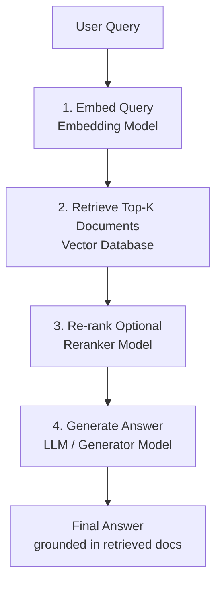
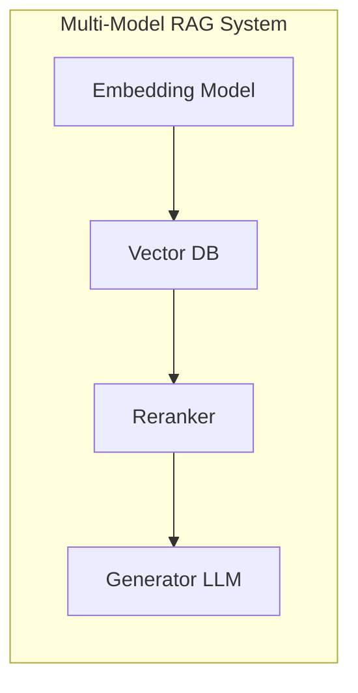
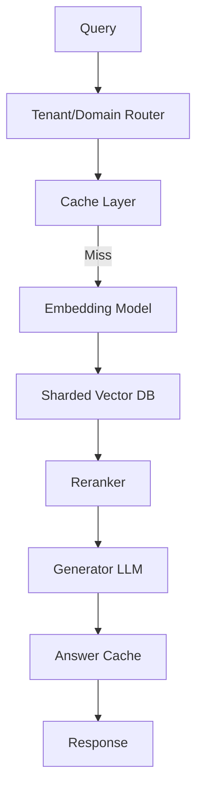

# RAG Pipelines as Multi-Model Systems

## What Is Retrieval-Augmented Generation (RAG)?

RAG combines **search** and **generation**. Instead of relying solely on what a language model has memorised in its weights, the system retrieves relevant documents from an external knowledge base and feeds them to the generator as context.

**Intuition**: A student taking an open-book exam (RAG) vs a closed-book exam (pure LLM). The open-book student looks up relevant passages before writing the answer.

---

## The RAG Pipeline: Step by Step



### Step 1: Embed the Query

An **embedding model** converts the user's text query into a dense vector.

### Step 2: Retrieve Relevant Documents

The query vector searches a **vector database** containing pre-embedded documents. Returns the top-$K$ most similar document chunks.

### Step 3: Re-rank (Optional)

A **reranker model** refines the ordering of retrieved documents for higher quality. Cross-encoder models are common rerankers — they score (query, document) pairs directly.

### Step 4: Generate the Answer

The **generator model** (typically an LLM) receives the original query plus the selected documents as context and produces the final answer, ideally grounded in the retrieved content.

---

## RAG as a Multi-Model System

A RAG pipeline is **multi-model by design** — it orchestrates multiple specialised models:

| Model role | Function | Example |
|-----------|----------|---------|
| Embedding model | Text → vector | `text-embedding-3-small`, BGE, E5 |
| Vector database | Store + search vectors | Pinecone, Milvus, pgvector |
| Reranker model | Refine retrieval order | Cross-encoder, Cohere Rerank |
| Generator model | Produce final text | GPT-4, Llama, Mistral |



This is a direct application of the routing, sharding, caching, and multi-tenancy patterns covered earlier in this module.

---

## Applying Module 12 Patterns to RAG

### Sharding

Shard vector indexes by domain, tenant, or region:

```
Shard 1: Customer support tickets
Shard 2: Product documentation
Shard 3: Internal engineering wiki
```

### Caching

| Cache layer | What to cache |
|------------|--------------|
| Embedding cache | Query vectors (expensive to compute) |
| Retrieval cache | Top-K results for frequent queries |
| Answer cache | Final responses for static/repeated questions |

### Multi-Tenancy

- Each tenant gets its own index or namespace in the vector database
- Access controls ensure tenants only see their own documents
- Per-tenant SLOs for retrieval latency and generation quality

### Routing

- Route by domain (support vs product vs internal)
- Route by language (different embedding models per language)
- Route by tenant ID

---

## At Scale: The Full Picture

```
A production RAG system is a large, multi-model, multi-tenant,
sharded, and cached system.
```



---

## Real-World Applications

| Application | RAG components |
|-------------|---------------|
| Semantic search / Q&A over docs | Embed + retrieve + generate |
| Customer support assistant | Past tickets + product docs as knowledge base |
| Personalisation / recommendations | User/item embeddings + similarity retrieval |
| Code and log search | Embed code snippets; find similar errors |
| Enterprise knowledge systems | Internal reports, policies, meeting notes |

If a system can answer questions over your proprietary data, there is almost certainly a vector database and RAG pipeline behind it.

---

## The Big Idea

Modern ML in production is **not just a model file**. It is:

$$\text{Production ML} = \text{Models} + \text{Data} + \text{Retrieval Infrastructure}$$

The model engineer's role expands from training models to **designing and operating multi-model platforms** that combine inference, retrieval, caching, and governance.

---

## Common Pitfalls / Exam Traps

- **Trap**: RAG replaces the need for a good LLM. **Reality**: RAG **augments** the LLM with external knowledge. A weak generator still produces poor answers even with perfect retrieval.
- **Trap**: Retrieval quality doesn't matter if the LLM is powerful. **Reality**: Garbage in, garbage out. Poor retrieval → irrelevant context → hallucinated or wrong answers.
- **Trap**: RAG is a single-model system with a database attached. **Reality**: RAG involves 3–4 distinct models (embedder, reranker, generator) plus a vector DB — inherently multi-model.
- **Trap**: Caching final answers is always safe for RAG. **Reality**: Only cache answers for static knowledge. Dynamic data (prices, inventory, policies) requires event-based invalidation.
- **Trap**: One vector index for all tenants and domains. **Reality**: Sharding indexes by tenant/domain improves relevance, isolation, and performance.

---

## Quick Revision Summary

- **RAG** = embed query → retrieve top-$K$ docs → optional rerank → generate answer with context
- RAG is **multi-model by design**: embedding model + vector DB + reranker + generator
- Apply sharding (per domain/tenant), caching (embeddings, retrieval, answers), and routing
- Production RAG is a multi-model, multi-tenant, sharded, cached system
- Real-world uses: Q&A, support bots, recommendations, code search, enterprise knowledge
- Production ML = models + data + retrieval infrastructure, not just a model file
