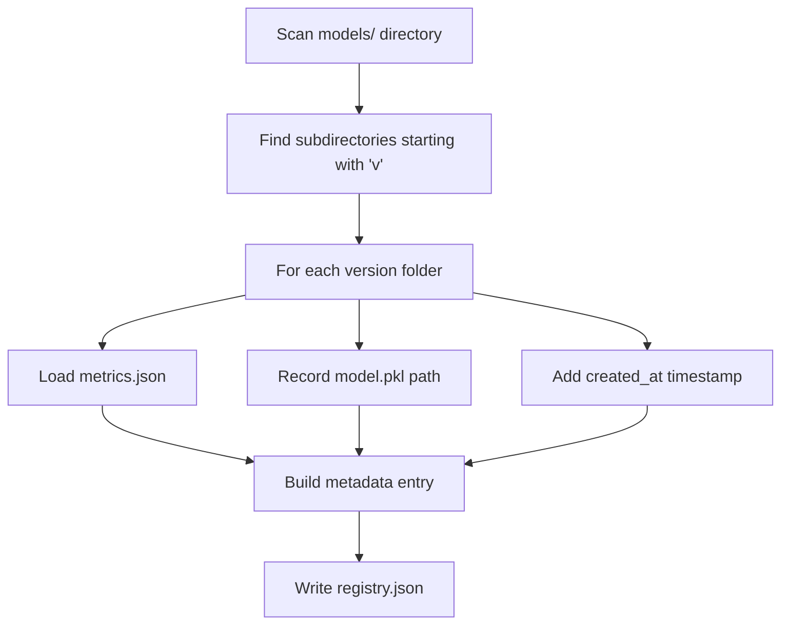

# Building a File-Based Model Registry

## The Problem: Model Artefact Chaos

Without a registry, model artefacts accumulate in ad hoc locations:

```
models/model_final.pkl
models/model_v2.pkl
models/model_for_real_this_time.pkl
```

No one knows which version is current, where files live, or how each version performed. A **model registry** is the single source of truth that answers:

- What models do we have?
- Which version is which?
- How did each version perform during evaluation?
- Where is the actual model file located?

---

## Registry Architecture: Versioned Folders

A surprisingly effective registry can be built with **simple file-based conventions** — no dedicated tool required (though MLflow, Vertex AI Model Registry, and similar platforms add features).

### Directory Structure

```
models/
├── v1/
│   ├── model.pkl          # Model artefact
│   └── metrics.json       # Evaluation KPIs
├── v2/
│   ├── model.pkl
│   └── metrics.json
└── registry.json          # Central catalogue (generated)
```

### Core Convention

Every model version gets its own folder containing:

| File | Purpose |
|------|---------|
| `model.pkl` (or `.onnx`, `.pt`, etc.) | The serialised model artefact |
| `metrics.json` | Key performance indicators from evaluation |

**Why store metrics with the model?** The artefact becomes **self-describing**. Anyone inspecting `v2/metrics.json` immediately knows that version's accuracy, log loss, or other KPIs without querying a separate system.

---

## Self-Describing Model Artefacts

```json
// v2/metrics.json
{
  "accuracy": 0.91,
  "log_loss": 0.23,
  "evaluated_on": "2025-06-01",
  "dataset": "holdout_v3"
}
```

This practice connects to model governance: every deployed model should be traceable to its evaluation results.

---

## Building `registry.json`: The Registration Agent

A registration script scans the `models/` directory and produces a central catalogue.

### Registration Logic



### `registry.json` Structure

```json
{
  "v1": {
    "path": "models/v1/model.pkl",
    "metrics": {
      "accuracy": 0.87,
      "log_loss": 0.31
    },
    "created_at": "2025-06-01T10:00:00Z"
  },
  "v2": {
    "path": "models/v2/model.pkl",
    "metrics": {
      "accuracy": 0.91,
      "log_loss": 0.23
    },
    "created_at": "2025-06-02T14:30:00Z"
  }
}
```

### What the Registry Achieves

- **Decouples** knowledge of what models exist from any other system component
- **Machine-readable** catalogue for automation (promotion scripts, serving layer)
- **Version-discoverable** — new folders are automatically picked up on re-scan

---

## Registry vs Dedicated Tools

| Aspect | File-based registry | MLflow / Vertex AI |
|--------|-------------------|-------------------|
| Setup complexity | Minimal | Moderate |
| Version tracking | Folder naming convention | Built-in versioning |
| Metrics storage | `metrics.json` per version | Experiment tracking UI |
| Lineage | Manual | Automatic (data, code, params) |
| Serving integration | Custom scripts | Native endpoints |
| Suitable for | Learning, small teams, prototypes | Production at scale |

The file-based approach teaches the **core concepts** that all registries share, regardless of tooling.

---

## Integration with Multi-Model Serving

The registry is the first step toward a multi-model serving system:

```
Training → Save to versioned folder → Register in registry.json
    → Promotion script selects best → current_best.json
    → Serving layer reads current_best.json → loads model
```

Each step is decoupled. The serving layer never needs to know about training or the full registry.

---

## Common Pitfalls / Exam Traps

- **Trap**: A registry stores model files itself. **Reality**: The registry stores **metadata and paths** to artefacts. Model files live in versioned folders.
- **Trap**: Metrics can be stored only in the registry. **Reality**: Storing `metrics.json` **with** the model artefact makes it self-describing even without the central registry.
- **Trap**: Manual folder naming is error-prone so skip it. **Reality**: Convention (`v1`, `v2`, ...) plus an automated scan script eliminates manual catalogue maintenance.
- **Trap**: The registry tells you which model to deploy. **Reality**: The registry is a **catalogue**. The **promotion** step (next note) decides which version is current best.
- **Trap**: File-based registries are not production-ready. **Reality**: The pattern (versioned artefacts + central catalogue + promotion file) scales to enterprise tools. The concepts are identical.

---

## Quick Revision Summary

- A **model registry** is the single source of truth for all trained model versions
- Convention: each version in its own folder with `model.pkl` + `metrics.json`
- Self-describing artefacts: metrics stored alongside the model file
- Registration agent scans version folders and writes `registry.json` catalogue
- Registry decouples model knowledge from training, promotion, and serving
- File-based registries teach core concepts applicable to MLflow, Vertex AI, and similar tools
