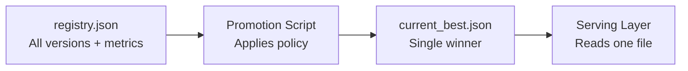
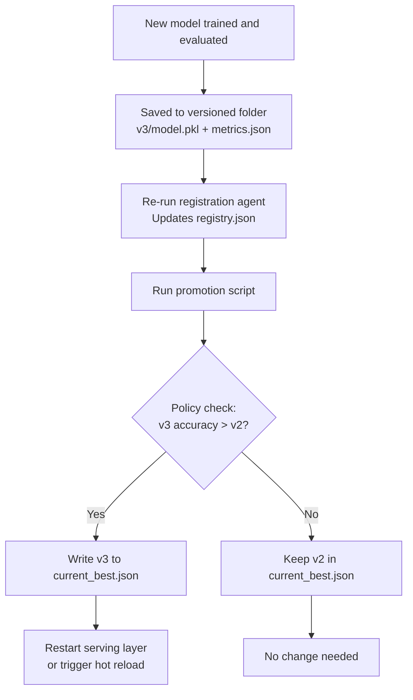

# Model Promotion and `current_best.json`

## Registry vs Promotion: Two Separate Concerns

The model registry (`registry.json`) is a **catalogue** — it lists all available versions with their metrics and paths. But it does not answer the operational question:

> Which model should production use **right now**?

**Promotion** is the act of evaluating registry candidates and declaring one as the **current best** for a specific purpose (e.g., production serving).

---

## The Decoupling Pattern



| Component | Knows about | Does NOT know about |
|-----------|------------|-------------------|
| Registry | All versions, all metrics | Which is "best" |
| Promotion script | Registry + policy rules | How to serve predictions |
| Serving layer | `current_best.json` only | Training, registry, promotion logic |

This decoupling is a core system design principle: each component has **one job**.

---

## Promotion Policy

The promotion script reads `registry.json`, applies a **policy**, and writes the winner to `current_best.json`.

### Example Policy: Highest Accuracy Wins

```python
def select_best_model(registry):
    best_version = None
    best_accuracy = -1
    for version, metadata in registry.items():
        accuracy = metadata["metrics"]["accuracy"]
        if accuracy > best_accuracy:
            best_accuracy = accuracy
            best_version = version
    return best_version
```

### Alternative Policies

| Policy | Rule |
|--------|------|
| Highest accuracy | `max(accuracy)` across versions |
| Minimum threshold | Accuracy ≥ 90% AND lowest log loss |
| Multi-metric | Weighted score: $0.7 \times \text{accuracy} + 0.3 \times (1 - \text{log\_loss})$ |
| Canary promotion | New version must beat champion by ≥ 1% on holdout |
| Human approval | Script recommends; human confirms via ticket |

**Key design point**: The policy is centralised in **one function**, making it easy to understand, modify, and audit.

---

## The `current_best.json` File

A single, unambiguous file the production service reads to know which model to load.

### Structure

```json
{
  "version": "v2",
  "path": "models/v2/model.pkl",
  "reason": "highest_accuracy",
  "metric_name": "accuracy",
  "metric_value": 0.91,
  "promoted_at": "2025-06-02T15:00:00Z"
}
```

### Why This Rich Metadata Matters

| Field | Purpose |
|-------|---------|
| `version` | Traceability — which model served this request |
| `path` | Direct path to load the artefact |
| `reason` | Audit trail — why this version was chosen |
| `metric_name` / `metric_value` | Evidence for the promotion decision |
| `promoted_at` | Timestamp for governance and rollback analysis |

---

## Promotion Workflow



### Rollback

To roll back to a previous version:

1. Edit `current_best.json` to point to the older version (e.g., `v1`)
2. Restart the serving service

No code changes. No registry changes. Just one file edit and a restart.

---

## Promotion vs Deployment Stages

Promotion (selecting `current_best.json`) is one step in the broader deployment pipeline:

| Stage | Action | Environment |
|-------|--------|-------------|
| Offline evaluation | Compare metrics on holdout set | Offline |
| Staging | Smoke tests, traffic replay | Staging |
| Promotion | Write winner to `current_best.json` | Decision point |
| Serving | Load model from `current_best.json` | Production |
| Canary / shadow | Route subset of traffic to challenger | Production (partial) |

File-based promotion handles the **decision** step. Canary and shadow handle **safe rollout**.

---

## Common Pitfalls / Exam Traps

- **Trap**: Promotion and deployment are the same thing. **Reality**: Promotion selects the best model; deployment loads it into the serving environment. They are sequential but distinct steps.
- **Trap**: The serving layer should read `registry.json` and apply promotion logic. **Reality**: Serving reads **only** `current_best.json`. Promotion logic stays in the promotion script.
- **Trap**: Highest accuracy is always the right promotion policy. **Reality**: Production policies may require minimum thresholds, fairness checks, latency constraints, or human approval.
- **Trap**: Rollback requires retraining. **Reality**: Rollback = edit `current_best.json` to a previous version + restart. The old model artefact is still in the registry.
- **Trap**: `current_best.json` should list all candidates. **Reality**: It contains **exactly one** winner. The registry holds all candidates.

---

## Quick Revision Summary

- **Promotion** decides which registry candidate is the current best for production
- Promotion policy is centralised in one function (e.g., highest accuracy wins)
- **`current_best.json`** is the single file the serving layer reads — rich metadata for audit
- Decoupling: registry (catalogue) → promotion (decision) → serving (execution)
- Rollback = edit `current_best.json` to previous version + restart service
- Promotion is one step in the broader staging → canary → production pipeline
