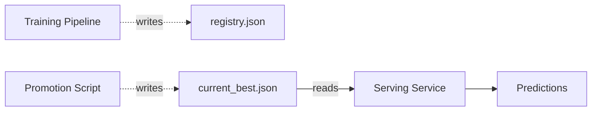
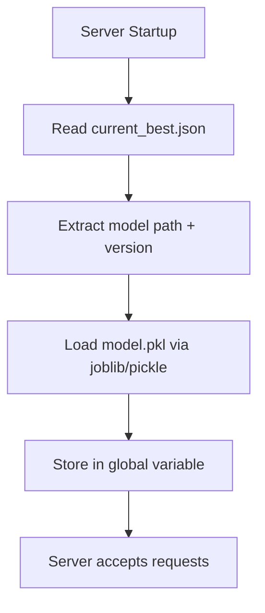
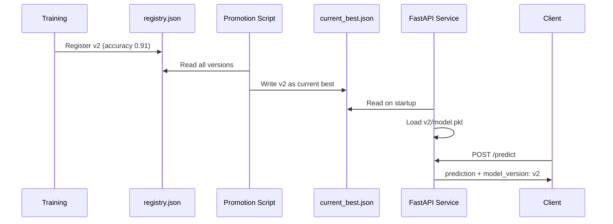

# Dynamic Model Serving with `current_best.json`

## Closing the Loop: Registry → Promotion → Serving

The full model lifecycle pipeline:

```
Train → Versioned folder → registry.json → Promotion → current_best.json → Serving
```

The final piece is a **serving service** that reads `current_best.json` at startup and loads the designated model — without knowing anything about training or promotion logic.

---

## The Decoupling Principle

A well-designed serving application has **one job**:

1. Read the configuration file (`current_best.json`)
2. Load the specified model artefact
3. Serve predictions

It should **not** know about:
- The training pipeline
- The full model registry
- Promotion policy logic
- How metrics were computed



**Power of decoupling**: Update the live model in production by changing one file and restarting — no service code changes.

---

## FastAPI Serving Pattern

### Request/Response Models

Standard Pydantic models define the API contract:

```python
class PredictionRequest(BaseModel):
    features: list[float]

class PredictionResponse(BaseModel):
    prediction: float
    model_version: str
```

### Model Loading at Startup

Use FastAPI **lifespan events** to load the model exactly once when the server starts:

```python
@asynccontextmanager
async def lifespan(app: FastAPI):
    load_model_from_best()  # Reads current_best.json, loads model.pkl
    yield

app = FastAPI(lifespan=lifespan)
```

**Why lifespan, not per-request loading?** Model loading is expensive (seconds for large models). Load once at startup; serve thousands of requests from the in-memory object.

### `load_model_from_best()` Logic



---

## API Endpoints

### Root / Metadata Endpoint

Returns information about the currently loaded model:

```json
GET /
{
  "status": "active",
  "model_version": "v2",
  "metric_name": "accuracy",
  "metric_value": 0.91,
  "promoted_at": "2025-06-02T15:00:00Z"
}
```

**Purpose**: Debugging and monitoring. Ask the live service: "Which version are you running?" without checking files on disk.

### Predict Endpoint

```json
POST /predict
Request:  { "features": [1.2, 3.4, 5.6] }
Response: { "prediction": 0.87, "model_version": "v2" }
```

**Critical**: The response includes `model_version` for **traceability**. Every prediction can be traced back to the exact model that produced it.

---

## End-to-End Flow



---

## Rollback Without Code Changes

To roll back from v2 to v1:

1. Edit `current_best.json`:
   ```json
   { "version": "v1", "path": "models/v1/model.pkl", ... }
   ```
2. Restart the FastAPI server
3. Verify via `GET /` — should show `model_version: v1`

No training rerun. No promotion script changes. No service code changes.

---

## Traceability Chain

Every prediction is traceable through the full chain:

```
Prediction response (model_version: v2)
    → current_best.json (promoted_at, reason: highest_accuracy)
    → registry.json (v2 metrics: accuracy 0.91)
    → models/v2/metrics.json (evaluated_on: 2025-06-01, dataset: holdout_v3)
    → Training run logs
```

This chain satisfies governance, audit, and debugging requirements.

---

## Extending to Multi-Model Serving

The same pattern scales to multi-model systems:

| Extension | How |
|-----------|-----|
| Multiple models per service | `current_best.json` lists models by task: `{ "fraud": "v3", "credit": "v1" }` |
| Per-tenant models | Router reads tenant-specific `current_best` file |
| Hot reload | Watch `current_best.json` for changes; reload without restart |
| A/B testing | Router reads experiment config; serving layer loads multiple models |

---

## Common Pitfalls / Exam Traps

- **Trap**: Load the model on every request for freshness. **Reality**: Model loading takes seconds. Load once at startup via lifespan events; restart to pick up new versions.
- **Trap**: The serving layer should implement promotion logic. **Reality**: Serving reads `current_best.json` only. Promotion is a separate offline step.
- **Trap**: Omitting `model_version` from prediction responses. **Reality**: Version in every response is essential for traceability, debugging, and audit.
- **Trap**: Hot reload is required for production. **Reality**: Restart-on-promotion is simpler and sufficient for most systems. Hot reload adds complexity.
- **Trap**: The metadata endpoint is optional. **Reality**: `GET /` confirming the active model version is critical for ops — it answers "what's running?" without SSH access.

---

## Quick Revision Summary

- Serving service reads **only** `current_best.json` — decoupled from training and promotion
- Load model once at startup via FastAPI lifespan events
- Two endpoints: metadata (`GET /`) and predict (`POST /predict`)
- Every prediction response includes `model_version` for traceability
- Rollback = edit `current_best.json` + restart — no code changes
- Pattern extends to multi-model, per-tenant, and A/B serving configurations
