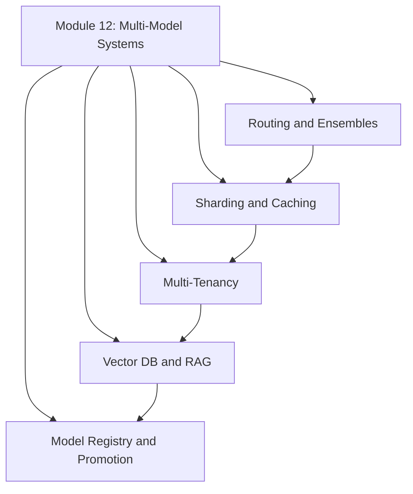
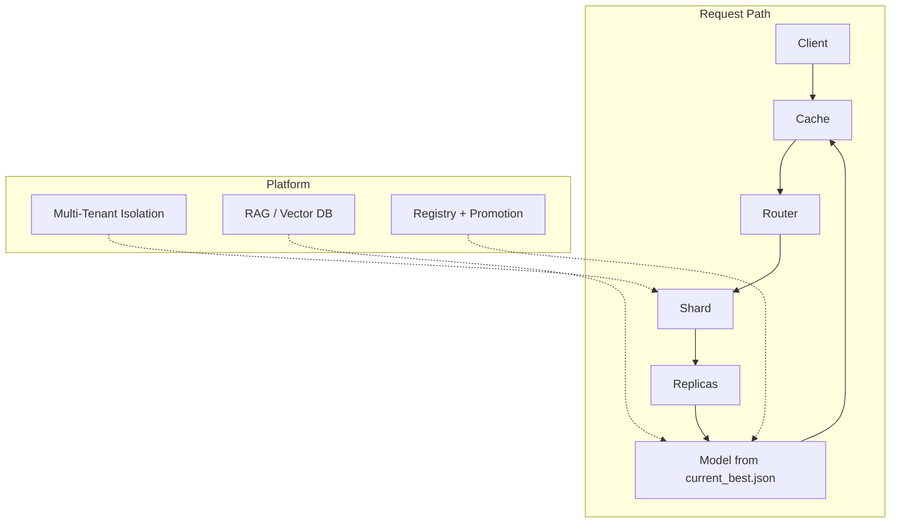

# Module 12 Summary: Multi-Model Systems at Scale

## The Central Thesis

In real production, **multi-model systems are the norm, not the exception**. A single model behind a single endpoint is a tutorial simplification. Mature platforms host many models — different versions, segments, languages, tasks, and tenants — orchestrated by routing, scaling, isolation, and retrieval patterns.

$$\text{Production ML} = \text{Models} + \text{Data} + \text{Retrieval Infrastructure} + \text{Governance}$$

---

## Topic Map



---

## Topic 1: Routing and Ensembles

### Routing — Choose One Model

| Strategy | Mechanism | Best for |
|----------|-----------|----------|
| Rule-based | Explicit if/else on region, language, tier | Day-one deployments |
| Learned router | Small model predicts best expert | Complex, high-volume routing |
| Fallback | Route to backup on uncertainty/failure | Safety and incident resilience |

### Ensembles — Combine Multiple Models

| Method | Combination | Cost |
|--------|------------|------|
| Averaging | Mean of probability scores | $N\times$ inference |
| Voting | Majority class label | $N\times$ inference |
| Stacking | Meta-model learns combination | $N\times$ inference + meta training |

**Trade-off**: Ensembles push accuracy up but also push latency, cost, and complexity up.

---

## Topic 2: Sharding, Replication, and Caching

### Scaling Primitives

| Pattern | Purpose |
|---------|---------|
| **Replication** | Multiple identical copies for throughput and fault tolerance |
| **Sharding** | Partition traffic/data for scale, isolation, and specialisation |
| **Caching** | Skip inference for repeated/similar requests |

### Composed Architecture

```
Cache → Router → Shard → Replicas → Model → Cache Write → Response
```

### Caching Layers

- **Output cache**: Final predictions
- **Embedding cache**: Reusable vectors for downstream tasks
- **Key design**: Content + model version + preprocessing version
- **Invalidation**: TTL, version-based, event-based

---

## Topic 3: Multi-Tenancy and Isolation

| Concept | Definition |
|---------|-----------|
| **Tenant** | Logical customer of the platform (team, unit, external client) |
| **Noisy neighbour** | Tenant over-consuming shared resources, degrading others |
| **Blast radius** | How far an incident spreads; limit via namespaces/clusters |
| **Per-tenant SLOs** | Different latency/availability targets per tenant tier |

### Isolation Stack

| Layer | Mechanism |
|-------|-----------|
| Logical | Namespaces, projects, separate clusters |
| Resource | Quotas (CPU/GPU/memory), priority classes |
| Data | Separate storage, RBAC/IAM |
| Observability | Per-tenant logs and metrics |

---

## Topic 4: Vector Databases and RAG

### Embeddings and Search

- Embeddings: dense vectors where similar items are nearby in space
- Similarity metrics: cosine, dot product, Euclidean
- Vector DB: stores (vector, metadata) pairs; fast ANN search

### ANN Trade-Off

$$\text{Speed} \uparrow \quad \text{vs} \quad \text{Recall@K} \uparrow$$

Tune index type, probes, and search depth per quality/latency requirements.

### RAG Pipeline

```
Query → Embed → Retrieve (vector DB) → Rerank → Generate (LLM) → Answer
```

RAG is **multi-model by design**: embedding model + vector DB + reranker + generator.

At scale, RAG uses the same patterns: sharding, caching, multi-tenancy, routing.

---

## Topic 5: Model Registry and Dynamic Serving

### File-Based Lifecycle

```
models/v1/ (model.pkl + metrics.json)
models/v2/ (model.pkl + metrics.json)
    ↓ registration agent
registry.json (catalogue of all versions)
    ↓ promotion script (policy: highest accuracy)
current_best.json (single winner)
    ↓ serving service (reads on startup)
FastAPI: GET / (metadata) + POST /predict (with model_version)
```

### Key Design Principles

- **Decoupling**: Each component has one job
- **Self-describing artefacts**: Metrics stored with model files
- **Traceability**: Every prediction includes `model_version`
- **Rollback**: Edit `current_best.json` + restart

---

## Integrated Production Mental Model



---

## Connections to Prior Modules

| Prior module | Connection |
|-------------|-----------|
| Module 5 (Monitoring) | Per-tenant dashboards, per-model metrics |
| Module 6 (Retraining) | New versions enter registry; promotion decides deployment |
| Module 8 (Trade-offs) | Accuracy–latency–cost framework applies to ensembles and caching |
| Module 9 (Feature governance) | Per-tenant feature access and lineage |
| Module 11 (Security/fairness) | Data isolation, access controls, audit trails |

---

## The Model Platform Engineer Mindset

The role expands beyond training models:

1. **Design routing** — which model handles which request
2. **Scale inference** — shard, replicate, cache
3. **Isolate tenants** — quotas, SLOs, blast-radius control
4. **Build retrieval** — embeddings, vector DBs, RAG pipelines
5. **Manage lifecycle** — registry, promotion, dynamic serving
6. **Govern everything** — traceability, rollback, per-tenant compliance

---

## Common Pitfalls / Exam Traps

- **Trap**: Production ML = deploy a model file. **Reality**: Production ML = orchestrated system of models, data, retrieval, caching, and governance.
- **Trap**: Start with learned routing and ensembles. **Reality**: Start with rule-based routing and a small model count. Add complexity when justified by metrics.
- **Trap**: Multi-tenancy is only for SaaS. **Reality**: Any platform with multiple teams sharing infrastructure is multi-tenant.
- **Trap**: RAG replaces model training. **Reality**: RAG augments models with retrieval. Both training and retrieval infrastructure are needed.
- **Trap**: Registry and promotion are the same step. **Reality**: Registry catalogues; promotion decides; serving executes. Three decoupled steps.

---

## Quick Revision Summary

- Multi-model systems are production norm: routing, ensembles, many versions/segments/tasks
- Scale via replication (throughput), sharding (partitioning), caching (deduplication)
- Multi-tenancy requires per-tenant SLOs, quotas, namespaces, and data isolation
- Vector DBs + ANN enable semantic search; RAG combines retrieval + generation
- Model lifecycle: versioned folders → registry.json → promotion → current_best.json → serving
- Production ML = models + data + retrieval + governance, not just a model file
- Model platform engineer: design, scale, isolate, retrieve, manage lifecycle, govern
