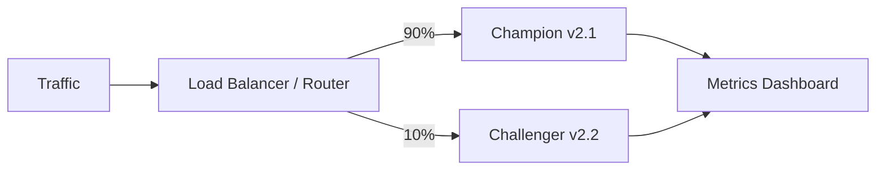

# Why Multi-Model Systems Exist

## From Single Model to Model Platform

A single-model deployment is the simplest mental model: train, export, serve. As products mature, one model cannot cover every segment, task, version, or tenant. Production platforms evolve into **multi-model systems** where routing and ensembles become core engineering patterns.

---

## Five Drivers of Multi-Model Architectures

### 1. Localization and Segmentation

Different geographies, languages, and customer tiers have different data distributions and regulatory requirements.

| Segment | Model strategy |
|---------|----------------|
| India users | Model trained on local transaction patterns |
| EU users | Model compliant with GDPR, trained on EU data |
| Enterprise tier | Higher-accuracy, higher-latency model |
| Free tier | Lightweight, cost-optimised model |

**Example**: A payment fraud system may use separate models for card-present vs card-not-present transactions, or for different currency regions.

### 2. Versioning and Experimentation

Running multiple model versions side by side is standard practice:

- **Canary deployment** — small traffic share to new version before full rollout
- **A/B testing** — compare champion vs challenger on live metrics
- **Champion–challenger** — production champion with shadow/challenger evaluation



### 3. Task Specialisation

A single "do everything" model is rarely optimal. Specialist models outperform generalists on narrow tasks:

| Task | Specialist model |
|------|------------------|
| Fraud scoring | Real-time anomaly detector |
| Credit risk | Long-horizon default predictor |
| Churn | Survival/time-to-churn model |
| Recommendations | Collaborative filtering + ranking |

### 4. Architecture and Scale

Models may be partitioned by:

- **Product line** — search vs ads vs recommendations
- **Tenant** — each customer on a SaaS ML platform
- **Use case** — batch scoring vs real-time inference

### 5. The Inevitable Outcome

The combination of segmentation, versioning, task splitting, and scale means a typical production platform hosts **dozens of models**, not one. Routing (which model?) and ensembles (how to combine?) become first-class engineering concerns.

---

## Two Core Patterns

### Routing

Choose **one** model per request. A router — often simple business logic — decides which model to invoke.

```
if region == "EU":     call model_eu
elif region == "IN":   call model_in
else:                  call model_global
```

### Ensembles

Call **multiple** models on the **same input**, then combine outputs:

- Average probability scores
- Majority vote on class labels
- Stacking with a meta-learner

| Pattern | Models called | Output |
|---------|---------------|--------|
| Routing | 1 | Single model's prediction |
| Ensemble | 2+ | Combined prediction |

Both patterns match requests with the right expertise and often improve accuracy and robustness compared to a single generalist model.

---

## Comparison: Single vs Multi-Model

| Dimension | Single model | Multi-model |
|-----------|-------------|-------------|
| Complexity | Low | High |
| Segment fit | One-size-fits-all | Per-segment optimisation |
| Experimentation | Hard (replace in place) | Easy (side-by-side versions) |
| Operational cost | Lower | Higher (more artefacts, monitoring) |
| Accuracy ceiling | Limited by generalisation | Higher via specialisation + ensembles |
| Failure isolation | Single point of failure | Fallback routes possible |

---

## Common Pitfalls / Exam Traps

- **Trap**: Multi-model means you need a learned router from day one. **Reality**: Start with simple rule-based routing (country, language, product). Learned routing is an advanced optimisation.
- **Trap**: Ensembles always beat routing. **Reality**: Ensembles improve accuracy but multiply latency and cost. Routing is cheaper when one specialist is sufficient.
- **Trap**: Canary and A/B are the same thing. **Reality**: Canary is a **gradual rollout** safety mechanism; A/B is a **controlled experiment** with statistical comparison. They overlap but serve different goals.
- **Trap**: Task specialisation requires separate services. **Reality**: Models can share infrastructure with routing logic; separate services are an implementation choice, not a requirement.

---

## Quick Revision Summary

- Multi-model systems arise from localization, versioning, task specialisation, and scale
- Typical production platforms run many models side by side, not one
- **Routing** = one model per request; **ensembles** = multiple models, combined output
- Canary, A/B, and champion–challenger are key multi-version patterns
- Specialist models (fraud, credit, churn, recs) outperform generalists on narrow tasks
- Both routing and ensembles aim to match requests with the right expertise for better accuracy and robustness
