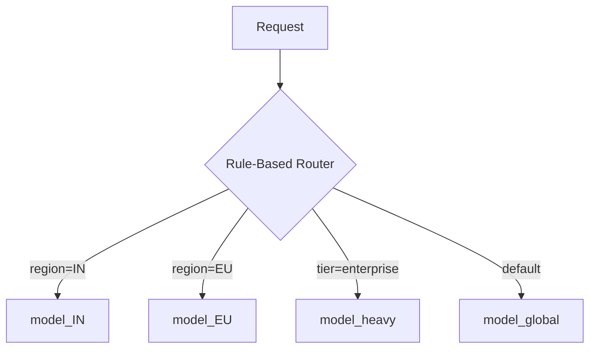
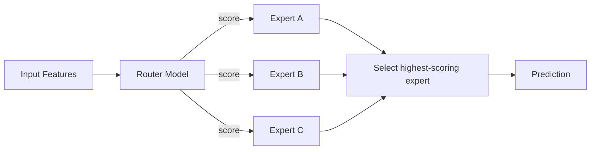

# Routing Strategies: Rule-Based and Learned Routers

## The Router's Job

A router sits between incoming requests and a pool of models. Its sole responsibility: **given this input, which model should handle it?** The answer can come from explicit business rules or from a learned model that predicts the best expert.

---

## Rule-Based Routing

The simplest and most common starting point. Rules are explicit, inspectable conditions that map request attributes to model endpoints.

### Common Routing Dimensions

| Dimension | Example rule |
|-----------|-------------|
| Country / region | India → `model_IN`, Europe → `model_EU`, else → `model_global` |
| Language | `lang=hi` → Hindi model, `lang=en` → English model |
| Product / tenant | Product A → `model_a`, Product B → `model_b` |
| Risk band / tier | High-value customers → accurate (slow) model; low-risk segment → lightweight model |



### Advantages

- **Explainable** — stakeholders can read and agree on rules
- **Fast to implement** — no training pipeline for the router itself
- **Auditable** — rules map directly to compliance and governance requirements
- **Debuggable** — when routing goes wrong, the rule is visible

### Disadvantages

- **Rule sprawl** — exceptions and special cases accumulate over time
- **Maintenance burden** — a 50-rule routing table becomes fragile
- **Missed patterns** — rules only capture what engineers explicitly encode

**Real-world example**: A global bank routes high-net-worth clients to a GPU-backed fraud model with 50 ms latency budget, while retail customers use a CPU-optimised model with a 200 ms budget.

---

## Learned Routing (Router–Expert Pattern)

Instead of hand-written `if/else` rules, train a **small router model** that predicts which expert (Model A, B, or C) is best suited for a given input.

### Mental Model

```
router(input) → {expert_A: 0.1, expert_B: 0.7, expert_C: 0.2}
→ route to expert_B
```

This pattern appears in:

- **Mixture of Experts (MoE)** — neural architectures where a gating network selects expert sub-networks
- **Domain-specific routing** — different models specialise on language, user behaviour, or product category
- **Cost-aware routing** — router learns when a cheap model suffices vs when an expensive model is needed



### Advantages

- **Discovers hidden patterns** — routing rules engineers would not hand-code
- **Adapts to data** — retrainable as distributions shift
- **Can optimise multi-objective goals** — accuracy, latency, cost jointly

### Disadvantages

- **Complexity** — additional model to train, deploy, monitor, and debug
- **Opacity** — harder to explain why a request went to Model B
- **Failure modes** — router errors cascade to wrong expert selection

---

## Comparison Table

| Aspect | Rule-based | Learned router |
|--------|-----------|----------------|
| Explainability | High | Low–medium |
| Setup effort | Low | High (needs training data) |
| Maintenance | Grows with exceptions | Retraining pipeline |
| Pattern discovery | Manual only | Automatic |
| Best starting point | Yes | After rules prove insufficient |
| Governance fit | Strong (auditable rules) | Requires additional monitoring |

---

## Practical Guidance

1. **Start with rules** — segment by country, language, or product on day one
2. **Keep model count small** — a dozen variants is already hard to maintain; document why each exists
3. **Measure per-route performance** — know the accuracy, latency, and cost of each route
4. **Document routing logic** — rules, models, and how they tie to SLOs and budgets
5. **Graduate to learned routing** only when rules are clearly insufficient and you have labelled routing decisions or proxy metrics

---

## Common Pitfalls / Exam Traps

- **Trap**: Learned routing is always better than rules. **Reality**: Rules are simpler, explainable, and sufficient for most early-stage systems. Learned routing adds complexity that must be justified.
- **Trap**: MoE in LLMs and router–expert in serving are unrelated. **Reality**: Both use a gating mechanism to select specialists; the serving pattern is the production analogue of MoE's train-time architecture.
- **Trap**: Routing by user ID hash is rule-based routing. **Reality**: Hash-based assignment is **sharding** (load distribution), not routing by business logic. Routing selects models by semantic attributes (region, risk, language).
- **Trap**: A router must always pick exactly one model. **Reality**: Routers can also direct to ensembles or fallback chains (covered in the next note).

---

## Quick Revision Summary

- **Rule-based routing** maps explicit conditions (region, language, tier) to model endpoints
- Rules are explainable and fast to build but suffer from sprawl and missed patterns
- **Learned routing** trains a small model to predict the best expert per input
- Learned routers appear in MoE architectures and cost-aware serving systems
- Start with rules; graduate to learned routing when complexity is justified
- Always measure per-route performance and document routing logic against SLOs
