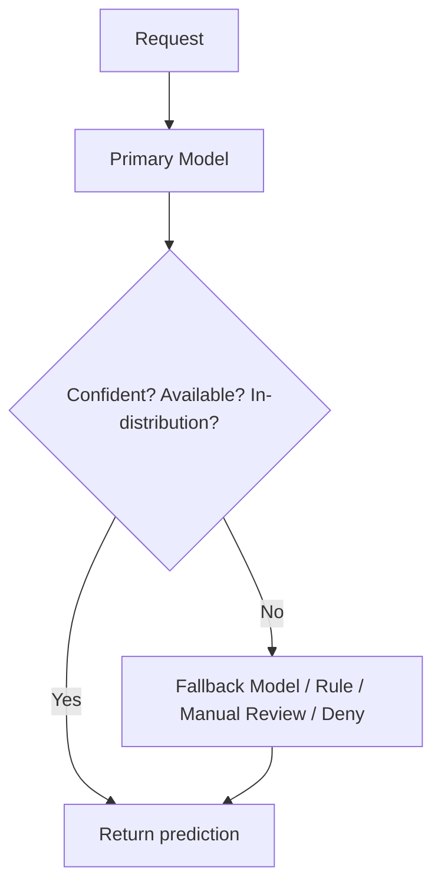
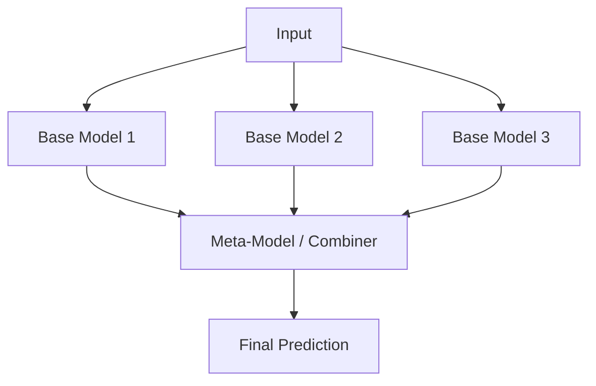
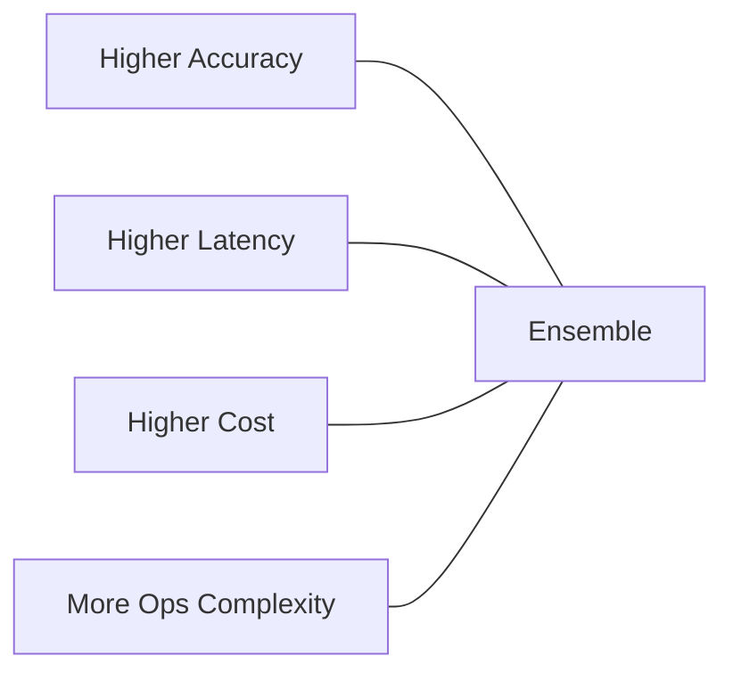

# Fallback Models, Ensembles, and the Accuracy–Cost Trade-Off

## Fallback Routing: Safety Nets for Production

The primary model will not always be the right choice. Fallback routing handles edge cases gracefully rather than failing catastrophically.

### When to Route to a Fallback

| Trigger | Example fallback |
|---------|-----------------|
| Low confidence / high uncertainty | Simpler, more conservative model |
| Out-of-distribution (OOD) input | Rule-based system or default deny |
| Primary service down / timeout | Backup model or cached response |
| Incident / degraded mode | Manual review queue or safe default |

**Intuition**: Fallbacks are airbags, not performance optimisers. The goal is **predictable behaviour** during incidents or unusual inputs, not marginal accuracy gains.



**Real-world example**: A credit-scoring API routes OOD applicants (missing key features) to a rule-based tier assignment instead of the neural model, avoiding nonsensical scores.

---

## Ensembles: Combining Multiple Models

Instead of choosing one model, call **multiple models on the same input** and combine their outputs.

### Three Common Combination Strategies

#### 1. Averaging

Average probability scores from $N$ models:

$$\hat{p} = \frac{1}{N} \sum_{i=1}^{N} p_i$$

Best for: regression and probabilistic classifiers where calibrated scores matter.

#### 2. Majority Voting

Each model votes for a class; the class with the most votes wins.

Best for: hard classifiers where individual models may disagree.

#### 3. Stacking

A **meta-model** (stacker) learns how to combine base model outputs:

```
base_models(input) → [pred_1, pred_2, pred_3] → meta_model → final_prediction
```

Best for: when base models have complementary strengths and you have data to train the meta-learner.



### Why Ensembles Work

- **Diversity reduces variance** — uncorrelated errors cancel out
- **Robustness to single-model bugs** — one bad model does not dominate
- **Better generalisation** — especially when base models use different algorithms or features

---

## The Cost–Benefit Trade-Off

Ensembles push the four-way production tension:

| Force | Ensemble effect |
|-------|----------------|
| **Accuracy** | Usually increases |
| **Latency** | Increases (sequential or parallel calls to $N$ models) |
| **Cost** | Increases ($N\times$ inference compute per request) |
| **User experience** | May degrade if latency budget is exceeded |



### When Ensembles Are Worth It

- High-stakes decisions (fraud, medical, credit) where accuracy justifies cost
- Models are diverse (different algorithms, features, or training data)
- Latency budget accommodates parallel inference (e.g., $N$ models on separate GPUs)

### When to Skip Ensembles

- Tight latency SLOs (< 50 ms)
- Cost-sensitive, high-volume endpoints
- Base models are highly correlated (ensemble gain is minimal)

---

## Practical Engineering Tips

1. **Start with simple rule-based routing** — country, language, product segmentation
2. **Keep model count small initially** — beyond ~12 variants, maintenance dominates
3. **Measure per-model and per-segment performance** — justify every route and ensemble
4. **Document routing and ensemble logic** — which rules, which models, how they relate to SLOs and cost budgets
5. **Use fallbacks for safety**, ensembles for accuracy — different tools for different goals

---

## Comparison: Routing vs Fallback vs Ensemble

| Pattern | Models invoked | Primary goal |
|---------|---------------|--------------|
| Routing | 1 (selected) | Match request to best expert |
| Fallback | 1 (backup) | Safety during failure/OOD |
| Ensemble | 2+ (all) | Accuracy and robustness |

---

## Common Pitfalls / Exam Traps

- **Trap**: Fallback models should be more accurate than the primary. **Reality**: Fallbacks prioritise **safety and availability** — they may be simpler or more conservative, not more accurate.
- **Trap**: Ensembles always improve accuracy. **Reality**: Gains require **diverse** base models. Correlated models waste compute with minimal benefit.
- **Trap**: Stacking and voting are interchangeable. **Reality**: Voting is model-agnostic and needs no training; stacking requires a meta-learner trained on held-out predictions.
- **Trap**: Run ensembles sequentially to save resources. **Reality**: Sequential execution multiplies latency; parallel execution is standard but needs $N$ times the compute capacity.
- **Trap**: The accuracy–latency–cost triangle is new to this module. **Reality**: It is the same framework from earlier modules — ensembles are one lever that shifts the balance toward accuracy at the expense of latency and cost.

---

## Quick Revision Summary

- **Fallback routing** handles uncertainty, OOD inputs, and service failures with safe alternatives
- **Ensembles** call multiple models and combine via averaging, voting, or stacking
- Ensembles improve accuracy and robustness when base models are diverse
- Trade-off: ensembles increase latency, cost, and operational complexity
- Start with rule-based routing; keep model count manageable; measure per-segment performance
- Document all routing, fallback, and ensemble logic against SLOs and cost budgets
