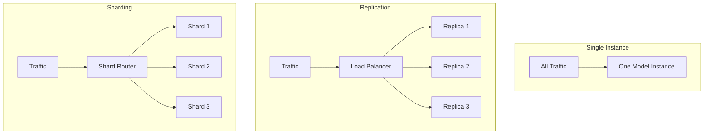
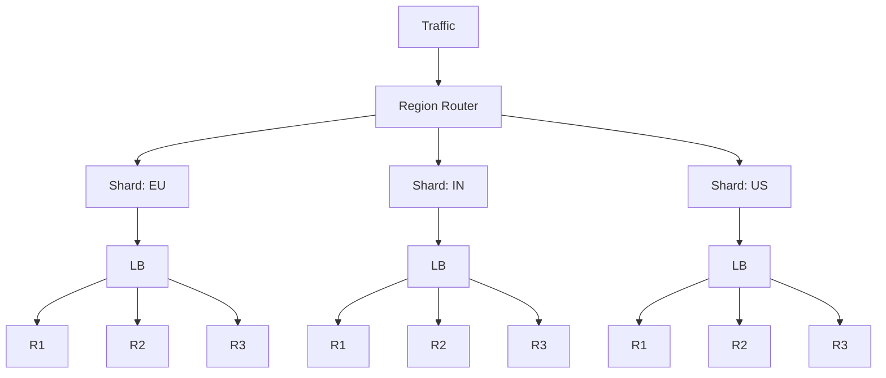

# Scaling Inference: Sharding and Replication

## The Single-Instance Ceiling

The simplest serving architecture — one model on one machine — works until it doesn't. As traffic grows:

- **Latency increases** — requests queue behind each other
- **Timeouts multiply** — clients abandon slow responses
- **Single point of failure** — one crash takes down all inference
- **Hard QPS ceiling** — one machine can only process so many queries per second

**Intuition**: A single checkout counter works for a small store. A supermarket needs multiple counters (replication) and possibly separate departments (sharding).

---

## Two Scaling Primitives

| Primitive | What it does | Analogy |
|-----------|-------------|---------|
| **Replication** | Multiple copies of the **same** model | More checkout counters |
| **Sharding** | Divide traffic/data into **subsets**, each handled by a dedicated subset of servers | Separate departments per region |

---

## Replication in Detail

Run $N$ identical copies of the same model. A load balancer distributes requests across replicas.

**Benefits**:
- Higher **throughput** — $N$ replicas handle roughly $N\times$ QPS
- **Fault tolerance** — if one replica fails, others continue serving
- **No request affinity** — any replica can handle any request

**Limitations**:
- Does not help if a **single request** is too slow (need model optimisation, not replication)
- All replicas must stay **in sync** on model version
- Total memory/GPU cost scales linearly with replica count

**Real-world example**: A fraud-scoring API runs 5 replicas behind an AWS ALB. Peak traffic of 10,000 QPS is spread evenly; losing one replica drops capacity by 20%, not 100%.

---

## Sharding in Detail

Divide traffic or data into pieces. Each **shard** owns a subset and may have its own resources, storage, and even model version.

**Benefits**:
- **Horizontal scale** beyond one machine's capacity
- **Isolation** — a spike or failure on one shard does not necessarily affect others
- **Specialisation** — different shards can run different models or configurations

**Shard assignment formula** (hash-based):

$$\text{shard} = \text{hash}(\text{user\_id}) \bmod N$$

where $N$ is the number of shards.

---

## Replication vs Sharding

| Aspect | Replication | Sharding |
|--------|------------|----------|
| Model copies | Identical | May differ per shard |
| Traffic split | Random / round-robin | Deterministic (hash or attribute) |
| Request affinity | None needed | Often required (same user → same shard) |
| Primary goal | Throughput + reliability | Scale + isolation + specialisation |
| Rebalancing | Add/remove replicas easily | Changing $N$ shards requires data migration |

**In practice, combine both**: e.g., 3 shards by region, each with 3 replicas = 9 total instances.

---

## When to Use Which

| Scenario | Pattern |
|----------|---------|
| Need more QPS, same model | Replication |
| Different models per region/language | Sharding by attribute |
| Even load, no specialisation | Hash sharding |
| Fault isolation between tenants | Sharding by tenant |
| Both throughput and specialisation | Shard + replicate within each shard |

---

## Common Pitfalls / Exam Traps

- **Trap**: Replication and sharding are interchangeable. **Reality**: Replication spreads identical work; sharding partitions different work. They solve different problems and are often combined.
- **Trap**: Adding replicas always fixes latency. **Reality**: Replication fixes **throughput** and availability. A single slow inference still takes the same time per request.
- **Trap**: Sharding eliminates the need for load balancing. **Reality**: Within each shard, replicas still need a load balancer.
- **Trap**: Scaling vertically is always cheaper than sharding. **Reality**: Vertical scaling hits hardware ceilings; sharding is the path to unbounded horizontal growth.

---

## Quick Revision Summary

- Single-instance serving hits latency, timeout, and QPS ceilings
- **Replication** = multiple identical model copies behind a load balancer
- **Sharding** = divide traffic/data into subsets, each with dedicated resources
- Hash sharding: $\text{shard} = \text{hash}(\text{id}) \bmod N$ for even distribution
- Combine both: shards for partitioning, replicas within shards for throughput and fault tolerance
- Replication improves throughput/reliability; sharding enables scale, isolation, and specialisation
