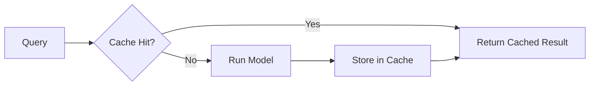
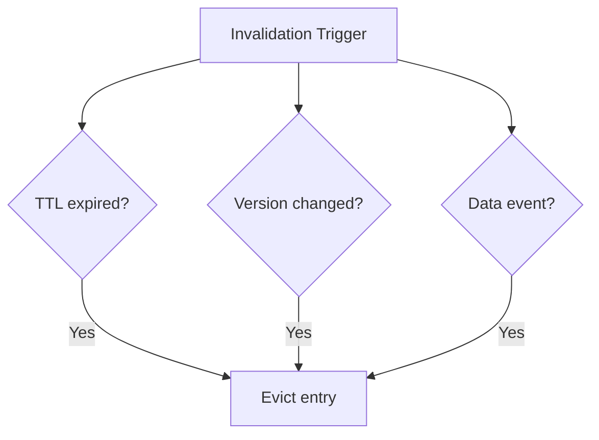

# Caching Model Results and Embeddings

## Why Cache Inference?

Model inference — especially for large deep learning models — is expensive in both **latency** and **compute cost**. Yet many production workloads exhibit high repetition:

- Same user asking the same question repeatedly
- Same product page rendered thousands of times per minute
- Identical feature vectors scored in batch pipelines

Caching lets you **skip the model entirely** when a recent, valid result already exists.

**Intuition**: Caching is memoisation at system scale. If you've computed $f(x)$ recently and $x$ hasn't changed, return the stored answer.

---

## Two Caching Layers

### 1. Output Caching

Store the **final model prediction** for a given input. On cache hit, return immediately — no model invocation.

| Benefit | Impact |
|---------|--------|
| Latency | Cache reads are microseconds vs milliseconds for inference |
| Cost | Fewer GPU/CPU inference calls |
| Throughput | Frees model capacity for cache misses |

**Best for**: Heavy models, bursty workloads, idempotent predictions (recommendations, classifications on static features).

### 2. Embedding Caching

Store the **vector representation** produced by an embedding model. Reuse across many downstream tasks.

```
text → embedding model → vector (cached) → search / RAG / recommendation / clustering
```

**Best for**: Large language model embeddings where the encoding step dominates cost. One cached embedding serves search, RAG, deduplication, and clustering.



---

## Cache Key Design

A cache key must uniquely identify **what** was computed and **how** it was computed.

### Required Key Components

| Component | Why it matters |
|-----------|---------------|
| Content or ID | Identifies the input (text hash, user ID, item ID) |
| Model version | V1 and V2 embeddings must not share a key |
| Preprocessing version | Feature pipeline changes invalidate cached results |

**Example key structure**:

```
cache_key = hash(input_text) + ":embed_model_v3" + ":preproc_v2"
```

**Failure mode without version in key**: Upgrade model from V1 to V2, but cache still returns V1 embeddings under the old key → silent quality degradation.

---

## Expiration and Invalidation Strategies

You cannot keep cache entries forever. Three standard strategies:

### Time-Based Expiry (TTL)

Entry expires after a fixed duration (e.g., 10 minutes, 1 hour).

$$\text{valid} \iff (t_{\text{now}} - t_{\text{cached}}) < \text{TTL}$$

**Use when**: Staleness is acceptable within a known window (product recommendations, search results).

### Version-Based Invalidation

When model or preprocessing version changes, use **new cache keys**. Old entries naturally become unreachable.

**Use when**: Model deployments — no need to purge; new version = new namespace.

### Event-Based Invalidation

When underlying data changes (user profile update, price change, inventory shift), explicitly clear or refresh affected entries.

**Use when**: Data-driven predictions where freshness is business-critical (dynamic pricing, personalised feeds).



---

## Freshness vs Performance Trade-Off

| Use case | Freshness need | Typical TTL |
|----------|---------------|-------------|
| Static FAQ answers | Low | Hours–days |
| Product recommendations | Medium | 10–60 min |
| Fraud scoring | High | Seconds–none |
| User-specific feed | High | Event-based invalidation |

The model engineer must decide: **how long is it safe to serve stale results?** and **which use cases absolutely require fresh answers?**

---

## Common Pitfalls / Exam Traps

- **Trap**: Cache keys need only the input content. **Reality**: Must include **model version** and **preprocessing version** to avoid serving stale artefacts after upgrades.
- **Trap**: Longer TTL always improves performance. **Reality**: Long TTLs increase staleness risk. Fraud and safety systems often cannot cache at all.
- **Trap**: Embedding cache and output cache are the same thing. **Reality**: Embedding cache stores intermediate vectors reused across tasks; output cache stores final predictions.
- **Trap**: Event-based invalidation is optional. **Reality**: For user-specific or price-sensitive predictions, missing invalidation causes visible business errors.
- **Trap**: Caching eliminates the need for scaling. **Reality**: Caching reduces load but does not replace replication/sharding for cache misses or cold-start traffic.

---

## Quick Revision Summary

- Inference caching skips expensive model calls when recent results exist
- **Output caching** stores final predictions; **embedding caching** stores reusable vectors
- Cache keys must include content/ID + model version + preprocessing version
- Three invalidation strategies: TTL, version-based (new keys), event-based (data changes)
- Always trade off freshness vs performance per use case
- Caching dramatically reduces latency and cost for repeated or similar requests
