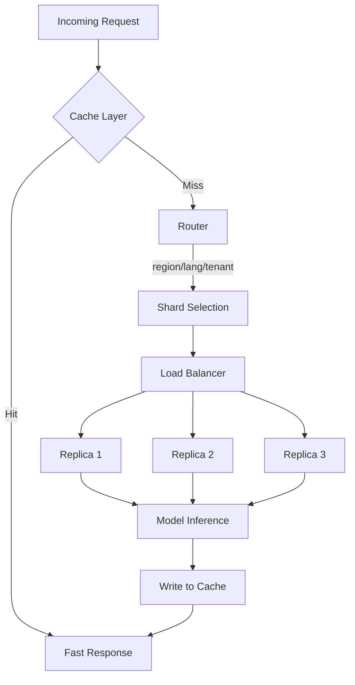

# Combining Routing, Sharding, and Caching at Scale

## The Production Inference Stack

Individual patterns — routing, sharding, replication, caching — are building blocks. At scale, they compose into a layered architecture that keeps latency low, throughput high, and SLOs predictable as traffic and model count grow.

---

## Layer-by-Layer Architecture

### Layer 1: Cache (Front)

Sits closest to the client. Checks for cached outputs or embeddings **before** any routing or model work.

- Cache keys include model version and preprocessing version
- TTL, version-based, and event-based invalidation policies apply
- Cache hits bypass all downstream layers — fastest path

### Layer 2: Router

On cache miss, the router decides **which shard or model** to target based on:

- Region, language, tenant
- Risk band, product line
- A/B experiment assignment
- Fallback conditions

### Layer 3: Shard

Each shard owns a subset of traffic or data. Shards may host:

- Different model versions tuned to local data
- Different infrastructure configurations or SLOs
- Dedicated resources for enterprise vs retail segments

### Layer 4: Replication (Within Shard)

Inside each shard, multiple replicas of the model handle load for **reliability and throughput**. A load balancer distributes requests across replicas.

---

## End-to-End Request Flow

| Step | Component | Action |
|------|-----------|--------|
| 1 | Cache | Check for existing result; return on hit |
| 2 | Router | Select shard/model based on request attributes |
| 3 | Shard | Route to correct partition |
| 4 | Load balancer | Distribute across replicas within shard |
| 5 | Model | Run inference |
| 6 | Cache | Store result for future requests |
| 7 | Response | Return prediction to client |

---

## Why This Composition Matters

| Challenge | Pattern that addresses it |
|-----------|--------------------------|
| Repeated requests | Caching |
| Many models/versions | Routing |
| Traffic exceeds single machine | Sharding |
| Replica failure / QPS ceiling | Replication |
| Per-region specialisation | Attribute-based sharding + routing |
| Cost control | Caching + lightweight routing for low-priority segments |

**Real-world example**: A global recommendation API caches product embeddings (Layer 1), routes EU users to an EU-tuned shard (Layers 2–3), load-balances across 4 replicas in that shard (Layer 4), and stores the final ranking in the output cache before responding.

---

## Scaling Arithmetic

If you have $S$ shards, each with $R$ replicas:

$$\text{total instances} = S \times R$$

Example: 3 region shards $\times$ 3 replicas each = 9 model instances.

Capacity planning must account for:
- Per-shard traffic distribution (watch for hot shards)
- Cache hit rate (reduces effective load on model instances)
- Failover capacity (can remaining replicas handle a shard losing one replica?)

---

## SLO Predictability

The composed stack makes SLOs more predictable because:

1. **Caching** absorbs repeated load spikes
2. **Sharding** isolates noisy segments
3. **Replication** provides headroom and fault tolerance
4. **Routing** ensures each segment gets the right model for its latency/accuracy budget

---

## Connection to Later Topics

This architecture extends naturally to:

- **Multi-tenant systems** — shard or namespace per tenant
- **Vector databases and RAG** — cache embeddings, shard indexes by domain/tenant
- **Model registry** — router reads `current_best.json` to know which model version each shard should load

---

## Common Pitfalls / Exam Traps

- **Trap**: Add caching last as an optimisation. **Reality**: Cache layer design (key schema, TTL) should be planned **with** routing and sharding, not bolted on.
- **Trap**: One global cache for all shards. **Reality**: Cache keys must account for shard-specific model versions and configurations.
- **Trap**: Routing happens after sharding. **Reality**: Router typically selects the shard **first**; load balancing within the shard is a separate step.
- **Trap**: This architecture only applies to large hyperscalers. **Reality**: Even modest systems benefit from cache + 2 replicas; the patterns scale from startup to enterprise.

---

## Quick Revision Summary

- Production inference stacks compose: cache → router → shard → replicas → model
- Cache sits in front to serve repeated requests without inference
- Router selects shard/model by region, language, tenant, or experiment
- Within each shard, replicas handle throughput and fault tolerance
- Total instances = shards $\times$ replicas per shard
- This layered design keeps latency, throughput, and SLOs predictable at scale
