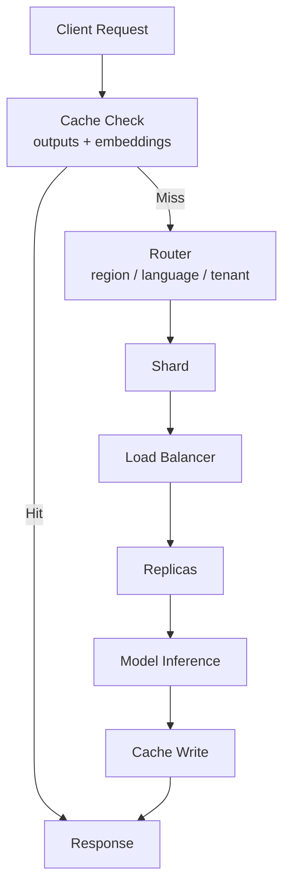
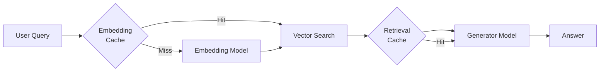

# Integrated Architecture: Routing, Sharding, Replication, and Caching

## The Complete Production Pattern

Large-scale ML inference is not a single technique — it is a **composed system** where routing, sharding, replication, and caching each solve a distinct bottleneck. Together they form the standard blueprint for scalable model serving.

---

## Reference Architecture



### Component Responsibilities

| Component | Responsibility |
|-----------|---------------|
| **Router** | Decide which shard or model variant handles this request |
| **Shard** | Partition traffic/data; may host specialised models |
| **Replicas** | Multiple instances within a shard for throughput and reliability |
| **Cache** | Store outputs and embeddings with versioned keys for fast reuse |

---

## How the Layers Interact

### Step 1: Cache First

Before any routing logic, check whether a valid cached result exists. This is the cheapest operation and eliminates downstream load entirely on hits.

### Step 2: Route to Shard/Model

On cache miss, the router applies business rules or learned routing to select the correct shard. Routing dimensions include:

- Geographic region
- Language
- Tenant identifier
- Product line or risk band

### Step 3: Replicate Within Shard

The selected shard may contain multiple replicas. A load balancer distributes the request across them, ensuring no single instance is overwhelmed.

### Step 4: Infer, Cache, Respond

The model produces a prediction. The result is written to cache (with proper key including model version) and returned to the client.

---

## Design Properties

| Property | How the stack delivers it |
|----------|--------------------------|
| **Low latency** | Cache hits + replica proximity |
| **High throughput** | Replication + sharding |
| **Predictable SLOs** | Isolation via shards, headroom via replicas |
| **Cost control** | Caching reduces inference calls |
| **Fault tolerance** | Replica redundancy + shard isolation |

---

## Scaling Example

A SaaS ML platform serving 50,000 QPS across 4 regions:

```
4 region shards × 5 replicas each = 20 model instances
Cache hit rate: 40% → effective inference load: 30,000 QPS
Per-replica load: 30,000 / 20 = 1,500 QPS (manageable)
```

Without caching: 50,000 / 20 = 2,500 QPS per replica — likely exceeding SLO.

---

## Extension to Multi-Tenancy and RAG

This same blueprint extends to:

### Multi-Tenant Platforms

- Router directs by `tenant_id`
- Each tenant gets a shard or namespace
- Per-tenant SLOs and resource quotas

### RAG Pipelines

- Cache embedding vectors and retrieval results
- Shard vector indexes by domain (support docs, product KB, internal wiki)
- Replicate embedding and generation models independently



---

## Operational Checklist

- [ ] Cache keys include model version and preprocessing version
- [ ] Router rules documented and tied to SLOs
- [ ] Shard capacity monitored for hot spots
- [ ] Replica count sized for failover (N-1 survivability)
- [ ] Per-shard and per-replica latency/error metrics in dashboards
- [ ] Cache hit rate tracked as a first-class metric

---

## Common Pitfalls / Exam Traps

- **Trap**: Caching replaces the need for replicas. **Reality**: Cache helps on hits; misses still need replica capacity. Both are necessary.
- **Trap**: Sharding and routing are redundant. **Reality**: Routing is the **decision logic**; sharding is the **infrastructure partition**. Routing selects the shard.
- **Trap**: This architecture is only for inference. **Reality**: The same pattern applies to embedding services, vector search, and RAG pipelines.
- **Trap**: One cache layer is sufficient for all data types. **Reality**: Output cache and embedding cache have different key schemas, TTLs, and invalidation triggers.

---

## Quick Revision Summary

- Production ML serving composes routing + sharding + replication + caching
- Router selects shard/model; replicas handle load within each shard
- Cache sits in front with versioned keys for outputs and embeddings
- Together: low latency, high throughput, predictable SLOs, controlled cost
- Same pattern extends to multi-tenant platforms and RAG systems
- Monitor cache hit rate, shard balance, and per-replica load as first-class metrics
