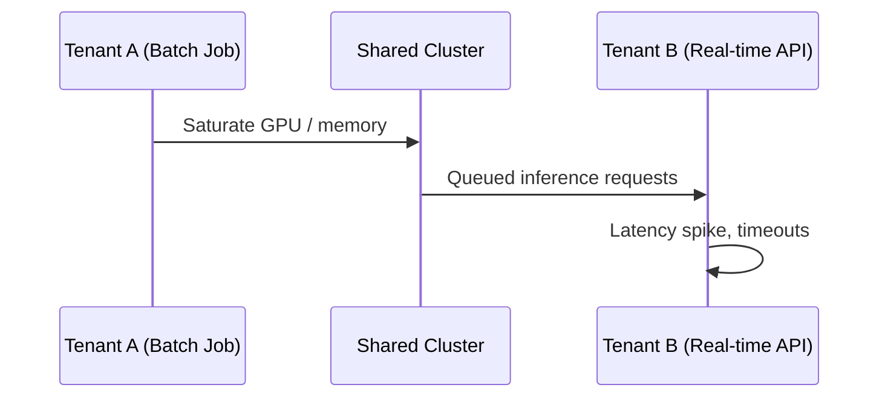

# Multi-Tenant ML Platforms and the Noisy Neighbour Problem

## What Is Multi-Tenancy?

A real ML platform rarely serves a single team. Multiple **tenants** — product teams, business units, or external customers — share the same infrastructure: compute, storage, networking, deployment tools, monitoring, and logging.

**Intuition**: Multi-tenancy is like an apartment building. Everyone shares the foundation, plumbing, and electricity, but each tenant has their own unit with boundaries.

---

## Defining a Tenant

A **tenant** is a logical customer of the ML platform:

| Tenant type | Example |
|-------------|---------|
| Internal product team | Search, recommendations, fraud detection |
| Business unit | Retail, enterprise, small business |
| External customer | SaaS ML platform subscriber |

Each tenant typically has:
- Its own **models** and training pipelines
- Its own **data** and feature stores
- Its own **SLOs** (latency, availability targets)
- Its own **budget** (compute spend, GPU hours)

But all tenants run on the **same shared hardware and infrastructure**.

---

## The Shared Platform Model

```mermaid
flowchart TB
    subgraph Platform Layer
        COMP[Compute / GPU]
        STOR[Storage]
        NET[Networking]
        TOOLS[Deploy / Monitor / Log]
    end
    T1[Tenant A: Fraud] --> Platform Layer
    T2[Tenant B: Recommendations] --> Platform Layer
    T3[Tenant C: External SaaS] --> Platform Layer
```

### What the Platform Provides

- Heavy infrastructure (clusters, GPUs, object storage)
- Common tooling (CI/CD, model registry, monitoring dashboards)
- Shared networking and load balancing

### What Tenants Bring

- Their own models and pipelines
- Their own traffic patterns (steady, spiky, batch-heavy)
- Their own priority levels (mission-critical vs best-effort)

---

## The Core Tension

| Force | Description |
|-------|-------------|
| **Efficiency** | Sharing resources reduces cost and idle capacity |
| **Safety** | Tenants must not interfere with each other |

Without isolation, one tenant's behaviour degrades everyone else's experience.

---

## The Noisy Neighbour Problem

A **noisy neighbour** is a tenant that over-consumes shared resources (CPU, GPU, memory, network bandwidth) to the point that other tenants suffer:

- Latency increases for unrelated services
- Request queues build up
- Timeouts cascade to downstream systems
- Users of other teams get a worse experience

### Concrete Example

```
Tenant A launches a large batch scoring job on the shared GPU cluster
    → GPU memory saturated
    → Tenant B's real-time fraud API latency jumps from 80 ms to 800 ms
    → Tenant B's SLO breached
    → Incident declared — but the root cause is another tenant's batch job
```



---

## Why This Matters for Model Engineering

Multi-tenancy is not just an infrastructure concern — it directly affects:

- **SLO compliance** — one tenant's spike breaks another's guarantees
- **Cost attribution** — who pays for the GPU hours consumed?
- **Incident response** — root cause may be cross-tenant, not a model bug
- **Governance** — data leaks between tenants are catastrophic

The central engineering challenge:

> How do we let tenants share resources efficiently while keeping noisy neighbours under control?

---

## Isolation Strategies Preview

The next notes cover the full isolation toolkit:

| Layer | Mechanism |
|-------|-----------|
| Logical | Namespaces, projects, separate clusters |
| Resource | Quotas, limits, priority classes |
| Data | Separate storage, access controls (RBAC/IAM) |
| Observability | Per-tenant logs and metrics |

---

## Common Pitfalls / Exam Traps

- **Trap**: Multi-tenancy only applies to external SaaS products. **Reality**: Internal platforms with multiple product teams are multi-tenant too.
- **Trap**: Noisy neighbour is a network concept only. **Reality**: It applies to **any shared resource** — GPU, memory, CPU, disk I/O, network.
- **Trap**: Adding more hardware eliminates noisy neighbours. **Reality**: Without quotas and isolation, the new capacity is simply consumed faster. Governance is essential.
- **Trap**: Tenants should share models to save cost. **Reality**: Tenants share **infrastructure**, not necessarily models or data. Model sharing is a separate design decision with privacy implications.

---

## Quick Revision Summary

- A **tenant** is a logical customer of the ML platform (team, business unit, external client)
- Multi-tenancy shares infrastructure for efficiency but requires isolation for safety
- The **noisy neighbour problem**: one tenant over-consumes shared resources, degrading others
- Symptoms: latency spikes, queue buildup, timeouts, broken SLOs for unrelated tenants
- Isolation strategies span logical, resource, data, and observability layers
- Multi-tenancy connects directly to SLOs, governance, monitoring, and responsible AI
