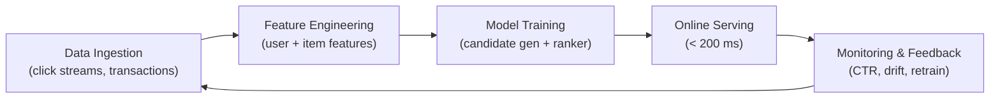

# End-to-End Architecture: Recommendation Systems

## Why This Matters

Recommendation systems sit at the intersection of machine learning, data engineering, and product design. A typical e-commerce homepage shows a "Recommended for You" carousel — a deceptively simple UI backed by a complex production system. The core objective is to **show the right item to the right user at the right time**, usually within a **100–200 ms latency budget** per page load.

This is not a single-model problem. It requires orchestrating data ingestion, feature engineering, model training, online serving, and continuous monitoring into one coherent architecture.

---

## The Production ML Lifecycle in One System

Every concept from prior modules — serving patterns, feature stores, retraining pipelines, monitoring, governance — converges here. A recommendation system is the canonical example of a full MLOps stack in action.

---

## Key Constraints at a Glance

| Constraint | Typical Target | Why It Matters |
|------------|----------------|----------------|
| Latency | 100–200 ms end-to-end | Users abandon slow pages; carousel must render with the rest of the UI |
| Personalisation | Per-user behaviour signals | Generic lists underperform; past clicks/purchases drive relevance |
| Freshness | React to recent activity | A user who just browsed electronics should see electronics, not yesterday's fashion picks |
| Business rules | Stock, promotions, diversity | ML score alone is insufficient; product and inventory constraints apply |

---

## Architectural Layers (Preview)

A production recommendation system decomposes into four cooperating layers:

1. **Data layer** — raw event ingestion (views, clicks, purchases) into a data lake or warehouse
2. **Feature and serving layer** — user/item features via a feature store (offline for training, online for inference)
3. **Model layer** — two-stage pipeline: candidate generation (recall) then ranking (precision)
4. **Online path** — request-time orchestration from API gateway to UI response

Each layer is explored in depth in the subsequent notes of this module.

---

## Real-World Context

Consider an Amazon or Flipkart homepage load:

- The user's session history, device type, and time of day all influence recommendations
- Millions of SKUs must be narrowed to ~10 visible items in under 200 ms
- A/B tests continuously compare ranking models
- Monitoring tracks click-through rate (CTR), conversion, and system latency simultaneously

Understanding this end-to-end picture is prerequisite for ML system design interviews and production engineering roles.

---

## Common Pitfalls / Exam Traps

- **Treating recommendations as a single-model problem** — production systems always use at least two stages (candidate generation + ranking); a single model cannot score millions of items in 200 ms.
- **Ignoring latency budget** — offline accuracy metrics are meaningless if the online path cannot meet P95 latency targets.
- **Confusing freshness with retraining frequency** — features can be updated hourly while the model is retrained weekly; these are independent concerns.
- **Skipping business rules** — even a perfect ranker must filter out-of-stock items and enforce diversity; post-processing is not optional.

---

## Quick Revision Summary

- Recommendation systems must show the right item to the right user within **100–200 ms**
- They integrate **data ingestion, features, training, serving, and monitoring** into one loop
- Core constraints: **personalisation, freshness, latency, and business rules**
- Architecture splits into **data, feature/serving, model, and online path** layers
- This module synthesises all prior MLOps concepts into a concrete, production-grade example
- Two-stage modelling (candidate gen + ranking) is standard for scalability
- Real-world systems run continuous A/B tests and monitor both ML and system metrics
- End-to-end thinking — not isolated model training — defines ML system engineering
