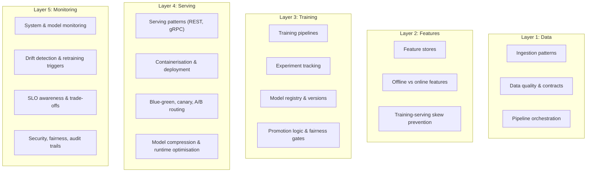
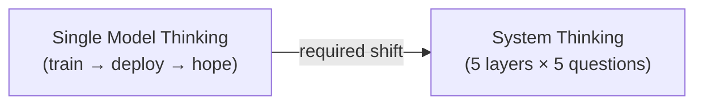

# ML Platform: Module Mapping and System Design Framework

## The Mental Index

Every topic in the ML Model Engineering course maps to one or more layers of the five-layer platform. This note provides the **cross-reference index** and the **system design question framework** for applying layered thinking to any ML problem.

---

## Course Topics Mapped to Platform Layers

### Layer-by-Layer Topic Map

| Layer | Course Topics Covered |
|-------|----------------------|
| **Data** | Ingestion patterns (batch, micro-batch, streaming); data quality monitoring; pipeline orchestration; schema contracts |
| **Features** | Feature store architecture; offline vs online materialisation; training-serving skew; feature reuse, metadata, lineage |
| **Training & Experiments** | Training pipelines; experiment tracking (MLflow); model registry and versioning; promotion logic; fairness thresholds; model optimisation trade-offs |
| **Serving & Infrastructure** | Serving patterns (REST, gRPC, batch, streaming); Docker containerisation; Kubernetes deployment; blue-green and canary rollouts; multi-model routing; ONNX/quantisation |
| **Monitoring & Feedback** | Prometheus metrics and dashboards; drift detection (data, concept, performance); retraining triggers; SLO/latency trade-offs; security, fairness, and audit governance |

---

## The System Design Question Framework

For any ML problem — recommendation, ranking, fraud, churn, search — walk through these five questions:

### 1. Data Layer

| Question | What to Specify |
|----------|-----------------|
| Where does data come from? | Event streams, batch exports, external APIs |
| How often? | Real-time, hourly, daily |
| How do we ensure quality? | Freshness checks, completeness alerts, schema validation |
| How much volume? | Events/day, storage growth rate, retention policy |

### 2. Feature Layer

| Question | What to Specify |
|----------|-----------------|
| Which features matter? | User, item, context features with definitions |
| How are they computed consistently? | Feature store with shared definitions |
| Offline vs online? | Batch materialisation schedule; online cache TTL |
| How do we prevent skew? | Single source of truth per feature |

### 3. Training Layer

| Question | What to Specify |
|----------|-----------------|
| How do we orchestrate training? | Scheduled pipeline, triggered by drift |
| How do we track experiments? | MLflow, parameters, metrics, artefacts |
| How do we choose the production model? | Promotion logic with accuracy + fairness gates |
| How often do we retrain? | Daily, weekly, on-trigger |

### 4. Serving Layer

| Question | What to Specify |
|----------|-----------------|
| How do we deploy? | Docker + Kubernetes, serverless |
| How do we meet latency? | Model compression, caching, auto-scaling |
| How do we roll out safely? | Canary, blue-green, A/B test |
| How do we handle scale? | Instance count, QPS capacity, multi-region |

### 5. Monitoring and Feedback

| Question | What to Specify |
|----------|-----------------|
| What do we monitor? | System, data, and model metrics |
| When do we alert? | Threshold definitions per metric |
| When do we retrain or rollback? | Automated triggers and manual playbook |
| What governance is required? | Audit logs, fairness checks, compliance |

---

## Applying the Framework: Three Use Cases

### Recommendation System

| Layer | Answer |
|-------|--------|
| Data | Click streams + transactions via Kafka → data lake; daily user/item summaries |
| Features | User affinity, item popularity via feature store; offline batch + online Redis |
| Training | Two-tower candidate gen + GBDT ranker; weekly retrain; MLflow tracking |
| Serving | FastAPI service; two-stage pipeline; 200 ms budget; canary rollout |
| Monitoring | CTR, conversion, latency; drift on user features; retrain on CTR drop |

### Search Ranking

| Layer | Answer |
|-------|--------|
| Data | Query logs + click logs; inverted index + vector index |
| Features | Query features, doc CTR, user history; precomputed popularity |
| Training | Learning-to-rank model; retrain from click logs; A/B test promotion |
| Serving | 50–150 ms ranking budget; lexical + vector retrieval → ML ranker |
| Monitoring | NDCG@10, CTR@3, dwell time; aggressive A/B experimentation |

### Fraud Detection

| Layer | Answer |
|-------|--------|
| Data | Transaction events via streaming; labels from chargebacks (30–90 day delay) |
| Features | Velocity, device, IP risk; point-in-time reconstruction for training |
| Training | Cost-sensitive evaluation; segment-specific thresholds; conservative promotion |
| Serving | Tens of ms decision; approve/decline/step-up; audit every decision |
| Monitoring | FN rate, FP rate, expected loss; compliance audit trails |

---

## The Paradigm Shift

| Old Thinking | New Thinking |
|-------------|-------------|
| "I trained a good model" | "I designed a system that continuously produces good models" |
| Focus on offline metrics | Focus on online metrics and system health |
| Deploy once | Continuous retrain-promote-monitor loop |
| One engineer owns everything | Clear layer ownership and interfaces |

---

## Governance Hooks Across Layers

Governance is not a separate layer — it is **woven through** every layer:

| Layer | Governance Concern |
|-------|-------------------|
| Data | PII handling, data retention policies, access controls |
| Features | Feature lineage, bias in feature definitions, consent |
| Training | Fairness thresholds before promotion, reproducibility |
| Serving | Model version audit, decision logging, explainability |
| Monitoring | Fairness slice monitoring, incident response, rollback audit |

---

## Common Pitfalls / Exam Traps

- **Jumping to architecture diagrams without clarifying requirements** — always start with the five questions, not boxes and arrows.
- **Designing for one use case only** — the platform primitives are shared; only priorities differ.
- **Ignoring governance until production** — audit trails and fairness checks must be designed in, not bolted on.
- **Treating module topics as isolated** — every topic maps to a layer; the course is one integrated system.
- **Forgetting the feedback loop** — a system without monitoring Layer 5 is an open-loop system that degrades silently.

---

## Quick Revision Summary

- Every course topic maps to one of **5 platform layers** — use this as a mental index
- System design = answer **5 questions** (data, features, training, serving, monitoring) for any ML problem
- Three worked examples: recommendation, ranking, fraud — same layers, different priorities
- Paradigm shift: from **single model** to **whole system** thinking
- Governance hooks exist in **every layer** — not a separate concern
- Layer interfaces must stay clear so layers evolve independently
- This framework is the expected thinking in ML system design interviews
- If you can walk through all 5 layers for any use case, you are doing ML system design
