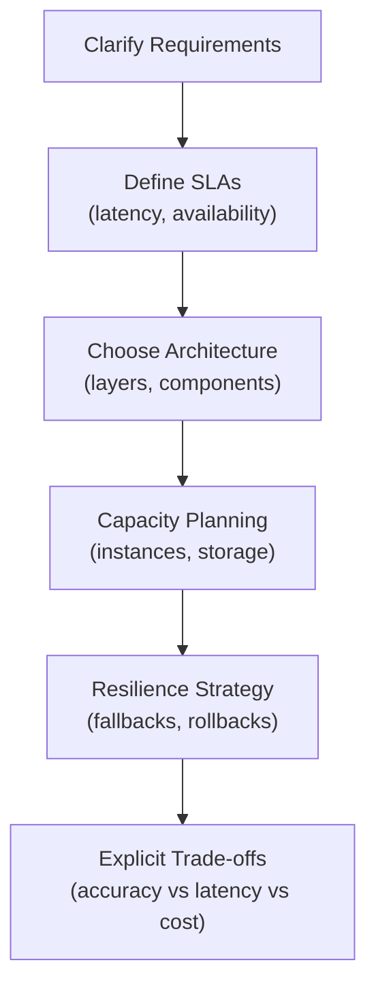

# ML System Design: Clarifying Requirements and SLAs

## Why Start with Requirements?

In any system design conversation — interview, architecture review, or sprint planning — the biggest mistake is **drawing boxes before understanding the problem**. Requirements shape every downstream decision: which SLA targets to hit, how many instances to provision, what failure modes to plan for, and which trade-offs are acceptable.

---

## Step 1: Clarify What You Are Building

### Product Definition Questions

| Question | Why It Matters | Example Answers |
|----------|----------------|-----------------|
| What is the product? | Determines architecture pattern | Recommendation carousel, fraud detector, search ranker |
| Who uses it? | Determines interface and SLA | UI-facing API, backend service, batch pipeline |
| UI-facing or backend? | Determines latency sensitivity | Homepage carousel (tight) vs nightly batch scoring (loose) |
| Batch or real-time? | Determines infrastructure | Real-time fraud (streaming) vs weekly churn (batch) |

### Priority Questions

| Priority | Implication |
|----------|-------------|
| **Accuracy** | Invest in model complexity, more features, ensemble methods |
| **Freshness** | Invest in streaming pipelines, frequent retraining, online features |
| **User experience (latency)** | Invest in model compression, caching, auto-scaling |
| **Cost** | Accept lower accuracy or higher latency to reduce infrastructure spend |

### Failure Impact Questions

| Failure Severity | System Type | Design Response |
|------------------|-------------|-----------------|
| Slightly worse homepage | Recommendation | Graceful degradation to popular items |
| Lower search relevance | Ranking | Fallback to BM25 baseline |
| Regulatory/financial incident | Fraud, credit | Hard fail-safe, audit trail, immediate rollback |

**The answer to "what happens if it fails?" directly shapes your resilience strategy.**

---

## Step 2: Define SLAs (Service Level Agreements)

### Latency SLAs

Always clarify:

- **Which percentile?** P50 (median), P95 (worst 5%), P99 (worst 1%)
- **End-to-end or service-only?** User-perceived latency includes network, gateway, and rendering — not just model inference
- **Per-component budget?** In a 200 ms total budget, how much for feature lookup vs ranking?

| System | Typical P95 Target | Measurement Point |
|--------|-------------------|-------------------|
| Recommendation carousel | 100–200 ms | End-to-end (gateway to response) |
| Search ranking step | 50–150 ms | Ranking service only |
| Fraud decision | 20–50 ms | Decision engine only |
| Batch scoring | Minutes–hours | Job completion time |

### Availability SLAs

| Uptime % | Downtime per Year | Name | Suitable For |
|----------|-------------------|------|-------------|
| 99% | ~3.65 days | "2 nines" | Internal tools, non-critical batch |
| 99.9% | ~8.76 hours | "3 nines" | Most production ML services |
| 99.99% | ~52.6 minutes | "4 nines" | Payment, fraud, critical path |
| 99.999% | ~5.26 minutes | "5 nines" | Core banking (extremely expensive) |

### Graceful Degradation

A critical SLA question: **can the system degrade gracefully if a component fails?**

| Degradation Strategy | When to Use | Trade-off |
|---------------------|-------------|-----------|
| Fallback to baseline model | ML model service down | Lower quality, but functional |
| Cached previous results | Feature store unavailable | Stale but fast |
| Non-personalised popular items | Full recommendation pipeline down | Generic but instant |
| Hard decline (fraud) | Fraud model unavailable | Blocks revenue but prevents loss |

---

## SLA Impact on Design Decisions



| SLA Constraint | Design Decision |
|----------------|-----------------|
| P95 < 50 ms | Model compression (ONNX, quantisation); aggressive caching |
| 99.99% availability | Multi-region deployment; health checks; automatic failover |
| Graceful degradation required | Baseline model fallback; cached features; circuit breakers |
| End-to-end latency | Co-locate feature store with serving; minimise network hops |

---

## Requirements Template for ML System Design

Use this checklist at the start of any design discussion:

```
1. PRODUCT
   - What does the system do?
   - Who are the users (end users, internal teams, other services)?
   - Real-time, batch, or streaming?

2. SUCCESS METRICS
   - Primary ML metric (CTR, fraud loss, NDCG, accuracy)
   - System metrics (latency, availability, throughput)
   - Business metrics (revenue, cost, compliance)

3. SLAs
   - Latency: P50 / P95 / P99 targets (end-to-end or per-service?)
   - Availability: N nines
   - Degradation: acceptable fallback behaviour

4. SCALE
   - QPS (average and peak)
   - Data volume (events/day, storage)
   - Retraining frequency and data window

5. FAILURE IMPACT
   - What happens if the system is down?
   - What happens if the model is wrong?
   - Regulatory or compliance requirements?

6. CONSTRAINTS
   - Budget (infrastructure cost)
   - Team size and expertise
   - Existing infrastructure to reuse
```

---

## Worked Example: Recommendation System Requirements

| Dimension | Specification |
|-----------|---------------|
| Product | "Recommended for You" carousel on e-commerce homepage |
| Users | End consumers (UI-facing API) |
| Success metrics | CTR, conversion rate, revenue per session |
| Latency SLA | P95 < 200 ms end-to-end |
| Availability | 99.9% (3 nines) |
| Degradation | Fall back to trending items if personalised pipeline fails |
| Scale | 5,000 QPS average, 20,000 QPS peak (sale events) |
| Data | 50M events/day, 6-month training window |
| Failure impact | Slightly worse homepage (not catastrophic) |
| Constraints | Must use existing Kafka + S3 infrastructure |

These requirements directly inform: two-stage model architecture, Redis feature cache, 20+ serving instances at peak, canary deployment, and trending-items fallback.

---

## Common Pitfalls / Exam Traps

- **Starting with architecture diagrams** — always clarify requirements and SLAs first; diagrams come after.
- **Ignoring graceful degradation** — interviewers specifically test whether you plan for partial failures.
- **Confusing P50 with P95** — "average latency is 50 ms" hides tail latency problems; always discuss P95/P99.
- **End-to-end vs service-only latency** — claiming "10 ms inference" when total user-perceived latency is 300 ms.
- **Same availability target for all systems** — fraud needs 4 nines; a batch churn model can tolerate 2 nines.

---

## Quick Revision Summary

- **Never start with boxes** — clarify requirements, SLAs, and failure impact first
- Key questions: what product, who uses it, what does success mean, what if it fails?
- **Latency SLAs**: specify percentile (P95/P99) and measurement point (end-to-end vs service)
- **Availability**: 99% = 3.5 days downtime/yr; 99.9% = 9 hrs; 99.99% = 1 hr
- **Graceful degradation**: fallback models, cached results, non-personalised defaults
- SLAs directly drive architecture, capacity, and resilience decisions
- Use the 6-section requirements template for any ML system design discussion
- Failure impact severity determines how much to invest in resilience
