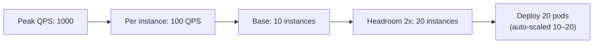

# ML System Design: Traffic Estimation and Capacity Planning

## Why Capacity Planning Matters

A system that handles 100 QPS is architecturally different from one that handles 20,000 QPS. Capacity planning translates requirements and SLAs into **concrete infrastructure numbers** — instance counts, storage sizes, batch windows, and cost estimates. In system design interviews, you are not expected to be exact, but you must demonstrate **quantitative reasoning**.

---

## Traffic Questions to Ask

| Question | Why It Matters |
|----------|----------------|
| Average QPS? | Baseline instance count |
| Peak QPS? | Burst capacity and headroom |
| When do peaks occur? | Sale events, evenings, product launches |
| Geographic distribution? | Multi-region requirements |
| Growth rate? | Future-proofing infrastructure |

### Typical QPS Ranges

| System Type | Average QPS | Peak QPS | Notes |
|-------------|-------------|----------|-------|
| Internal ML API | 10–100 | 200 | Small team, batch-heavy |
| E-commerce recommendations | 1,000–5,000 | 10,000–20,000 | Homepage loads per second |
| Search ranking | 500–2,000 | 5,000–10,000 | Every search query |
| Fraud detection | 1,000–10,000 | 50,000+ | Every payment transaction |
| Ad ranking | 10,000–100,000 | 500,000+ | Real-time bidding |

---

## Data Volume Questions

| Question | Why It Matters |
|----------|----------------|
| Events per day? | Storage sizing, pipeline throughput |
| Training data window? | 3 months, 6 months, 1 year — affects storage and training time |
| Feature count and dimensionality? | Feature store size, inference memory |
| Model size? | Serving instance memory, load time |
| Retention policy? | Long-term storage costs |

### Storage Estimation Example

**Given**: 50M events/day, 500 bytes/event average, 6-month retention

$$\text{daily storage} = 50 \times 10^6 \times 500 \text{ bytes} \approx 25 \text{ GB/day}$$

$$\text{6-month storage} = 25 \text{ GB} \times 180 \text{ days} \approx 4.5 \text{ TB}$$

With Parquet compression (~5x): **~900 GB** in the data lake.

---

## Back-of-the-Envelope Instance Calculation

### Serving Instances

**Given**:
- Peak QPS = 1,000
- Single instance handles ~100 QPS at required P95 latency
- Need headroom for bursts and failover (2x multiplier)

$$\text{instances} = \frac{\text{peak QPS}}{\text{QPS per instance}} \times \text{headroom} = \frac{1000}{100} \times 2 = 20 \text{ instances}$$



### Factors Affecting Per-Instance Throughput

| Factor | Impact on QPS/instance |
|--------|----------------------|
| Model type | XGBoost: 200+ QPS; large neural net: 20–50 QPS |
| Hardware | GPU vs CPU; instance size (vCPUs, RAM) |
| Model compression | ONNX/quantisation can 2–4x throughput |
| Feature lookup time | Slow feature store reduces effective QPS |
| Batch inference | Micro-batching improves throughput at cost of latency |

### Inference Cost Estimation

| Hardware | Relative Cost | Typical Use |
|----------|--------------|-------------|
| CPU (general) | 1x (baseline) | Tree models, small neural nets |
| CPU (optimised) | 0.5x with ONNX | Compressed models |
| GPU | 3–10x per instance | Large neural nets, embeddings |
| Serverless | Pay-per-request | Low-traffic, spiky workloads |

**Rule of thumb**: start with CPU instances for tree models; move to GPU only when neural net inference exceeds CPU capacity at target latency.

---

## Batch Job Window Planning

### Nightly Retraining Feasibility

**Given**:
- Training data: 6 months, 50M events/day → ~9B events
- Feature materialisation: 2 hours
- Model training: 3 hours
- Evaluation + registry update: 30 minutes
- **Total**: ~5.5 hours

Available window: midnight to 6 AM = 6 hours → **feasible with 30-minute buffer**.

If training grows to 10 hours → need either:
- Incremental training (warm-start from previous model)
- More powerful training instances
- Micro-batch retraining (every 6 hours on recent data only)

### Pipeline Stage Timing

| Stage | Typical Duration | Parallelisable? |
|-------|-----------------|-----------------|
| Data ingestion validation | 15–30 min | Yes (per partition) |
| Feature materialisation | 1–3 hours | Yes (per entity type) |
| Training | 1–6 hours | Limited (single model) |
| Evaluation | 15–30 min | Yes (per metric slice) |
| Registry update + promotion | 5 min | No (sequential) |

---

## Multi-Region Considerations

| Setup | Complexity | Use When |
|-------|-----------|----------|
| Single region | Low | MVP, internal tools, < 1000 QPS |
| Primary + backup (failover) | Medium | 99.9% availability requirement |
| Active-active multi-region | High | 99.99%+, global user base, data sovereignty |

Multi-region adds:
- **Data replication lag** — features in Region B may be minutes behind Region A
- **Model sync** — all regions must serve the same model version (or run independent A/B tests)
- **Cost multiplier** — roughly 1.5–2x infrastructure cost for active-active

---

## Capacity Planning Checklist

```
1. TRAFFIC
   □ Average QPS: ___
   □ Peak QPS: ___
   □ Peak multiplier (peak/avg): ___

2. SERVING CAPACITY
   □ QPS per instance (benchmarked): ___
   □ Base instances: peak_qps / qps_per_instance
   □ With headroom (2x): ___
   □ Auto-scaling range: min ___ to max ___

3. STORAGE
   □ Events/day: ___
   □ Bytes/event: ___
   □ Retention period: ___
   □ Total storage: ___
   □ Compressed (Parquet ~5x): ___

4. BATCH WINDOWS
   □ Feature materialisation: ___ hours
   □ Training: ___ hours
   □ Total offline window: ___ hours
   □ Available window: ___ hours
   □ Feasible? Yes / No

5. COST
   □ Serving instances: ___ × $___/hr
   □ Training instances: ___ × $___/hr (ephemeral)
   □ Storage: ___ TB × $___/TB/month
   □ Total monthly estimate: $___
```

---

## Worked Example: E-Commerce Recommendation System

| Parameter | Value | Calculation |
|-----------|-------|-------------|
| Average QPS | 5,000 | Given |
| Peak QPS | 20,000 | 4x average (sale events) |
| QPS per instance | 100 | Benchmarked with ONNX model |
| Base instances | 200 | 20,000 / 100 |
| With headroom | 400 | 200 × 2 |
| Auto-scaling range | 50–400 | Min for off-peak, max for sales |
| Events/day | 50M | Given |
| Storage (6 months) | ~900 GB compressed | 25 GB/day × 180 / 5 |
| Nightly retrain window | 5.5 hours | Fits in 6-hour window |
| Monthly cost estimate | ~$15,000 | 100 avg instances × $0.10/hr × 720 hr + storage |

---

## Common Pitfalls / Exam Traps

- **Planning for average QPS only** — peak traffic (4–10x average) causes outages during sales events.
- **No headroom for failover** — if you need 10 instances normally, deploy 20 so losing half still meets SLA.
- **Ignoring feature lookup in latency budget** — slow Redis adds 20–50 ms, reducing effective QPS per instance.
- **Training window overflow** — as data grows, nightly retrain may exceed available window; plan for incremental training.
- **GPU for everything** — tree models (XGBoost) are faster on CPU; GPU is for large neural nets only.
- **Forgetting storage growth** — 6-month retention at 50M events/day is terabytes; budget for it.

---

## Quick Revision Summary

- Capacity planning = translate SLAs into **instance counts, storage, and batch windows**
- Ask: average QPS, **peak QPS**, events/day, training data window
- Instance formula: $\text{instances} = (\text{peak QPS} / \text{QPS per instance}) \times \text{headroom}$
- Headroom multiplier typically **2x** for bursts and failover
- Storage: events/day × bytes/event × retention days ÷ compression ratio
- Batch window: sum all pipeline stages; must fit in available overnight window
- Per-instance QPS depends on model type, hardware, compression, and feature lookup time
- Multi-region adds complexity and ~1.5–2x cost; only when availability requires it
- Show quantitative reasoning in interviews — exact numbers not required, but methodology is
