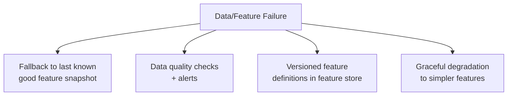
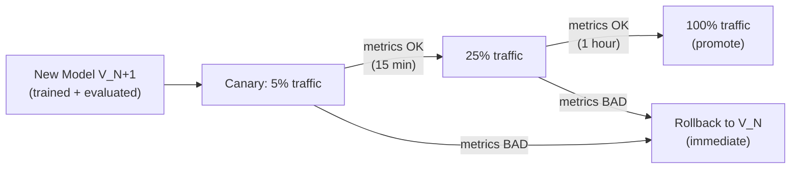
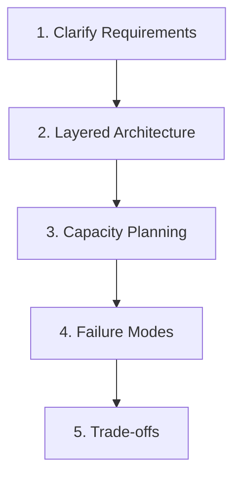

# ML System Design: Failure Scenarios and Resilience Strategies

## Why Plan for Failures?

Production ML systems fail in predictable ways. Data pipelines stall, feature computations break, model services overload, and bad deployments regress quality. Planning for these scenarios — and articulating mitigations — distinguishes a system designer from someone who only knows how to train models.

In interviews and architecture reviews, explicitly calling out failure modes demonstrates **end-to-end reliability thinking**.

---

## Failure Category 1: Data and Features

### Common Failure Modes

| Failure | Symptom | Downstream Impact |
|---------|---------|-------------------|
| Pipeline stall | No new events ingested for hours | Stale features, outdated training data |
| Partial batch | Only 60% of expected events arrive | Biased aggregations, incorrect features |
| Schema change | New column added, old column removed | Downstream SQL/feature jobs crash |
| Feature job failure | Aggregation pipeline fails overnight | Offline features stale; online cache expires |

### Mitigation Strategies

| Strategy | Mechanism | Trade-off |
|----------|-----------|-----------|
| **Last known good snapshot** | Serve cached features from last successful computation | Stale but functional |
| **Data quality alerts** | Monitor freshness, volume, schema; alert within minutes | Requires upfront instrumentation |
| **Versioned feature definitions** | Roll back to previous feature computation logic | Requires feature store versioning |
| **Simpler feature fallback** | If complex features fail, use basic features (e.g., popularity only) | Lower model quality, but system stays up |

### Example: Feature Pipeline Failure

1. Nightly `user_30d_avg_purchase` computation fails at 2 AM
2. Data quality alert fires at 2:15 AM (freshness check fails)
3. Online serving continues using yesterday's cached values (TTL = 48 hours)
4. Recommendation quality slightly degrades but carousel still renders
5. On-call engineer investigates; fixes pipeline; next run succeeds

---

## Failure Category 2: Model Service and Deployment

### Common Failure Modes

| Failure | Symptom | Downstream Impact |
|---------|---------|-------------------|
| Service outage | 5xx errors, health check failures | No predictions; UI shows empty carousel |
| Overload / latency spike | P95 latency exceeds SLA | Timeouts; user-perceived slowness |
| Bad model deployment | Quality regression after new version promoted | Lower CTR, higher fraud loss |
| Model crash under load | OOM or segfault on specific inputs | Partial outage for certain request types |

### Mitigation Strategies

| Strategy | Mechanism | When to Use |
|----------|-----------|-------------|
| **Cached fallback** | Return cached predictions for recent requests | Short outages (< 5 min) |
| **Baseline model fallback** | Switch to simpler, well-tested model | ML service degraded |
| **Non-personalised fallback** | Show trending/popular items | Full recommendation pipeline down |
| **Blue-green deployment** | Two environments; instant traffic switch | Zero-downtime model updates |
| **Canary rollout** | 5% traffic to new model; monitor; then promote | New model deployment |
| **Fast rollback** | Update `current_best.json` to previous version; restart | Bad model detected in production |
| **Circuit breaker** | Stop calling failing downstream service after N failures | Cascading failure prevention |

### Deployment Safety Flow

### Post-Incident Requirements

Every failure should produce:

- **Logs**: model version, request context, error type, timestamp
- **Traceability**: which deployment, which config change, which data batch
- **Post-incident review**: root cause, timeline, action items
- **Process improvement**: updated runbooks, additional monitoring

---

## Failure Category 3: Infrastructure

| Failure | Mitigation |
|---------|-----------|
| Single instance crash | Kubernetes restarts pod; load balancer routes to healthy pods |
| AZ (availability zone) outage | Multi-AZ deployment; traffic routed to surviving AZ |
| Region outage | Multi-region failover (if SLA requires 4 nines) |
| Dependency failure (feature store, DB) | Circuit breaker + cached fallback |
| DDoS / traffic spike | Auto-scaling + rate limiting at API gateway |

---

## Structured Interview Answer Template

Use this structure in system design interviews:

### 1. Clarify Requirements
- Product, users, success metrics
- SLA: latency percentiles, availability target
- Traffic: average and peak QPS
- Data volume and retraining window
- Failure impact severity

### 2. Sketch Layered Architecture
- Data → Features → Training → Serving → Monitoring
- Show data flow and feedback loop

### 3. Capacity and Scaling
- Instance count calculation with headroom
- Batch window feasibility
- Auto-scaling strategy

### 4. Failure Modes and Mitigations
- Data pipeline failures → fallback features, quality alerts
- Model service failures → baseline model, cached results
- Bad deployments → canary, fast rollback
- Infrastructure failures → multi-AZ, auto-scaling

### 5. Trade-offs and Open Questions
- Accuracy vs latency vs cost vs complexity
- What would you validate with a prototype or A/B test?
- What assumptions need confirmation from stakeholders?

---

## Resilience Design Patterns Summary

| Pattern | Layer | Purpose |
|---------|-------|---------|
| Feature snapshot fallback | Feature | Serve stale but valid features |
| Circuit breaker | Serving | Prevent cascade failures |
| Canary deployment | Serving | Safe model rollout |
| Config-based rollback | Serving | Instant model version revert |
| Data quality alerts | Data | Early detection of pipeline issues |
| Versioned features | Feature | Roll back broken feature logic |
| Auto-scaling | Infrastructure | Handle traffic spikes |
| Multi-AZ deployment | Infrastructure | Survive zone-level failures |
| Audit logging | Monitoring | Post-incident investigation |
| Automated retrain trigger | Monitoring | Self-healing on quality degradation |

---

## Common Pitfalls / Exam Traps

- **Only discussing model accuracy failures** — infrastructure and data failures are more common and more impactful.
- **No fallback strategy** — "the service will just restart" is not a resilience plan.
- **Canary without defining success criteria** — "monitor metrics" is vague; specify CTR drop < 5% for 1 hour.
- **Ignoring data pipeline failures in interviews** — shows you only think about the model, not the system.
- **Rollback without audit trail** — in regulated systems, every rollback must be logged with who, when, and why.
- **Over-engineering resilience for low-stakes systems** — a batch churn model does not need multi-region failover.

---

## Quick Revision Summary

- **Data failures**: pipeline stall, partial batches, schema changes → fallback snapshots, quality alerts, versioned features
- **Model service failures**: outage, overload, bad deployment → cached fallback, baseline model, canary, fast rollback
- **Deployment safety**: canary (5% → 25% → 100%) with defined success criteria; instant rollback via config
- **Infrastructure failures**: auto-scaling, multi-AZ, circuit breakers, rate limiting
- Interview structure: requirements → architecture → capacity → failures → trade-offs
- Every failure needs: logs, traceability, post-incident review
- Graceful degradation > hard failure for non-critical systems
- Resilience patterns: feature fallback, circuit breaker, canary, config rollback, data quality alerts
