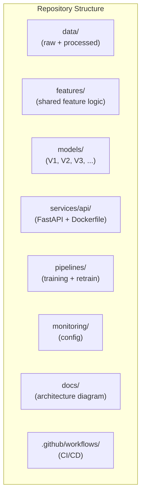
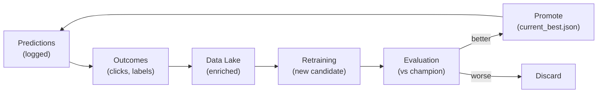

# MLOps Capstone: From Components to Complete System

## The Integration Challenge

Throughout the ML Model Engineering course, each topic was explored in isolation — serving patterns, feature stores, monitoring, retraining, optimisation, governance. The capstone demands a different skill: **integrating every component into one coherent, production-grade system** and being able to narrate that system's story end to end.

This is the shift from knowing individual techniques to **designing and operating complete ML systems**.

---

## What the Capstone Tests

| Skill | How It Is Demonstrated |
|-------|------------------------|
| **End-to-end architecture** | Complete diagram from raw data to monitored production model |
| **Component integration** | Each module's artefact has a home in the repository |
| **Operational narrative** | Explain what the system does, how it scales, how it fails |
| **Hands-on execution** | Train models, promote champions, serve predictions, roll back |
| **System storytelling** | Present the architecture to an interviewer or review board |

---

## Capstone System Components

The capstone assembles artefacts built across the course into one repository:

| Directory | Layer | Purpose |
|-----------|-------|---------|
| `data/` | Data | Raw and processed datasets (data lake) |
| `features/` | Features | Shared feature engineering logic |
| `models/` | Training | Versioned model folders (V1, V2, V3) |
| `services/api/` | Serving | FastAPI app + Docker container |
| `pipelines/` | Training | Training and retraining orchestration scripts |
| `monitoring/` | Monitoring | Metrics and alert configuration |
| `docs/` | All | Architecture diagram and documentation |
| `.github/workflows/` | All | CI/CD pipeline automation |

**Every part of the architecture diagram has a corresponding home in the repository.**

---

## The System Story Framework

When presenting the capstone (or any ML system), narrate these four dimensions:

### 1. What the System Does

- Input: raw events (clicks, transactions, user profiles)
- Processing: feature engineering → model training → online serving
- Output: real-time predictions with logged outcomes
- Feedback: outcomes flow back as training labels

### 2. How It Scales

- Serving: auto-scaled FastAPI pods behind load balancer
- Features: offline batch materialisation + online Redis cache
- Training: scheduled pipeline with configurable data window
- Storage: partitioned data lake with retention policies

### 3. How It Behaves When Things Go Wrong

| Scenario | System Response |
|----------|-----------------|
| Bad model promoted | Rollback via `current_best.json` + restart |
| Data pipeline fails | Serve cached features; alert on-call |
| Serving overload | Auto-scale pods; circuit breaker on dependencies |
| Model performance drops | Monitoring triggers retraining pipeline |

### 4. How It Improves Over Time

---

## Key Integration Points

| Integration | How It Works |
|-------------|-------------|
| Feature logic shared | `features/` module imported by both training pipeline and serving API |
| Model registry → serving | `current_best.json` points serving to champion model version |
| Monitoring → retraining | Alert triggers `retrain_job.py` which runs full offline pipeline |
| CI/CD → deployment | GitHub Actions builds Docker image, runs tests, deploys on merge |
| Promotion → rollback | Same mechanism: edit `current_best.json`, restart service |

---

## Preparing for Architecture Discussions

The capstone prepares you for real-world scenarios:

### System Design Interviews

- Start with requirements (product, SLA, traffic, failure impact)
- Sketch five-layer architecture
- Do capacity planning (instance counts, storage)
- Discuss failure modes and mitigations
- Close with trade-offs

### Architecture Reviews

- Present the system story (what, scale, failures, improvement)
- Walk through the architecture diagram layer by layer
- Demonstrate live rollback (change config, restart, verify)
- Discuss monitoring coverage and alert thresholds

### Production On-Call

- Know which layer a failure belongs to
- Have rollback playbook ready (config change + restart)
- Understand data freshness checks and feature fallbacks
- Know retraining trigger conditions

---

## Common Pitfalls / Exam Traps

- **Treating the capstone as a coding exercise** — it tests system thinking and integration, not just script execution.
- **Cannot narrate the system story** — knowing components without understanding how they connect fails interviews.
- **Skipping the rollback demo** — rollback via config is the most powerful resilience pattern; practise it.
- **Repository structure does not mirror architecture** — if you cannot map directories to layers, the system is not well-organised.
- **No closed loop** — a system that serves predictions but never retrains is not MLOps.

---

## Quick Revision Summary

- Capstone integrates **all course components** into one production-grade system
- Repository structure mirrors the **five-layer architecture**
- System story: **what it does, how it scales, how it fails, how it improves**
- Key integration: shared features, registry → serving, monitoring → retrain, CI/CD → deploy
- Rollback = edit `current_best.json` + restart — decoupled model management
- Prepare for: system design interviews, architecture reviews, production on-call
- The capstone tests **system thinking**, not isolated technique knowledge
- Every directory maps to a platform layer — organisation reflects architecture
