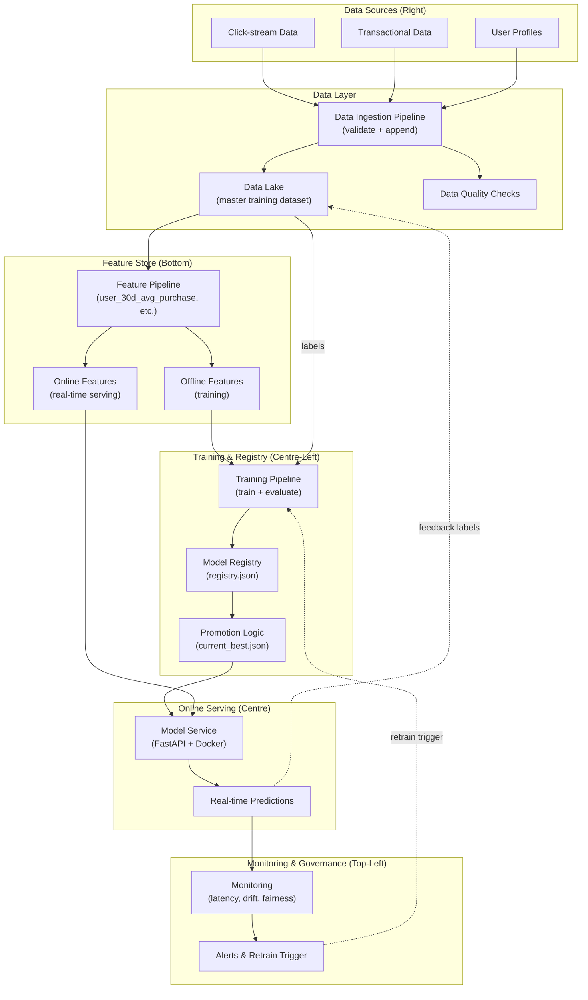
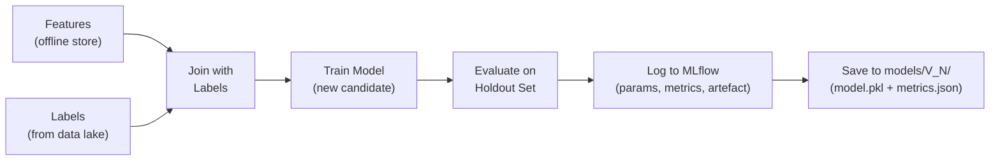
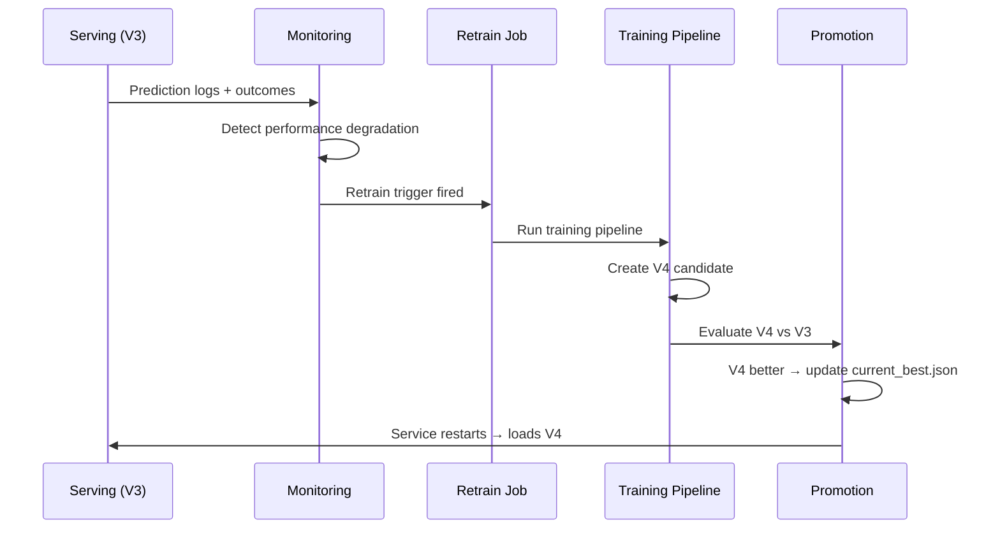

# MLOps Capstone: Complete System Walkthrough

## System Blueprint

The capstone implements a complete MLOps lifecycle — from raw data ingestion through feature engineering, model training, registry management, online serving, monitoring, and automated retraining. The architecture diagram is the single visual that ties every course module together.



---

## Offline Path: Raw Data to Registered Model

### Step 1: Data Ingestion

The ingestion pipeline picks up new files, validates them, and appends to the master training dataset.

| Action | Detail |
|--------|--------|
| Input | New CSV/Parquet files in `data/raw/` |
| Validation | Schema check, null rate, volume sanity |
| Output | Appended rows in `data/processed/train.parquet` |
| Failure handling | Reject bad files; alert on validation failure |

### Step 2: Feature Engineering

Raw data is not model-ready. The feature pipeline computes meaningful attributes:

| Feature | Computation | Storage |
|---------|-------------|---------|
| `user_30d_avg_purchase` | Mean purchase value over 30 days | Offline table + online cache |
| `num_clicks_7d` | Click count in last 7 days | Offline table + online cache |
| `item_popularity_7d` | View count in last 7 days | Offline table + online cache |

**Key principle**: feature logic is defined once in `features/` and shared between training and serving — preventing training-serving skew.

### Step 3: Training Pipeline



Each training run produces a new model version (V1, V2, V3, ...) with logged metrics and a serialised model artefact.

### Step 4: Registration

The registry building script scans the `models/` directory and updates `registry.json`:

```json
{
  "models": [
    {"version": "V1", "accuracy": 0.87, "path": "models/V1/model.pkl"},
    {"version": "V2", "accuracy": 0.85, "path": "models/V2/model.pkl"},
    {"version": "V3", "accuracy": 0.89, "path": "models/V3/model.pkl"}
  ]
}
```

The offline journey is complete: a new version exists, evaluated, and catalogued.

---

## Online Path: Registry to Production Predictions

### Step 5: Promotion Logic

The promotion script compares the new candidate against the currently serving champion:

| Check | Threshold | Pass? |
|-------|-----------|-------|
| Accuracy > champion | V3: 0.89 > V1: 0.87 | Yes |
| Fairness metrics acceptable | Demographic parity within bounds | Yes |
| Latency benchmark | P95 < target on holdout | Yes |

If all checks pass, update `current_best.json`:

```json
{
  "model_version": "V3",
  "model_path": "models/V3/model.pkl",
  "promoted_at": "2026-05-15T14:30:00Z",
  "reason": "accuracy 0.89 > champion 0.87"
}
```

### Step 6: Serving

The FastAPI application:

1. Reads `current_best.json` on startup
2. Loads the promoted model (V3)
3. Receives prediction requests with entity features
4. Fetches online features from the feature store
5. Returns prediction and logs request context

**Model optimisation** (ONNX conversion, quantisation) ensures inference meets latency targets within the Docker container.

### Step 7: Monitoring

While the service runs, the monitoring system watches:

| Metric Type | Examples | Alert Threshold |
|-------------|----------|-----------------|
| System | P95 latency, error rate, QPS | Latency > 200 ms for 5 min |
| Data | Feature drift, missing values | Mean shift > 2 std devs |
| Model | Accuracy proxy, prediction distribution | CTR drop > 10% |

---

## The Closed Loop: Feedback and Retraining



When monitoring detects degradation or data drift:

1. Retrain trigger fires automatically
2. Training pipeline creates a new candidate (e.g., V4)
3. V4 is evaluated against the current champion (V3)
4. If better, promotion updates `current_best.json`
5. Service restarts and loads V4
6. The cycle repeats — **continuously running, self-improving system**

---

## Rollback Demonstration

When monitoring detects a major issue with V3 in production:

| Step | Action | Result |
|------|--------|--------|
| 1 | Edit `current_best.json` → set version to V1 | Config updated |
| 2 | Stop the running application | Service down briefly |
| 3 | Restart the application | V1 loaded automatically |
| 4 | Verify with inference request | Predictions from V1 confirmed |

**No code changes. No redeployment. Just a config edit and restart.**

This demonstrates the power of decoupled model management — the serving code never changes; only the config pointer changes.

---

## Repository Structure

| Directory | Contents | Course Module |
|-----------|----------|---------------|
| `data/raw/` | Incoming data files | Data pipelines |
| `data/processed/` | Cleaned training dataset | Data pipelines |
| `features/` | Feature engineering logic | Feature stores |
| `models/V1/`, `V2/`, `V3/` | Versioned model + metrics | Training + registry |
| `services/api/app.py` | FastAPI prediction service | Serving |
| `services/api/Dockerfile` | Container definition | Containerisation |
| `pipelines/training_pipeline.py` | Single model training run | Training pipelines |
| `pipelines/retrain_job.py` | Scheduled retraining orchestrator | Retraining triggers |
| `monitoring/` | Alert and metric configuration | Monitoring |
| `docs/` | Architecture diagram | System design |
| `.github/workflows/` | CI/CD automation | CI/CD |

---

## Running the Complete System

### Offline Workflow (ML Engineer)

```bash
# 1. Train initial models
cd pipelines && python training_pipeline.py
# Creates V1, V2 in models/

# 2. Run scheduled retrain (creates V3, builds registry, promotes best)
python retrain_job.py
# Builds registry.json, runs promotion, writes current_best.json
```

### Online Workflow (Platform Engineer)

```bash
# 3. Start production service
cd services/api && uvicorn app:app --host 0.0.0.0 --port 8000
# Loads model from current_best.json

# 4. Verify
curl http://localhost:8000/health    # Check model version
curl -X POST http://localhost:8000/predict -d '{"features": {...}}'
```

### Rollback (On-Call Engineer)

```bash
# 5. Rollback to V1
# Edit current_best.json → "model_version": "V1"
# Restart uvicorn → V1 loaded
```

---

## What This Demonstrates

| Property | Evidence |
|----------|----------|
| **Automated** | Retrain job runs pipeline, evaluates, promotes — no manual steps |
| **Auditable** | Every model version logged with metrics; promotion decisions recorded |
| **Resilient** | Rollback in seconds via config change; no redeployment |
| **Integrated** | Every course module has a concrete artefact in the system |
| **Self-improving** | Monitoring triggers retraining; new models challenge champions |

---

## Common Pitfalls / Exam Traps

- **Training without registration** — a model file without registry metadata cannot be promoted or rolled back.
- **Serving without reading config** — hardcoding model path means every update requires code change and redeployment.
- **No shared feature module** — duplicate feature logic in training and serving guarantees training-serving skew.
- **Monitoring without retrain trigger** — detecting degradation without automated response means manual intervention every time.
- **Skipping the rollback test** — if you have not practised rollback, you will panic during a real incident.

---

## Quick Revision Summary

- Capstone implements the **full MLOps loop**: data → features → train → register → promote → serve → monitor → retrain
- **Offline path**: ingest → feature pipeline → training → MLflow logging → registry.json
- **Online path**: current_best.json → FastAPI loads champion → predictions with online features
- **Closed loop**: monitoring detects drift → retrain trigger → new candidate → promote or discard
- **Rollback**: edit current_best.json + restart — seconds, no code changes
- Repository structure mirrors architecture: data/, features/, models/, services/, pipelines/, monitoring/
- System is **automated, auditable, and resilient**
- Every course module maps to a concrete directory or script in the capstone
