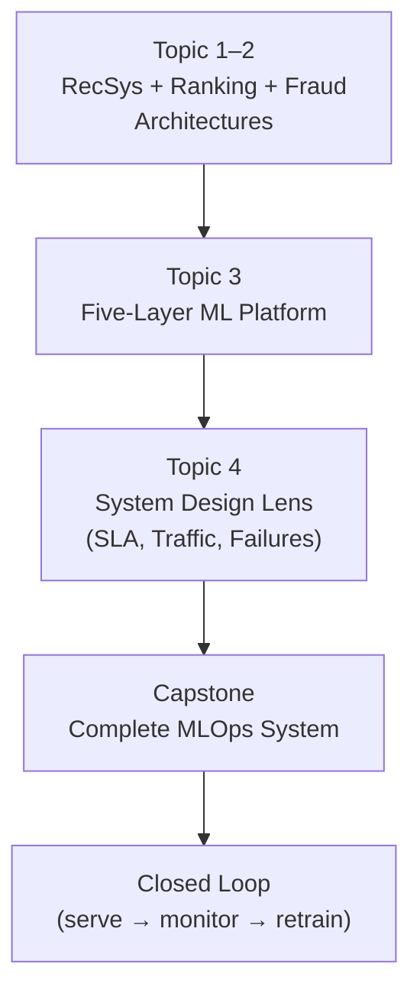
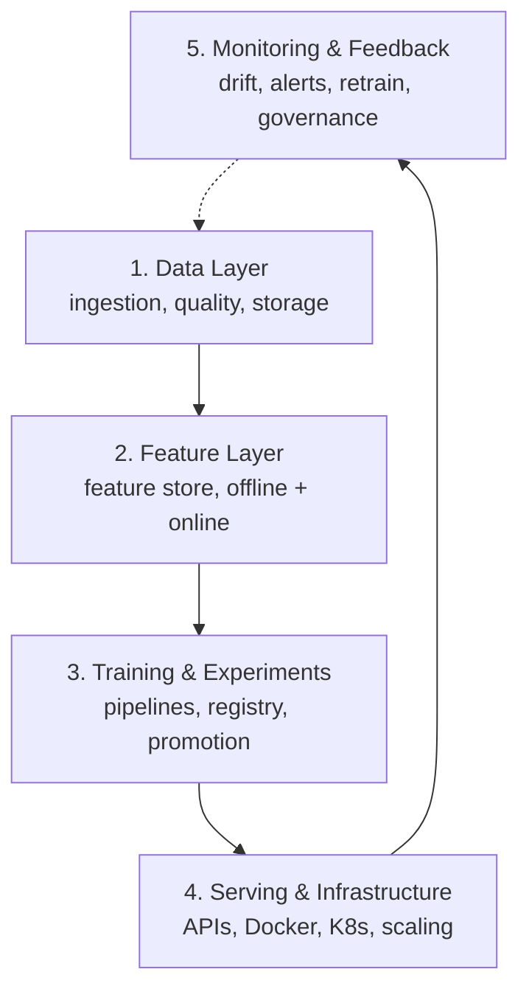

# Module 13 Summary: End-to-End ML System Architecture

## Module Arc

Module 13 synthesises the entire ML Model Engineering course into production system design. It moves from isolated techniques to integrated architectures for recommendation, ranking, and fraud systems — and provides a framework for ML system design interviews.

---

## Topic 1: Recommendation System Architecture

### Problem

Show ~10 personalised products to the right user within **100–200 ms**, using past behaviour, with business constraints (stock, promotions, diversity).

### Architecture

| Layer | Components |
|-------|-----------|
| Data | Click streams, transactions → Kafka → data lake (Parquet) |
| Features | User affinity, item popularity, context; feature store (offline + online) |
| Model | Two-stage: candidate generation (millions → hundreds) + ranking (hundreds → top N) |
| Online | Gateway → features → candidates → rank → business rules → UI |

### Two-Stage Model

1. **Candidate generation** — recall-focused; heuristics, embeddings, two-tower ANN
2. **Ranking** — precision-focused; GBDT/neural ranker + post-processing (stock, diversity, promos)

---

## Topic 2: Ranking and Fraud Architectures

### Search Ranking

- Retrieve 100–1000 candidates (BM25 + vector index)
- Enrich with query, document, user features
- ML ranker scores and orders; post-process for diversity and safety
- Latency: 50–150 ms; success = CTR, conversion, dwell time
- Aggressive A/B testing; immediate click-based feedback loop

### Fraud Detection

- Real-time feature assembly (velocity, device, IP risk)
- Risk score → threshold decision (approve / decline / step-up)
- Latency: tens of ms; success = fraud loss, segment error rates
- Labels arrive 30–90 days late (chargebacks); point-in-time feature reconstruction
- Conservative deployment; audit every decision

### Comparison

| Dimension | Ranking | Fraud |
|-----------|---------|-------|
| Optimises | Order and relevance | Risk and correctness |
| Error cost | Annoying | Financial loss / unfair treatment |
| Experimentation | Aggressive A/B | Conservative canary |
| Labels | Immediate (clicks) | Delayed (chargebacks) |

**Shared**: data pipelines, feature stores, online scoring, monitoring. **Different**: priorities and risk profiles.

---

## Topic 3: Five-Layer ML Platform

| Layer | Key Question |
|-------|-------------|
| Data | Where does data come from? Quality checks? |
| Features | Which features? Consistent in training and serving? |
| Training | How to train, track, and promote models? |
| Serving | How to deploy, scale, meet latency SLAs? |
| Monitoring | How to detect failures and trigger retraining? |

Every course module maps to one or more layers. This is the mental index for design and debugging.

---

## Topic 4: System Design Interview Lens

### Structured Approach

1. **Clarify requirements** — product, users, success metrics, failure impact
2. **Define SLAs** — P95/P99 latency, availability (nines), graceful degradation
3. **Estimate capacity** — QPS, instances, storage, batch windows
4. **Sketch layered architecture** — five layers with data flow
5. **Plan for failures** — data, model service, deployment, infrastructure
6. **Discuss trade-offs** — accuracy vs latency vs cost vs complexity

### Key Calculations

$$\text{instances} = \frac{\text{peak QPS}}{\text{QPS per instance}} \times \text{headroom (2x)}$$

$$\text{storage} = \frac{\text{events/day} \times \text{bytes/event} \times \text{retention days}}{\text{compression ratio}}$$

### Resilience Patterns

| Failure | Mitigation |
|---------|-----------|
| Data pipeline stall | Cached feature fallback + quality alerts |
| Model service outage | Baseline model or non-personalised fallback |
| Bad deployment | Canary rollout + config-based rollback |
| Infrastructure failure | Auto-scaling + multi-AZ deployment |

---

## Capstone: Complete MLOps System

### Offline Path

Raw data → ingestion → feature pipeline → training → MLflow logging → model registry (`registry.json`)

### Online Path

Promotion logic → `current_best.json` → FastAPI service loads champion → predictions with online features

### Closed Loop

Predictions logged → monitoring detects drift/degradation → retrain trigger → new candidate → evaluate → promote or discard

### Rollback

Edit `current_best.json` → restart service → previous model loaded. No code changes. Seconds, not hours.

---

## Operational Challenges in Recommendation Systems

Even with clean architecture, recommendation systems are hard to operate:

| Challenge | Description | Mitigation |
|-----------|-------------|------------|
| **Freshness** | User behaviour shifts quickly | Frequent feature updates; streaming pipelines |
| **Multi-objective balance** | Relevance vs diversity vs business rules vs long-term trust | Explicit post-processing; multi-objective ranking |
| **Short-term overoptimisation** | High CTR but declining long-term trust | Monitor long-term metrics; exploration in carousel |
| **Operational complexity** | Strict latency + traffic spikes + healthy pipelines | Auto-scaling; monitoring at all layers |
| **Monitoring breadth** | CTR, conversion, latency, drift, fairness | Dashboard per layer; automated alerts |

---

## The Paradigm Shift

| Before This Module | After This Module |
|-------------------|-------------------|
| "I trained a good model" | "I designed a system that continuously produces good models" |
| Focus on offline metrics | Focus on online metrics and system health |
| Deploy once | Continuous retrain-promote-monitor loop |
| Single model thinking | Five-layer system thinking |
| Know techniques in isolation | Integrate techniques into coherent architecture |

---

## Common Pitfalls / Exam Traps

- **Single-model thinking in interviews** — always present the five-layer architecture.
- **Ignoring operational challenges** — freshness, multi-objective balance, and latency are as important as model accuracy.
- **Same resilience for all systems** — fraud needs audit trails and conservative rollout; ranking can experiment aggressively.
- **Forgetting the closed loop** — a system without monitoring and retraining is open-loop and will degrade.
- **Cannot do back-of-envelope capacity planning** — instance counts and storage estimates are expected in system design interviews.
- **Treating capstone as optional** — it is the proof that you can integrate everything, not just know individual topics.

---

## Quick Revision Summary

- **Recommendation**: two-stage (candidate gen + ranking), 100–200 ms, feature store prevents skew
- **Ranking vs fraud**: shared platform, different priorities (relevance vs risk) and error costs
- **Five-layer platform**: Data → Features → Training → Serving → Monitoring
- **System design**: requirements → SLAs → capacity → architecture → failures → trade-offs
- **Capacity**: instances = (peak QPS / per-instance QPS) × 2x headroom
- **Resilience**: feature fallback, canary deployment, config-based rollback
- **Capstone**: full MLOps loop with registry, promotion, serving, monitoring, retrain
- **Rollback**: edit current_best.json + restart — decoupled, fast, auditable
- **Operational challenges**: freshness, multi-objective balance, latency, monitoring breadth
- **Paradigm shift**: from single model to whole system thinking
