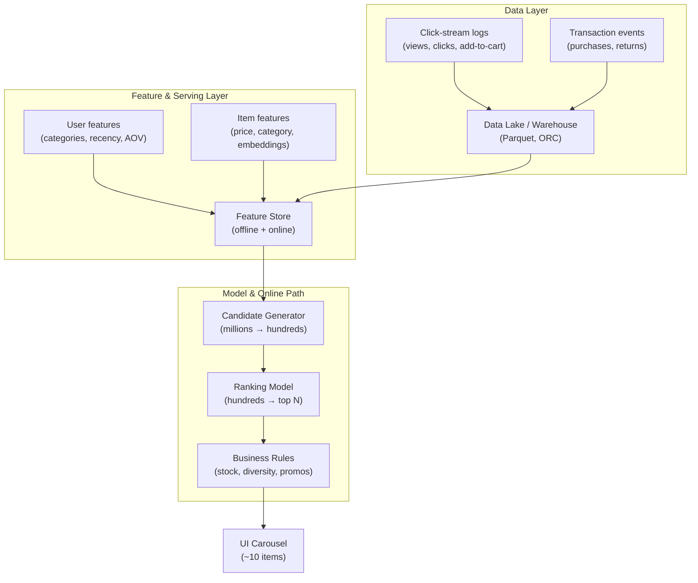

# Recommendation System: Problem Definition and Requirements

## The Concrete Problem

When a user opens a homepage or product detail page, the system must render a carousel of roughly **10 recommended products**. This sounds simple, but satisfying all requirements simultaneously is genuinely hard.

### Functional Requirements

| Requirement | Description | Example |
|-------------|-------------|---------|
| **Personalisation** | Use individual behaviour history | Past views, clicks, purchases shape recommendations |
| **Freshness** | React quickly to recent activity | User clicks a new category → carousel updates within minutes |
| **Low latency** | No perceptible delay | Entire recommendation call completes in **100–200 ms** |
| **Business constraints** | Honour inventory and marketing rules | Only in-stock items; highlight promotions; avoid 10 near-identical products |

### Non-Functional Requirements

- **Diversity** — prevent filter bubbles and repetitive carousels
- **Scalability** — serve millions of users concurrently
- **Observability** — track CTR, conversion, latency, and error rates
- **Experimentation** — support A/B tests on ranking models without downtime

---

## High-Level Architecture

---

## Data Layer (Left Side)

Raw behavioural signals flow in continuously:

- **Web/app events**: page views, clicks, scrolls
- **Transaction events**: add-to-cart, purchases, returns

These are collected via streaming pipelines (e.g., Kafka, Kinesis) and stored in a data lake or warehouse in columnar formats like Parquet or ORC. Aggregated tables (e.g., daily user summaries) sit on top of raw events and feed downstream feature and training pipelines.

**Everything else depends on this layer.** If data ingestion breaks, features go stale, models train on outdated distributions, and recommendations degrade silently.

---

## Feature and Serving Layer (Middle)

### User Features

- Category affinities (electronics vs fashion interest)
- Recency and frequency signals (clicks in last 7 days)
- Spend patterns (average order value, discount sensitivity)

### Item Features

- Static attributes: category, brand, price, in-stock status
- Content features: title/description text, image embeddings
- Popularity metrics: view counts, click-through rates

### Feature Store Role

A feature store defines each feature **once** and serves it in two modes:

| Mode | Purpose | Latency |
|------|---------|---------|
| **Offline** | Materialise big tables for training | Minutes to hours |
| **Online** | Low-latency lookup per user/item ID | Milliseconds |

This prevents **training-serving skew** — the silent bug where training computes `user_30d_clicks` one way and the online service computes it differently.

---

## Model and Online Path (Right Side)

### Stage 1: Candidate Generation

- **Input**: millions of items
- **Output**: a few hundred roughly relevant candidates
- **Goal**: high **recall** at scale — does not need perfect ranking
- **Methods**: trending items in category, embedding-based retrieval (ANN search), two-tower models (separate user and item embedding networks; similarity = candidate score)

### Stage 2: Ranking

- **Input**: hundreds of candidates + user + context features
- **Output**: a relevance score per candidate
- **Goal**: fine-tune trade-offs between relevance, business goals, and UX
- **Models**: gradient boosted trees (XGBoost, LightGBM) or neural rankers
- **Post-processing**: filter out-of-stock, enforce category diversity, boost promotions, select top $N$

---

## Why Two Stages?

Scoring every item in the catalogue for every user is computationally infeasible at request time. Candidate generation uses cheap heuristics or ANN search to shrink the search space; the ranker then applies expensive feature-rich scoring only on the shortlist.

$$\text{Total latency} \approx T_{\text{feature lookup}} + T_{\text{candidate gen}} + T_{\text{ranking}} + T_{\text{post-processing}}$$

Each term must fit within the 100–200 ms budget.

---

## Common Pitfalls / Exam Traps

- **Optimising ranking without candidate generation** — you cannot score 10M items per request; two-stage architecture is mandatory at scale.
- **Ignoring diversity constraints** — high-CTR models often recommend near-duplicates; business rules must enforce variety.
- **Conflating freshness of features with model version** — updating features hourly does not require retraining the ranker daily.
- **Treating business rules as afterthoughts** — stock filtering and promotion boosting are part of the production contract, not optional post-processing.

---

## Quick Revision Summary

- Carousel shows ~10 personalised products within **100–200 ms**
- Requirements: personalisation, freshness, low latency, business constraints, diversity
- **Data layer**: click streams and transactions → data lake via streaming pipelines
- **Feature layer**: user/item features via feature store (offline training + online serving)
- **Two-stage model**: candidate generation (recall, scale) → ranking (precision, business trade-offs)
- Candidate gen uses heuristics, embeddings, or two-tower ANN search
- Ranking uses rich features + GBDT/neural models + business rule post-processing
- Feature store prevents training-serving skew by defining features once
- Architecture is the template for all large-scale personalisation systems
