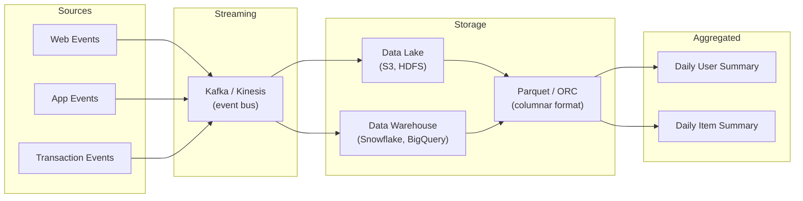
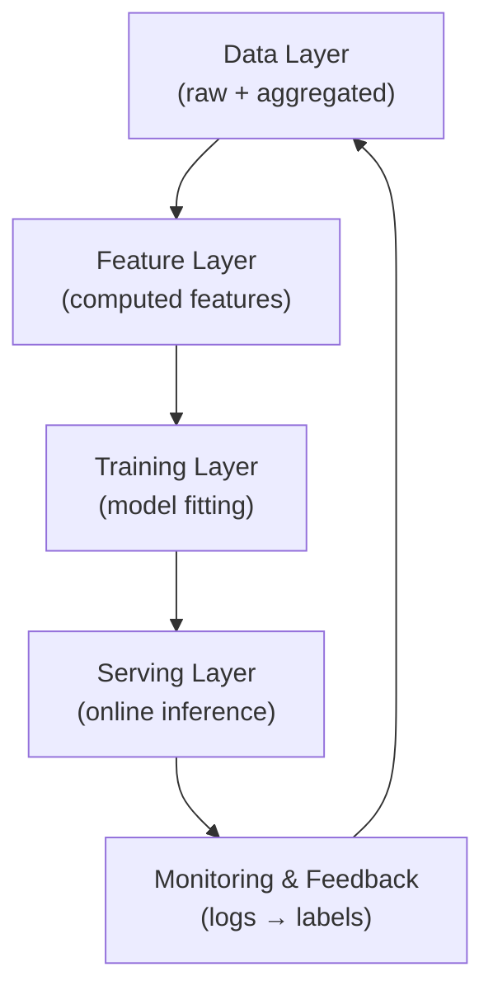

# Recommendation Systems: The Data Layer

## Intuition

The data layer is the foundation of every production ML system. No amount of model sophistication compensates for missing, delayed, or corrupt data. In a recommendation system, the data layer captures **what users did** and **what they bought** — the raw material from which all features, models, and evaluations are derived.

If this layer fails, every upstream component — features, training, serving — operates on stale or incorrect information.

---

## Data Sources

### Behavioural Events (Web and App)

| Event Type | Signal Captured | Use in Recommendations |
|------------|-----------------|------------------------|
| Page views | Browsing intent, category interest | Category affinity features |
| Clicks | Active engagement | Short-term preference signals |
| Scrolls | Attention depth | Engagement quality metrics |
| Search queries | Explicit intent | Query-document matching |

### Transactional Events

| Event Type | Signal Captured | Use in Recommendations |
|------------|-----------------|------------------------|
| Add-to-cart | Purchase intent | Conversion funnel features |
| Purchases | Confirmed preference | Ground-truth labels for ranking |
| Returns | Negative feedback | Quality and satisfaction signals |

---

## Ingestion Architecture

### Why Streaming Pipelines?

Behavioural events arrive continuously and at high volume. A streaming pipeline (Kafka, Kinesis, Pulsar) provides:

- **Durability** — events are not lost if a downstream consumer is temporarily down
- **Decoupling** — multiple consumers (feature pipeline, monitoring, analytics) read independently
- **Near-real-time freshness** — events available for feature computation within seconds to minutes

### Why Columnar Formats (Parquet, ORC)?

- Efficient compression for large historical datasets
- Column pruning — read only the fields needed for a given aggregation
- Partition-friendly — slice by date, user segment, or event type

---

## Aggregated Tables

Raw events are too granular for direct model consumption. Aggregation jobs build summary tables:

**Daily User Summary** (example schema):

| Field | Description |
|-------|-------------|
| `user_id` | Entity key |
| `event_date` | Partition key |
| `num_clicks_1d` | Click count in last day |
| `num_views_1d` | View count in last day |
| `categories_viewed` | Set of categories browsed |
| `total_spend_7d` | Purchase value in last 7 days |

**Daily Item Summary** (example schema):

| Field | Description |
|-------|-------------|
| `item_id` | Entity key |
| `event_date` | Partition key |
| `view_count_1d` | Popularity signal |
| `click_count_1d` | Engagement signal |
| `purchase_count_1d` | Conversion signal |
| `return_rate_7d` | Quality signal |

These tables are consumed by the **feature pipeline** (offline materialisation) and **training jobs** (label generation).

---

## Data Quality Responsibilities

The data layer owns quality contracts:

| Check | What It Catches | Impact If Missed |
|-------|-----------------|------------------|
| **Freshness** | Pipeline delay, missing batches | Stale features, outdated recommendations |
| **Completeness** | Partial event delivery | Biased training data |
| **Schema validation** | New fields, type changes | Downstream job failures |
| **Volume anomaly** | Traffic spike or drop | False alerts or missed incidents |

Monitoring freshness, completeness, and schema stability at this layer prevents silent degradation across the entire stack.

---

## Volume and Scale Considerations

A mid-size e-commerce platform might log:

- **100M+ events per day** (views, clicks, transactions)
- **Terabytes per month** in the data lake
- **Partitioning by date** essential for query performance and retention policies

Retention policy example: keep raw events for 90 days, aggregated tables for 2 years (sufficient for seasonal pattern learning).

---

## Relationship to Other Layers

The data layer is both the **starting point** and the **sink** of the MLOps loop — online predictions generate new events that flow back as training labels.

---

## Common Pitfalls / Exam Traps

- **Skipping aggregation** — models cannot train on raw click-stream events at scale; aggregated entity-time tables are required.
- **Ignoring schema evolution** — adding a field without versioning breaks downstream SQL and feature definitions.
- **Treating the data lake as a database** — lakes are cheap storage with lazy consistency; warehouses add query optimisation and governance.
- **No freshness monitoring** — a pipeline that silently stops ingesting for 6 hours degrades every downstream system before anyone notices.

---

## Quick Revision Summary

- Data layer ingests **behavioural events** (views, clicks) and **transactional events** (cart, purchases, returns)
- Events flow through **streaming pipelines** (Kafka/Kinesis) into **data lakes/warehouses** (Parquet/ORC)
- **Aggregated tables** (daily user/item summaries) feed feature pipelines and training jobs
- Data layer owns **freshness, completeness, and schema** quality contracts
- Everything upstream — features, models, serving — depends on reliable data ingestion
- Columnar formats enable efficient storage and selective reads at scale
- Online prediction logs close the feedback loop back into the data layer
- Monitoring data volume and pipeline health is a first-class operational concern
