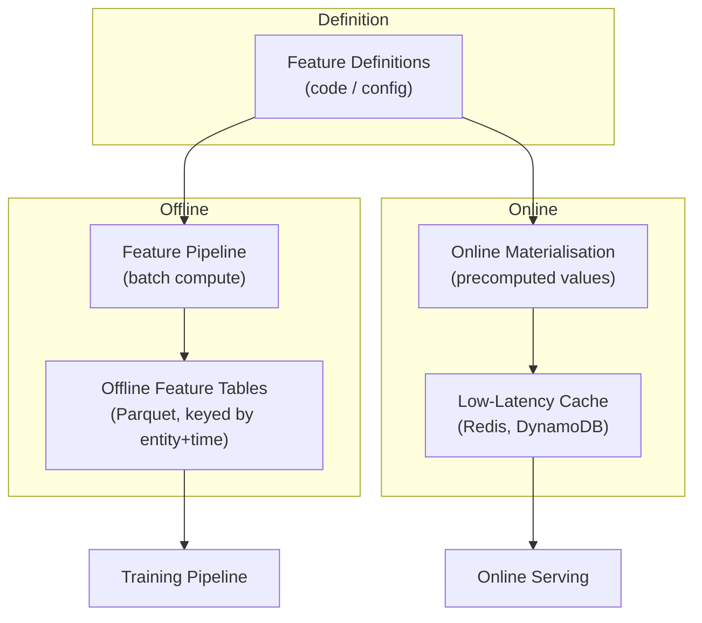
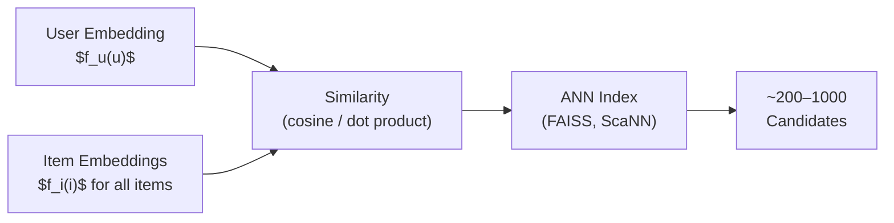
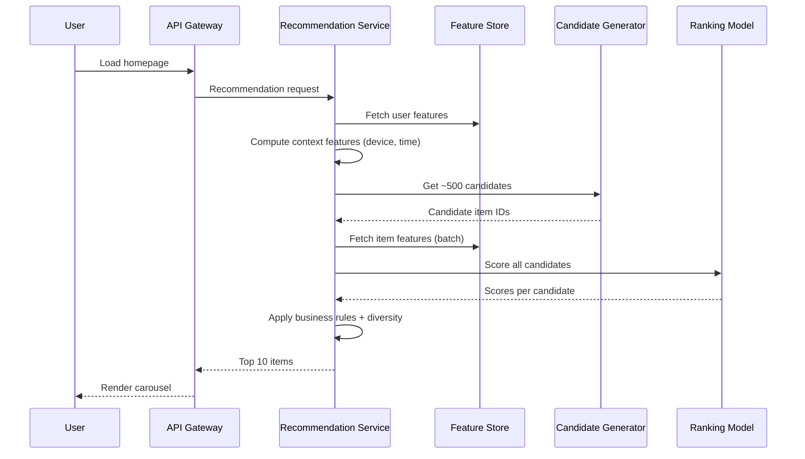

# Recommendation Systems: Feature Store, Candidate Generation, and Ranking

## Intuition

Raw data is not model-ready. The feature and serving layer transforms behavioural logs into **structured feature vectors** that models consume at both training time and request time. This layer also hosts the two-stage model pipeline — candidate generation followed by ranking — and orchestrates the full online request path.

The central design principle: **define each feature once, use it everywhere**, eliminating training-serving skew.

---

## Feature Taxonomy

### User Features

| Category | Examples | Computation |
|----------|----------|-------------|
| Recency / frequency | Clicks in last 7 days, days since last purchase | Sliding window aggregation |
| Category affinity | P(electronics), P(fashion) from browse history | Normalised click distribution |
| Spend patterns | Average order value, discount sensitivity | Transaction aggregations |

### Item Features

| Category | Examples | Computation |
|----------|----------|-------------|
| Static attributes | Category, brand, price, in-stock flag | Product catalogue |
| Content features | Title/description embeddings, image embeddings | NLP/CV pipelines |
| Popularity | View count, CTR, purchase rate | Event aggregations |

### Context Features

| Feature | Why It Matters |
|---------|----------------|
| Time of day | Morning browsing differs from evening |
| Device type | Mobile vs desktop behaviour patterns |
| Page type | Homepage carousel vs product-detail cross-sell |

All features combine into a **feature vector** $\mathbf{x} = [x_{\text{user}}, x_{\text{item}}, x_{\text{context}}]$ consumed by the ranker.

---

## Feature Store Architecture

### Dual-Mode Serving

| Mode | Consumer | Latency | Freshness |
|------|----------|---------|-----------|
| Offline | Training jobs, batch scoring | Minutes–hours | Last batch run |
| Online | Real-time inference per request | Milliseconds | Near real-time |

### Training-Serving Skew Prevention

Without a feature store:

- Training job computes `user_30d_clicks` over a 30-day SQL window
- Online service computes it over a 7-day in-memory buffer
- Same feature name, **different semantics** → silent production degradation

With a feature store: one definition, two materialisation paths, guaranteed consistency.

---

## Two-Stage Model Pipeline

### Stage 1: Candidate Generation

**Goal**: Reduce millions of items to hundreds of plausible candidates (high recall, low precision requirement).

| Approach | Mechanism | Scalability |
|----------|-----------|-------------|
| Heuristic | Top trending in user's preferred category | Very fast |
| Embedding retrieval | ANN search over item embeddings | Fast, scalable |
| Two-tower model | Separate user network $f_u$ and item network $f_i$; score = $\text{sim}(f_u(u), f_i(i))$ | Fast at inference |

Candidate generation is about **recall and scalability** — a good shortlist, not perfect ordering.

### Stage 2: Ranking Model

**Goal**: Score each candidate for the specific user and context; optimise relevance and business objectives.

- **Input**: user features + item features + context features (per candidate)
- **Model**: gradient boosted trees (XGBoost, LightGBM) or deep neural ranker
- **Output**: relevance score $s_i$ for each candidate $i$
- **Post-processing**: sort by score, apply business filters

$$\text{final list} = \text{top-}N\Big(\text{filter}\big(\text{diversify}(\text{sort}(s_i))\big)\Big)$$

Post-processing rules:

- Remove out-of-stock items
- Enforce category diversity (no 10 identical products)
- Boost promotional items
- Return top $N$ (typically $N \approx 10$)

---

## Online Request Path (End-to-End)

**Latency budget breakdown** (typical):

| Step | Target |
|------|--------|
| Feature lookup | 10–20 ms |
| Candidate generation | 20–50 ms |
| Ranking (500 candidates) | 30–80 ms |
| Post-processing | 5–10 ms |
| **Total** | **< 200 ms** |

---

## Technology Choices

| Component | Common Choices |
|-----------|----------------|
| API framework | FastAPI, gRPC |
| Feature store | Feast, Tecton, Hopsworks, custom Redis cache |
| ANN index | FAISS, ScaNN, Elasticsearch kNN |
| Ranker | XGBoost, LightGBM, TensorFlow Ranking |
| Cache | Redis, Memcached |

---

## Common Pitfalls / Exam Traps

- **Single-stage scoring at scale** — scoring millions of items per request is infeasible; always use candidate generation first.
- **Feature store as optional** — without it, training-serving skew is inevitable in any team larger than one engineer.
- **Ignoring post-processing in latency budget** — diversity enforcement and stock filtering add 5–15 ms; plan for it.
- **Using offline popularity for online ranking without refresh** — stale popularity features recommend yesterday's trends.
- **Confusing two-tower retrieval with the ranker** — two-tower gives cheap approximate scores for recall; the ranker does precise scoring on the shortlist.

---

## Quick Revision Summary

- Features span **user** (affinity, recency, spend), **item** (attributes, content, popularity), and **context** (time, device, page)
- **Feature store** defines features once for offline training and online serving — prevents training-serving skew
- **Candidate generation**: millions → hundreds via heuristics, embeddings, or two-tower ANN search (recall-focused)
- **Ranking model**: hundreds → top $N$ via GBDT/neural ranker + business rules (precision-focused)
- **Online path**: gateway → feature lookup → candidate gen → ranking → post-processing → UI (all under 200 ms)
- Post-processing enforces stock, diversity, and promotion rules — not optional
- Two-tower: separate $f_u(u)$ and $f_i(i)$ networks; similarity drives candidate retrieval
- FastAPI/gRPC for serving; Redis for online feature cache; FAISS for ANN retrieval
