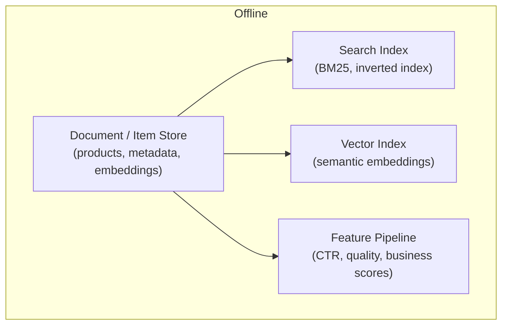
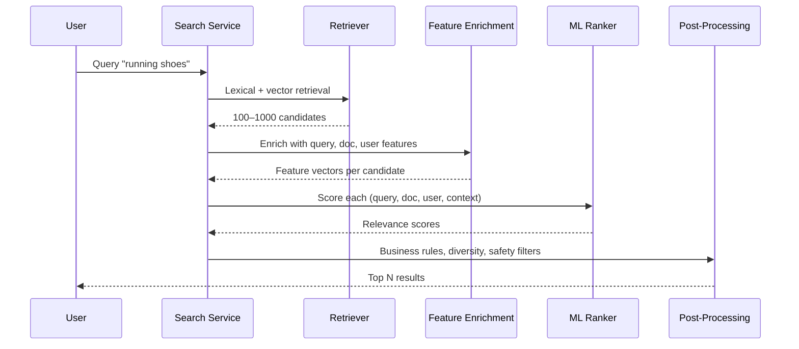
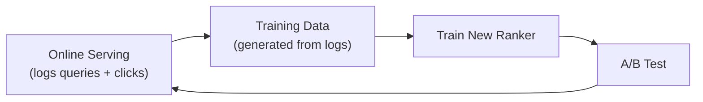
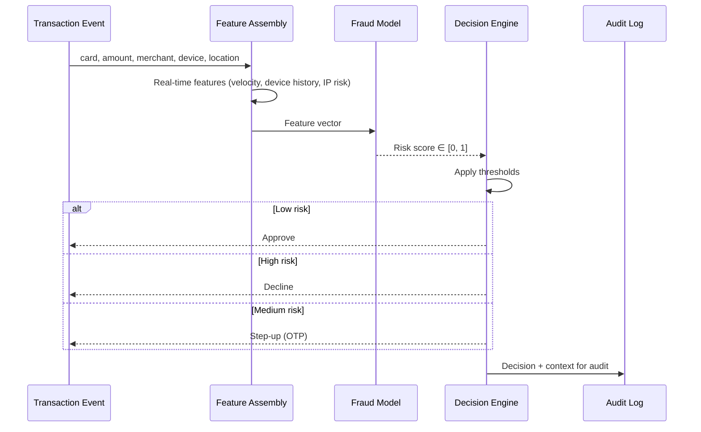

# Architectures for Search Ranking and Fraud Detection

## Why Compare These Two?

Ranking systems and fraud detection systems both require data pipelines, online scoring, and monitoring — but their **constraints, success metrics, and cost of errors** are fundamentally different. Understanding both architectures — and what they share — is essential for ML system design.

---

## Search Ranking Architecture

### The Problem

A user searches "running shoes" on an e-commerce site. The system must:

1. Retrieve potentially thousands of relevant products
2. Rank them in a useful order
3. Return results within a **50–150 ms** ranking budget

**Success metric**: click-through rate (CTR), conversion rate, dwell time.

**Critical insight**: users interact almost exclusively with the **top of the list**. If the first few results are bad, the experience feels broken — even if overall recall is high.

### Offline Foundation

| Component | Purpose |
|-----------|---------|
| Document store | Products, articles, or videos with metadata and precomputed embeddings |
| Lexical index | BM25, inverted indexes for keyword matching |
| Vector index | Semantic search via embedding similarity |
| Feature pipeline | Precompute popularity (CTR), quality signals, business scores |

### Online Ranking Path

**Feature types per candidate**:

| Feature Group | Examples |
|---------------|----------|
| Query features | Query length, detected intent, entity extraction |
| Document features | Popularity, CTR, metadata, freshness |
| User features | Past interactions, purchase history (from feature store) |
| Context features | Device, location, time |

### Experimentation and Feedback Loop

Ranking systems live and die by **online metrics and A/B testing**:

1. Log every query, shown items, clicks, and ignores
2. Generate training data from interaction logs
3. Train new ranker version offline
4. A/B test: baseline model vs challenger
5. Compare CTR, conversion, dwell time, bounce rate
6. Promote winner to production

---

## Fraud Detection Architecture

### The Problem

A user presses "Pay" on an online transaction. The system must decide within **tens of milliseconds**:

- **Approve** the transaction
- **Decline** it
- **Step up** with extra verification (OTP, 3D Secure)

### Cost of Errors

| Error Type | Consequence | Severity |
|------------|-------------|----------|
| **False negative** (approve fraud) | Direct financial loss | High — money lost |
| **False positive** (block legitimate) | Lost revenue, damaged trust | High — customer churn |

This is a **one-shot decision** with limited evidence and strong compliance implications — very different from ranking where a bad result is merely annoying.

### Online Fraud Flow

**Real-time features assembled at decision time**:

| Feature | Signal |
|---------|--------|
| Transaction velocity | How many transactions this card made in last 10 minutes |
| Device familiarity | New device vs known device |
| IP risk | Suspicious or geographically unusual IP |
| Amount anomaly | Transaction amount vs historical pattern |
| Merchant risk | High-risk merchant category |

### Decision Engine Thresholds

$$\text{decision}(s) = \begin{cases} \text{approve} & \text{if } s < \tau_{\text{low}} \\ \text{step-up} & \text{if } \tau_{\text{low}} \leq s < \tau_{\text{high}} \\ \text{decline} & \text{if } s \geq \tau_{\text{high}} \end{cases}$$

Thresholds are tuned **per segment** (region, merchant type, risk appetite) — not globally.

---

## Side-by-Side Comparison

| Dimension | Search Ranking | Fraud Detection |
|-----------|---------------|-----------------|
| **Primary goal** | Ordering and relevance | Risk and correctness |
| **Latency budget** | 50–150 ms (ranking step) | Tens of ms (entire decision) |
| **Success metrics** | CTR, conversion, dwell time | Fraud loss, segment error rates |
| **Error cost** | Annoying, metric impact | Direct financial loss or unfair treatment |
| **Decision type** | Ordered list (many items) | Binary/ternary (approve/decline/step-up) |
| **Experimentation** | Aggressive A/B testing | Conservative; compliance constraints |
| **Feedback loop** | Clicks logged immediately | Labels arrive days/weeks later (chargebacks) |
| **Compliance** | Low | High — audit trails required |

---

## Common Pitfalls / Exam Traps

- **Applying ranking latency budgets to fraud** — fraud decisions need sub-50 ms; ranking can tolerate 150 ms for the ranker step alone.
- **Using accuracy as the fraud metric** — class imbalance means 99% accuracy can be worthless; optimise for cost-weighted error rates.
- **Ignoring top-of-list bias in ranking evaluation** — NDCG@10 matters more than overall recall; users never scroll past position 5.
- **Treating fraud labels as immediately available** — chargebacks arrive weeks later; offline training requires point-in-time feature reconstruction.
- **Same threshold globally for fraud** — different regions and merchant types need different risk appetites.

---

## Quick Revision Summary

- **Ranking**: retrieve 100–1000 candidates → enrich with query/doc/user features → ML ranker → post-process → top N
- Ranking optimises **order and relevance**; success = CTR, conversion, dwell time; latency 50–150 ms
- Ranking feedback loop: log queries/clicks → train → A/B test → promote
- **Fraud**: assemble real-time features → risk score → threshold decision (approve/decline/step-up)
- Fraud optimises **risk and correctness**; errors are expensive; latency tens of ms
- Fraud uses segment-specific thresholds tuned for cost of false positives vs false negatives
- Both share: data pipelines, feature stores, online scoring, monitoring — but priorities differ radically
- Ranking experiments aggressively; fraud moves conservatively with audit requirements
