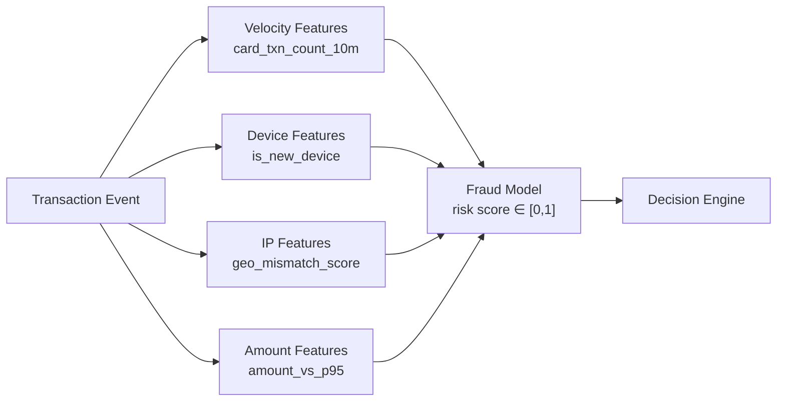
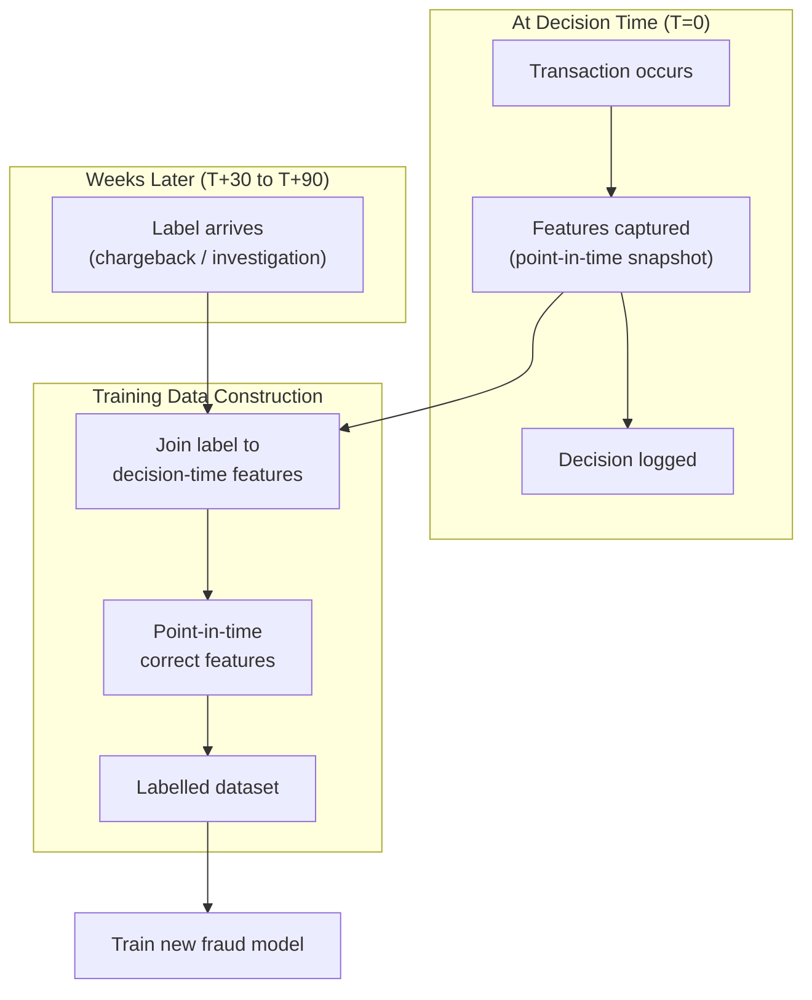
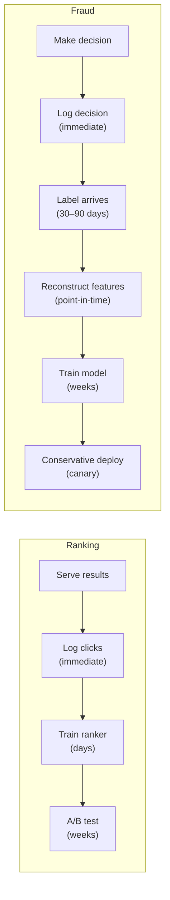

# Fraud Detection: Online Decisions and Delayed Labels

## The Core Challenge

Fraud detection makes **real-time, one-shot decisions** with incomplete information. Unlike ranking — where a bad recommendation is merely suboptimal — a fraud error has immediate financial or customer-trust consequences. The offline training side is equally challenging because **ground-truth labels arrive late**, sometimes weeks after the transaction.

---

## Online Decision Architecture (Deep Dive)

### Transaction Event Structure

When a payment is initiated, the system receives:

| Field | Use in Feature Assembly |
|-------|------------------------|
| Card details (tokenised) | Velocity checks, historical pattern |
| Transaction amount | Anomaly detection vs user baseline |
| Merchant ID / category | Merchant risk scoring |
| Device fingerprint | New vs known device |
| IP address / geolocation | Geographic anomaly detection |
| Timestamp | Velocity windows (last 10 min, 1 hr, 24 hr) |

### Real-Time Feature Assembly

Features must be computed in **tens of milliseconds** from streaming state:

**Velocity features** are especially powerful:

- `card_txn_count_10m` — sudden burst of transactions signals card testing
- `card_txn_amount_sum_1h` — cumulative spend anomaly
- `distinct_merchants_24h` — card used at many merchants quickly

### Three-Way Decision Logic

| Risk Score Range | Action | Rationale |
|------------------|--------|-----------|
| $s < \tau_{\text{low}}$ | **Approve** | Low risk; friction hurts conversion |
| $\tau_{\text{low}} \leq s < \tau_{\text{high}}$ | **Step-up** (OTP, 3DS) | Ambiguous; verify without hard decline |
| $s \geq \tau_{\text{high}}$ | **Decline** | High confidence fraud |

Thresholds $\tau_{\text{low}}$ and $\tau_{\text{high}}$ are **not global constants** — they vary by:

- Geographic region (fraud patterns differ by country)
- Merchant category (digital goods vs physical retail)
- Customer segment (new vs established)
- Organisational risk appetite

### Audit and Compliance

Every decision is logged with:

- Model version used
- Feature vector at decision time
- Risk score and threshold applied
- Final action taken
- Timestamp and transaction ID

This audit trail is mandatory for regulatory compliance (PCI-DSS, PSD2) and post-incident investigation.

---

## The Delayed Label Problem

### Why Labels Arrive Late

Fraud is rarely confirmed at transaction time. Ground truth emerges through:

| Label Source | Typical Delay | Mechanism |
|--------------|---------------|-----------|
| Customer chargeback | 30–90 days | Customer disputes transaction with bank |
| Internal investigation | Days to weeks | Fraud team manual review |
| Merchant report | Days | Merchant flags suspicious activity |
| Law enforcement | Months | External fraud ring identification |

### Offline Training Pipeline with Late Labels

### Point-in-Time Correctness

When reconstructing training data, you must use **only features available at decision time** — not features computed with future knowledge.

**Example trap**: Using `chargeback_flag_30d` as a feature during training when that flag did not exist at inference time. This is **data leakage** and inflates offline metrics.

Correct approach:

$$\text{training row} = (\mathbf{x}_{t=0}, y_{t+60})$$

where $\mathbf{x}_{t=0}$ is the feature snapshot at transaction time and $y_{t+60}$ is the label confirmed 60 days later.

---

## Evaluation Focus: Cost of Error

Fraud models are **not** evaluated on accuracy alone. With 0.1% fraud rate, a model that always predicts "not fraud" achieves 99.9% accuracy while being useless.

### Cost-Sensitive Metrics

| Metric | Formula / Definition | Why It Matters |
|--------|---------------------|----------------|
| False negative rate | FN / (FN + TP) | Direct fraud loss per missed fraud |
| False positive rate | FP / (FP + TN) | Legitimate customers blocked |
| Expected loss | $\text{FN} \times C_{\text{fn}} + \text{FP} \times C_{\text{fp}}$ | Business-weighted objective |
| Precision at threshold | TP / (TP + FP) | Of declined transactions, how many were actually fraud |

### Segment-Specific Threshold Tuning

| Segment | Risk Appetite | Threshold Strategy |
|---------|---------------|-------------------|
| High-value merchants | Low fraud tolerance | Lower $\tau_{\text{high}}$ → more declines |
| New user onboarding | Prioritise UX | Higher $\tau_{\text{low}}$ → fewer false positives |
| Digital goods | High fraud rate | Aggressive thresholds |
| Established customers | Trust history | More lenient thresholds |

---

## Feedback Loop Comparison: Fraud vs Ranking

| Aspect | Ranking | Fraud |
|--------|---------|-------|
| Label latency | Minutes (clicks) | Weeks (chargebacks) |
| Experimentation speed | Fast A/B tests | Slow, conservative rollouts |
| Feedback signal | Abundant (every click) | Sparse (few fraud cases) |
| Deployment risk | Low (bad ranking) | High (financial loss) |

---

## Common Pitfalls / Exam Traps

- **Training on future information** — using post-chargeback features as inputs creates leakage; always reconstruct point-in-time feature snapshots.
- **Optimising accuracy with imbalanced data** — 99.9% accuracy can mean zero fraud caught; use cost-weighted metrics.
- **Global thresholds** — fraud patterns vary by region and merchant; segment-specific tuning is mandatory.
- **Ignoring step-up decisions in evaluation** — OTP challenges are neither approve nor decline; metrics must account for three-way outcomes.
- **Assuming labels are binary** — some transactions remain ambiguous indefinitely; training data has a "unknown" class that must be handled.

---

## Quick Revision Summary

- Fraud decisions are **one-shot, real-time** (tens of ms) with approve / decline / step-up outcomes
- Real-time features: **velocity, device familiarity, IP risk, amount anomaly**
- Thresholds $\tau_{\text{low}}$ and $\tau_{\text{high}}$ are **segment-specific**, not global
- Every decision is **audited** with model version, features, score, and action
- Labels arrive **30–90 days late** via chargebacks and investigations
- Training requires **point-in-time feature reconstruction** — no future leakage
- Evaluate on **cost of error** (expected loss), not accuracy
- Fraud feedback loop is slower and more conservative than ranking's click-based loop
