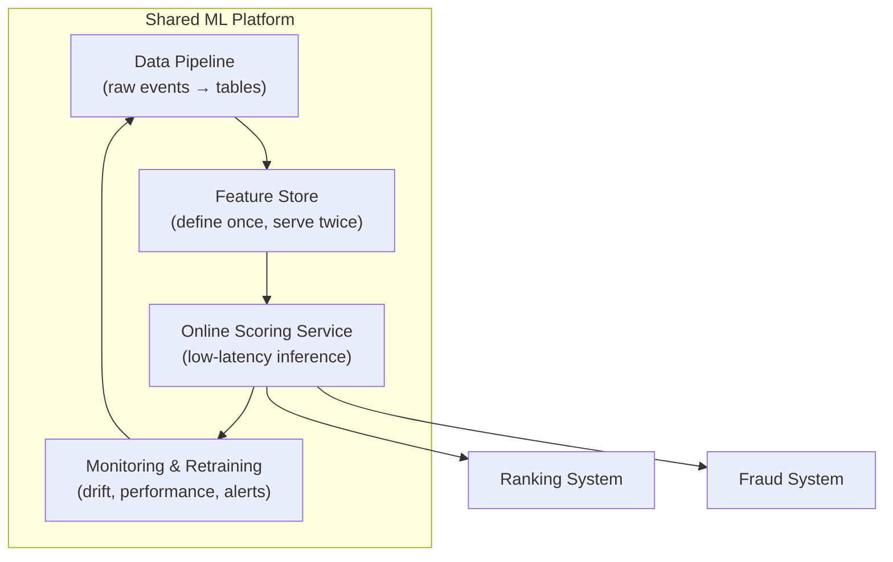
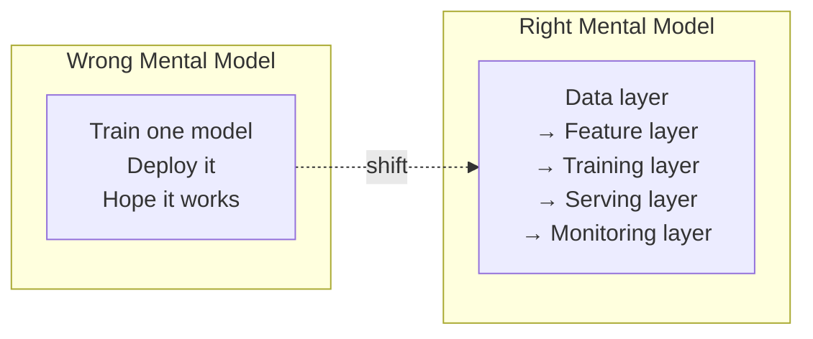

# Ranking vs Fraud Systems: Shared Platform, Different Priorities

## The Central Insight

Ranking and fraud detection look like different problems on the surface — one optimises click order, the other blocks stolen credit cards. Yet both run on the **same ML platform primitives**: data pipelines, feature stores, online scoring services, and monitoring/retraining loops.

The toolbox is shared. The **priorities and risk profiles** are not.

---

## Shared Platform Primitives

### What Both Systems Need

| Primitive | Function | Shared Implementation |
|-----------|----------|----------------------|
| **Data pipeline** | Ingest raw events into usable tables | Kafka → data lake → aggregated tables |
| **Feature layer** | Consistent features for training and serving | Feature store with offline + online paths |
| **Online scoring** | Low-latency model inference | FastAPI/gRPC service with model registry |
| **Monitoring** | Track drift, performance, system health | Prometheus + alerting + dashboards |
| **Retraining** | Close the loop when models degrade | Scheduled or triggered training pipelines |

Both systems track:

- **Metric drift** — model predictions shifting from training distribution
- **Data drift** — input feature distributions changing over time
- **Model performance** — online quality metrics degrading

---

## Where They Diverge

### Optimisation Objectives

| Dimension | Ranking | Fraud |
|-----------|---------|-------|
| **Primary objective** | Order and relevance | Risk and correctness |
| **Success metrics** | CTR, conversion, dwell time, engagement | Fraud loss, segment-specific error rates |
| **Model output** | Relevance score per item (continuous) | Risk score with threshold decision (discrete) |
| **User interaction** | Many items shown; user picks one | Single binary/ternary decision per transaction |

### Cost of Getting It Wrong

| System | Bad Outcome | Severity | Recovery |
|--------|-------------|----------|----------|
| **Ranking** | User sees irrelevant products | Annoying; hurts metrics | User scrolls past; next session recovers |
| **Fraud (FN)** | Fraudulent transaction approved | Direct financial loss | Money is gone; chargeback process |
| **Fraud (FP)** | Legitimate customer blocked | Revenue loss + trust damage | Customer may churn permanently |

A bad ranking result is **recoverable and non-catastrophic**. A bad fraud decision can mean **direct financial loss or unfair treatment** — with compliance and audit consequences.

### Experimentation Culture

| Aspect | Ranking | Fraud |
|--------|---------|-------|
| A/B testing | Aggressive; frequent model swaps | Conservative; canary with heavy monitoring |
| Rollback speed | Fast (swap model version) | Fast but with audit trail requirement |
| Risk tolerance for new models | High (worst case: lower CTR) | Low (worst case: financial loss) |
| Feedback speed | Immediate (clicks) | Delayed (chargebacks, 30–90 days) |

### Decision Characteristics

| Property | Ranking | Fraud |
|----------|---------|-------|
| Decision type | Ordered list (top N from M candidates) | One-shot approve/decline/step-up |
| Evidence available | Rich (user history, query, context) | Limited (single transaction snapshot) |
| Compliance requirements | Low | High (PCI-DSS, audit trails, explainability) |
| Latency budget | 50–150 ms (ranking step) | Tens of ms (entire pipeline) |

---

## Design Implications

### For Ranking Systems

- Invest heavily in **experimentation infrastructure** (A/B testing, multi-armed bandits)
- Optimise for **top-of-list quality** (NDCG@5, CTR@3)
- Accept that **exploration** (showing diverse items) is part of the product
- Feature freshness matters for **recent behaviour signals**

### For Fraud Systems

- Invest heavily in **audit and explainability** infrastructure
- Optimise for **cost-weighted error rates**, not accuracy
- Design for **segment-specific thresholds** from day one
- Build **point-in-time feature reconstruction** for delayed-label training
- Plan for **conservative deployment** (canary, shadow mode)

---

## The Platform Thinking Shift

The key shift is from thinking about a **single model** to thinking about the **whole system**. For any ML problem, ask:

1. Where does data come from? How often? Quality checks?
2. Which features matter? Consistent in training and serving?
3. How do we train, track experiments, and choose which model to promote?
4. How do we deploy, scale, and meet latency/reliability constraints?
5. How do we detect drift or failures and trigger retraining or rollback?

If you can walk through these five questions for a recommendation system, a ranking system, or a fraud system, you are doing **ML system design**.

---

## Common Pitfalls / Exam Traps

- **Assuming ranking and fraud need different platforms** — they share 80% of infrastructure; only priorities and risk profiles differ.
- **Applying ranking experimentation speed to fraud** — fraud requires conservative canary rollouts with audit trails.
- **Ignoring compliance in fraud architecture** — audit logging is not optional; it is a regulatory requirement.
- **Treating a bad ranking outcome as equivalent to a fraud false positive** — severity and recovery paths are completely different.
- **Building separate feature stores per use case** — one platform, many consumers; reuse features across models.

---

## Quick Revision Summary

- Ranking and fraud share: **data pipelines, feature stores, online scoring, monitoring/retraining**
- Both track metric drift, data drift, and model performance over time
- **Ranking** optimises order/relevance (CTR, conversion); bad results are annoying, not catastrophic
- **Fraud** optimises risk/correctness; bad decisions mean financial loss or unfair treatment
- Ranking experiments aggressively with A/B tests; fraud deploys conservatively with audit trails
- Fraud has compliance requirements; ranking does not
- The toolbox is the same; **priorities and risk profiles** drive architectural differences
- ML system design = walking through all five platform layers for any use case
