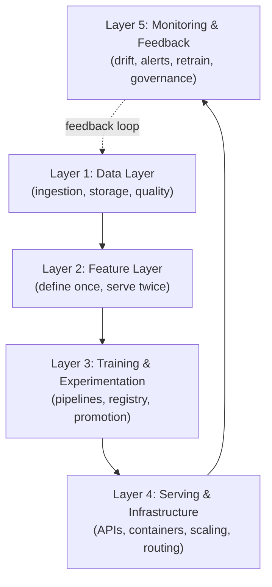
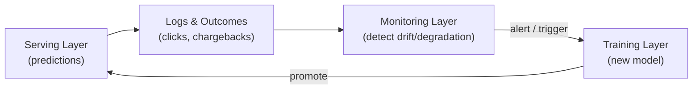
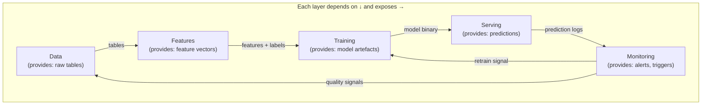

# The Layered ML Platform: Five-Layer Architecture

## Why Layered Thinking?

Production ML is not a single monolith. A healthy ML platform is a **set of well-defined layers** that can evolve somewhat independently, as long as their interfaces stay clear. Each layer depends on the one below and exposes capabilities to the one above.

This mental model lets you point to any part of a production system and identify which layer it belongs to — essential for design discussions, debugging, and system design interviews.

---

## The Five-Layer Stack

| Layer | Core Responsibility | Key Question |
|-------|----------------------|--------------|
| **Data** | Ingest, store, validate raw data | Where does data come from? Is it on time and complete? |
| **Features** | Transform raw data into reusable features | Which features matter? Are they consistent in training and serving? |
| **Training & Experiments** | Train, evaluate, track, promote models | How do we choose which model goes to production? |
| **Serving & Infrastructure** | Deploy, scale, route inference requests | How do we meet latency, reliability, and cost constraints? |
| **Monitoring & Feedback** | Detect problems, trigger retraining, govern | How do we know when something breaks? |

---

## Layer 1: Data Layer

### Responsibilities

- Ingest raw data from batch exports, micro-batch jobs, and real-time streams
- Store in data lake or warehouse with partitioning (Parquet, ORC)
- Own **data quality contracts**: freshness, completeness, schema stability

### Quality Checks

| Check | Question | Alert If |
|-------|----------|----------|
| Freshness | Are we getting data on time? | Pipeline delay > SLA |
| Completeness | Is volume roughly expected? | Volume drop > 20% |
| Schema | Has schema changed unexpectedly? | New/missing columns detected |

### Ingestion Patterns

| Pattern | Latency | Use Case |
|---------|---------|----------|
| Batch | Hours | Daily aggregations, training data |
| Micro-batch | Minutes | Near-real-time feature updates |
| Streaming | Seconds | Real-time event processing, fraud features |

Everything above this layer depends on reliable, high-volume data ingestion.

---

## Layer 2: Feature Layer

### Responsibilities

- Transform messy raw data into **reusable features** (e.g., `user_30d_avg_purchase`, `num_logins_7d`)
- Define each feature **once** in code or configuration
- Materialise features **offline** (big tables for training) and **online** (low-latency lookups for inference)

### Goals

1. **Avoid training-serving skew** — same definition, two materialisation paths
2. **Enable reusability** — one feature used by many models
3. **Capture metadata and lineage** — know where each feature comes from

### Feature Store Placement

The feature store sits in this layer, providing:

- Feature definitions (code/config registry)
- Offline materialisation (batch pipelines → Parquet tables)
- Online serving (precomputed values → Redis/DynamoDB cache)
- Metadata API (discovery, lineage, freshness timestamps)

---

## Layer 3: Training and Experimentation

### Responsibilities

- Run pipelines that pull data + features, train models, evaluate, package artefacts
- Own **experiment tracking** and the **model registry**
- Contain **promotion logic** — deciding which models are production candidates

### Key Components

| Component | Function |
|-----------|----------|
| Training scripts | Fit models on labelled data |
| Experiment tracker (MLflow) | Log parameters, metrics, artefacts per run |
| Model registry | Catalogue versions (V1, V2, V3) with metadata |
| Promotion logic | Compare candidates vs champion; apply fairness thresholds |
| Evaluation harness | Holdout sets, slice metrics, cost-sensitive metrics |

### Promotion Decision

A new model version is promoted when it beats the current champion on business metrics **and** passes governance checks (fairness thresholds, latency benchmarks).

---

## Layer 4: Serving and Infrastructure

### Responsibilities

- Run model APIs (FastAPI, gRPC) for batch, online, and streaming inference
- Handle containerisation (Docker) and deployment (Kubernetes, serverless)
- Manage rollouts: blue-green, canary, A/B experiments
- Scale and route: auto-scaling, multi-model routing, caching

### Deployment Strategies

| Strategy | Mechanism | Risk |
|----------|-----------|------|
| **Blue-green** | Two identical environments; switch traffic instantly | Low downtime; full swap |
| **Canary** | Send small traffic slice to new version; monitor; promote | Gradual; early issue detection |
| **A/B test** | Split users between model versions; compare metrics | Product decision; not just deployment |

### Scaling Concerns

- Auto-scaling triggers: CPU utilisation, QPS, P95 latency
- Multi-tenant routing: shard by tenant, region, or model version
- Result caching: cache predictions for identical inputs when appropriate

**This layer is where latency, throughput, cost, and reliability concerns are front and centre.**

---

## Layer 5: Monitoring and Feedback

### Responsibilities

- Monitor **system metrics** (latency, error rates, throughput)
- Monitor **data metrics** (feature drift, data quality)
- Monitor **model metrics** (prediction quality, fairness slices)
- Raise alerts and trigger retraining, promotion, or rollback
- Support **governance**: audit logs, model version tracking, decision logging

### The Closed Loop

Online behaviour generates data and labels that feed back into training, which produces a new model for serving. This is the **MLOps closed loop**.

---

## Layer Dependencies

A failure at any layer propagates upward. Stale data → stale features → degraded model → bad predictions → monitoring alert → retrain trigger.

---

## Common Pitfalls / Exam Traps

- **Treating the platform as a monolith** — layers must have clear interfaces so they can evolve independently.
- **Skipping the data layer** — no feature, model, or serving layer works without reliable data ingestion.
- **Monitoring as an afterthought** — Layer 5 closes the loop; without it, models degrade silently in production.
- **Confusing training layer with serving layer** — training is batch/offline; serving is real-time; they have different SLAs and failure modes.
- **No promotion logic** — a model registry without promotion rules means manual, error-prone deployment decisions.

---

## Quick Revision Summary

- ML platform = **5 layers**: Data → Features → Training → Serving → Monitoring
- Each layer depends on the one below; interfaces must stay clear
- **Data layer**: ingestion, storage, quality contracts (freshness, completeness, schema)
- **Feature layer**: define once, materialise offline + online; feature store lives here
- **Training layer**: pipelines, experiment tracking, model registry, promotion logic
- **Serving layer**: APIs, containers, deployment strategies, scaling, routing
- **Monitoring layer**: system/data/model metrics, alerts, retraining triggers, governance
- The closed loop: serving → logs → monitoring → retrain → new model → serving
- Layered thinking is the foundation of ML system design interviews
