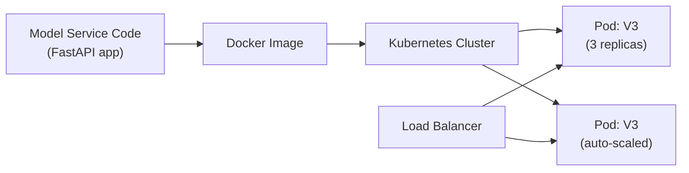
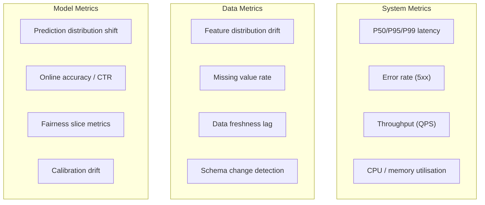
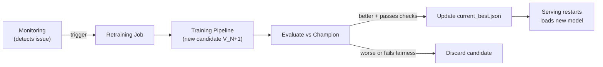
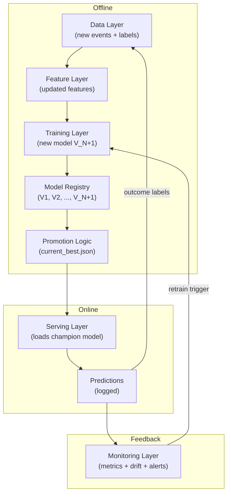

# ML Platform Layers: Serving, Monitoring, and the Closed Loop

## Overview

This note deep-dives into **Layers 4 and 5** of the five-layer ML platform — serving/infrastructure and monitoring/feedback — and shows how they connect to form the production closed loop. Layers 1–3 (data, features, training) were covered in the previous note.

---

## Layer 4: Serving and Infrastructure (Deep Dive)

### Model API Services

The serving layer exposes trained models as production APIs:

| Interface Type | Pattern | Latency | Example |
|----------------|---------|---------|---------|
| **Online (sync)** | Request-response per prediction | Milliseconds | Fraud scoring, recommendation ranking |
| **Batch** | Score large datasets offline | Minutes–hours | Nightly churn prediction for all users |
| **Streaming** | Process event stream continuously | Seconds | Real-time feature updates, anomaly detection |

Common frameworks: **FastAPI** (Python, REST), **gRPC** (high-performance RPC), **TensorFlow Serving**, **Triton Inference Server**.

### Model Loading from Registry

At startup, the serving service reads a configuration file (e.g., `current_best.json`) pointing to the promoted model version:

```json
{
  "model_version": "V3",
  "model_path": "models/V3/model.pkl",
  "deployed_at": "2026-05-15T10:00:00Z"
}
```

On restart or reload, the service automatically loads the new version — **no code changes required**. This decouples model updates from application deployments.

### Containerisation and Deployment



| Concern | Implementation |
|---------|----------------|
| Packaging | Docker image with model + dependencies + API |
| Orchestration | Kubernetes deployments, Helm charts |
| Rollout | Blue-green swap or canary (5% → 25% → 100%) |
| Rollback | Update `current_best.json` to previous version; restart |

### Scaling and Routing

| Mechanism | Trigger | Action |
|-----------|---------|--------|
| Horizontal auto-scaling | CPU > 70% or QPS > threshold | Add pod replicas |
| Vertical scaling | Model too large for instance | Upgrade instance type |
| Multi-model routing | A/B test or tenant sharding | Route traffic by user segment |
| Caching | Identical repeated requests | Cache prediction results (Redis) |

### Runtime Optimisation

Techniques from model compression modules apply here:

- **ONNX export** — portable model format for cross-framework inference
- **Quantisation** — reduce precision (FP32 → INT8) for faster inference
- **Model pruning** — remove low-importance weights

These ensure the model meets latency SLOs within cost constraints.

---

## Layer 5: Monitoring and Feedback (Deep Dive)

### Three Categories of Metrics



| Category | What It Detects | Example Alert |
|----------|-----------------|---------------|
| **System** | Infrastructure problems | P95 latency > 200 ms for 5 min |
| **Data** | Input distribution changes | `user_age` mean shifted by 2 std devs |
| **Model** | Prediction quality degradation | CTR dropped 15% vs 7-day baseline |

### Alerting and Response Playbook

| Alert | Likely Cause | Automated Response | Manual Response |
|-------|-------------|---------------------|-----------------|
| Latency spike | Overload or slow model | Auto-scale pods | Investigate bottleneck |
| Error rate increase | Bad deployment or dependency failure | Rollback to previous model | Post-incident review |
| Data drift detected | Upstream pipeline change or seasonality | Trigger retraining pipeline | Investigate root cause |
| Fairness check failed | Model bias on protected attribute | Block promotion; alert team | Audit and retrain |
| CTR drop | Model staleness or data issue | Trigger retraining | A/B test new candidate |

### Retraining Triggers

Retraining can be triggered by:

1. **Schedule** — nightly or weekly batch retrain
2. **Performance degradation** — online metric drops below threshold
3. **Data drift** — feature distribution shift detected
4. **Manual** — ML engineer initiates after investigation



### Governance and Audit

In regulated or high-stakes settings (fraud, credit, healthcare), the monitoring layer also provides:

- **Decision logging** — every prediction with model version, features, and outcome
- **Model lineage** — which data, features, and code produced each model version
- **Fairness auditing** — performance breakdowns across demographic slices
- **Rollback audit trail** — who changed `current_best.json`, when, and why

---

## The Complete Closed Loop



**Every arrow is a production concern:**

- Data → Features: pipeline reliability
- Features → Training: point-in-time correctness
- Training → Registry: experiment tracking
- Registry → Promotion: governance gates
- Promotion → Serving: zero-downtime model swap
- Serving → Monitoring: instrumentation
- Monitoring → Training: automated improvement
- Predictions → Data: label generation for next training cycle

---

## Rollback in Practice

When monitoring detects a major issue with the production model (e.g., V3 causing latency spikes or fairness violations):

1. Edit `current_best.json` → point to previous stable version (e.g., V1)
2. Restart the serving application
3. Service loads V1 automatically — no code changes
4. Log the rollback event for audit

This works because the system is **decoupled**: model version selection is configuration, not code.

---

## Common Pitfalls / Exam Traps

- **Monitoring only system metrics** — data drift and model performance degradation cause silent quality loss without any 5xx errors.
- **No automated retraining trigger** — manual retraining cycles are too slow; production models go stale.
- **Deploying model and code together** — coupling means every model update requires a full application deployment.
- **Skipping canary for high-stakes models** — fraud and credit models need gradual rollout with monitoring before full promotion.
- **No rollback mechanism** — without `current_best.json` pattern, reverting a bad model requires redeployment from scratch.

---

## Quick Revision Summary

- **Serving layer**: FastAPI/gRPC APIs, Docker/Kubernetes deployment, blue-green/canary rollouts, auto-scaling
- Model loaded from **registry config** (`current_best.json`) — swap versions without code changes
- Runtime optimisation: ONNX, quantisation, pruning for latency/cost targets
- **Monitoring layer**: system metrics (latency, errors), data metrics (drift, freshness), model metrics (CTR, fairness)
- Alerts trigger: auto-scale, rollback, retrain, or block promotion
- **Closed loop**: serve → log → monitor → retrain → promote → serve
- Rollback = edit config file + restart; no redeployment needed
- Governance: decision logging, model lineage, fairness auditing in high-stakes settings
