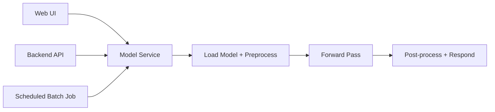

# Model Inference in Production: Module Overview

## Why Inference Deserves Its Own Module

Training gets most of the academic spotlight, but production ML systems spend the vast majority of their lifetime **serving predictions**, not fitting parameters. Module 2 zooms in on that serving phase: what happens when a trained model is asked for a prediction, how we measure it, and how we choose among different calling patterns.

By the end of this module, you should be able to:

- Define **model inference** in plain terms and distinguish it from training
- Use a shared vocabulary for **latency**, **throughput**, and **cost**
- Explain why the same model is often invoked in different ways depending on who is waiting and how fast they need an answer

---

## From Notebook Artifact to Running Service

A common beginner mistake is treating a production model as a pickle file on disk or a `predict()` call in a Jupyter notebook. In reality, a deployed model is part of a **service**:

1. It receives requests (from a UI, another backend, or a batch job)
2. It runs the model forward pass
3. It returns predictions to the caller

**Serving** or **deployment** means operating a system that can answer prediction requests **reliably, repeatedly, and at scale**.

| Phase | What Happens | Frequency |
|-------|--------------|-----------|
| Training | Learn parameters from historical data | Occasional (days/weeks) |
| Inference | Apply trained model to new data | Continuous (every request/event) |

---

## The Three Inference Patterns Preview

The same underlying model function $\hat{y} = f(x)$ can be called in three fundamentally different ways:

| Pattern | Who Waits? | Primary Metric |
|---------|-----------|----------------|
| **Batch** | Nobody per row; job must finish by deadline | Throughput, total job time |
| **Online (request-response)** | User or upstream service blocks until answer | P95/P99 latency |
| **Streaming** | No direct caller; pipeline reacts to events | Event-to-action latency, sustained throughput |

Module 2 structures the serving side: how we call the model, how we measure what happens when we do, and how to choose the right pattern.

---

## Connection to Module 1

Module 1 established that ML in production is more than saving weights. Module 2 builds on that foundation by adding:

- A formal definition of the **inference pipeline** (validate → transform → predict → post-process → respond)
- Quantitative metrics that turn vague "fast enough" requirements into engineering targets
- Hands-on lab work comparing batch and online clients against the same model API with real latency and throughput numbers

---

## Common Pitfalls / Exam Traps

- **Trap**: "Inference is just calling `model.predict()`." — Inference includes the full request path: validation, feature engineering, post-processing, serialization, and network overhead.
- **Trap**: "Training is the expensive part." — At scale, inference cost often dominates because it runs continuously across millions or billions of calls.
- **Trap**: "One deployment pattern fits all use cases." — The same model may be served batch overnight, online at checkout, and via a streaming pipeline for fraud alerts.
- **Trap**: Confusing **serving** with **training infrastructure** — Training clusters (GPU-heavy, episodic) and serving infrastructure (latency-sensitive, always-on) have different design constraints.

---

## Quick Revision Summary

- Production models are **services**, not static files — they receive requests and return predictions reliably
- **Inference** dominates the model lifecycle in both call volume and operational cost
- Three core metrics: **latency** (how long), **throughput** (how many per second), **cost** (resources per prediction)
- Three calling patterns: **batch** (scheduled bulk scoring), **online** (synchronous request-response), **streaming** (continuous event processing)
- Same model function $f(x)$, different invocation patterns based on business requirements
- Module 2 adds structure around calling patterns and measurement, building on Module 1's deployment foundations
