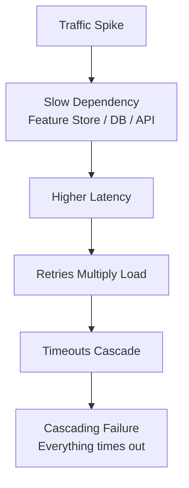
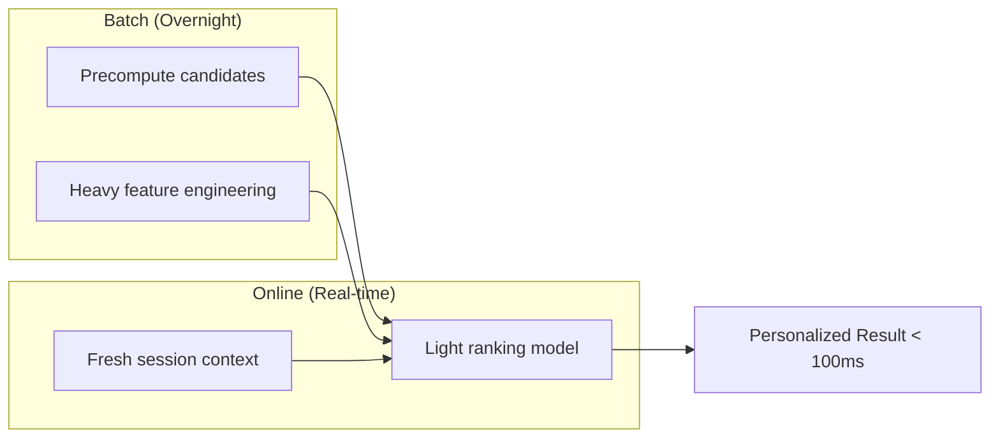

# Online Inference: Latency, Reliability, and Production Techniques

## The Price of Real-Time Serving

Online inference delivers fresh, personalized predictions but demands strict engineering discipline. The advantages come with real costs in latency requirements, scaling complexity, and operational fragility.

---

## Advantages of Online Inference

| Advantage | Description |
|-----------|-------------|
| **Fresh predictions** | Latest session data, recent actions, geolocation, device type — context absent from yesterday's batch snapshot |
| **Per-request personalization** | Two users on the same page simultaneously see completely different rankings or recommendations |
| **Tighter feedback loop** | Log each prediction with user interactions; feed outcomes back into training faster than batch cycles allow |

These capabilities enable the dynamic, interactive ML-powered experiences users expect from modern products.

---

## Challenges of Online Inference

| Challenge | Impact |
|-----------|--------|
| **Strict latency requirements** | P95/P99 must stay within target — "usually fast" is not enough |
| **Scaling complexity** | Traffic spikes from campaigns, launches, time-of-day patterns, bots |
| **More moving parts** | Load balancers, caches, feature stores, external dependencies — any failure is user-visible immediately |
| **Model complexity limits** | Heavy models may be too slow for reliable real-time serving |

---

## Failure Under Stress: Cascading Failures

A sudden traffic spike or a single slow dependency (feature store, database, upstream API) can trigger:

1. Higher latency on affected requests
2. Retries that multiply load
3. Timeouts that cascade across services
4. Complete system degradation where everything starts failing

Online systems must be designed to **fail gracefully**, not catastrophically.

---

## Production Techniques for Online Inference

### 1. Caching

If the same prediction is requested frequently, cache and reuse the result.

| Aspect | Detail |
|--------|--------|
| **Benefit** | Dramatically reduces latency and cost for common queries |
| **Risk** | Stale predictions if cache TTL is too long |
| **Example** | Cache popular product recommendations for 5 minutes |

### 2. Auto-Scaling

Automatically adjust the number of model serving replicas based on CPU, GPU, or request load.

| Aspect | Detail |
|--------|--------|
| **Scale out** | Add replicas during busy periods |
| **Scale in** | Remove replicas during quiet periods to save cost |
| **Trigger** | CPU utilization, request queue depth, custom metrics |

### 3. Circuit Breakers and Timeouts

If a downstream dependency is slow or failing, stop calling it and fall back to safe behavior.

| Aspect | Detail |
|--------|--------|
| **Circuit breaker** | After N failures, stop sending requests to the failing service |
| **Timeout** | Hard limit on how long to wait for any dependency |
| **Fallback** | Default prediction, cached result, or degraded experience |
| **Prevents** | One slow component dragging the entire system down |

### 4. Rate Limiting

Cap the number of requests per client/time window to prevent overload during spikes or abuse.

### 5. Hybrid Pattern

Precompute heavy features and candidate sets in **batch**, then use a **lighter model online** for final ranking or decision.

---

## Batch vs Online: Final Contrast

| Dimension | Batch | Online |
|-----------|-------|--------|
| Mental model | "10M rows scored by tomorrow morning" | "User clicked — page must load now" |
| Top metrics | Throughput, total job time | P95/P99 latency, error rate |
| Per-row latency | Irrelevant | Critical |
| Failure impact | Rerun job | Real users affected immediately |
| Infrastructure | Scheduled job | 24/7 API with auto-scaling |
| Analogy | Backstage heavy lifting | Live performance on stage |

Same function $f(\text{input})$ — very different constraints and engineering choices.

---

## MLOps Responsibility

Online inference is where **model engineering and MLOps** truly intersect. It is not just about the model — it is about building a **robust service** around it:

- Health checks and readiness probes
- Graceful shutdown and rolling deployments
- Observability: latency histograms, error rates, saturation metrics
- Capacity planning for peak traffic

---

## Common Pitfalls / Exam Traps

- **Trap**: "Circuit breakers are only for microservices." — They are essential around feature stores, embedding services, and any inference dependency.
- **Trap**: Auto-scaling alone solves everything — scaling takes time (cold starts); pre-warming and capacity buffers are still needed.
- **Trap**: Caching without TTL strategy — stale predictions can cause worse outcomes than slightly slower fresh ones.
- **Trap**: Deploying the same heavy model online that works in batch — hybrid batch+online is the standard mitigation.
- **Trap**: Ignoring retry storms — retries without backoff and circuit breakers amplify cascading failures.

---

## Quick Revision Summary

- Online advantages: fresh context, per-request personalization, faster training feedback
- Online challenges: strict P95/P99 SLOs, scaling complexity, cascading failure risk
- Key production techniques: **caching**, **auto-scaling**, **circuit breakers/timeouts**, **rate limiting**, **hybrid batch+online**
- Hybrid pattern: batch precomputes heavy work; online does light real-time ranking
- Batch = backstage; online = on-stage — same model, different engineering constraints
- MLOps is essential: robust service design, not just model accuracy
