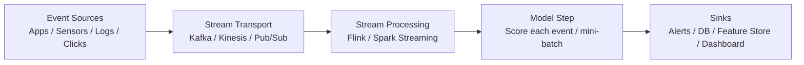
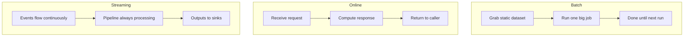

# Streaming Inference: Architecture and Pattern Comparison

## The Third Pattern: Continuous Event Processing

Batch processes a static dataset on a schedule. Online handles one request at a time with a synchronous response. **Streaming inference** introduces a third model: data arrives as a **continuous flow of events**, and the model processes them as they happen.

There is no clear job start or job end. The pipeline is **always running**.

---

## Definition

**Streaming inference** occurs when:

1. Data arrives as a **continuous stream of events** (not a static file, not a single API request)
2. The model processes events **as they happen**
3. Outputs feed into downstream systems — alerts, dashboards, feature stores, or other services

The mental model is a **long-running pipeline** where the model is one stage in an event flow.

---

## Streaming Pipeline Architecture

### Building Blocks

| Component | Role | Examples |
|-----------|------|----------|
| **Event source** | Where events originate | Applications, IoT sensors, click streams, server logs |
| **Stream transport** | Durable, ordered event delivery | Apache Kafka, AWS Kinesis, Google Pub/Sub |
| **Stream processing** | Transform, join, aggregate events | Apache Flink, Spark Structured Streaming |
| **Model step** | Call model on each event or mini-batch | Embedded inference within processing job |
| **Sinks** | Where outputs go | Alert systems, databases, feature stores, monitoring dashboards |

---

## Three Patterns Compared

| Dimension | Batch | Online | Streaming |
|-----------|-------|--------|-----------|
| **Data input** | Static snapshot (file/table) | Single request | Continuous event stream |
| **Job lifecycle** | Start → process → end | Per-request | Always running |
| **Caller** | Nobody per row | Blocked until response | No direct caller; downstream consumers |
| **Response** | Bulk write to storage | Synchronous HTTP/gRPC response | Alerts, feature updates, downstream triggers |
| **Primary latency** | Total job time | P95/P99 per request | Event-to-action latency |
| **Primary throughput** | Rows per job | Requests per second | Sustained events per second |

---

## Key Distinction: No Request-Response to a Human

In streaming, there is often **no direct request-response** to a human user. Instead:

- A suspicious transaction triggers a **fraud alert**
- An anomalous metric updates a **monitoring dashboard**
- A user click event updates a **real-time feature** in a feature store

The model reacts to the stream; downstream systems act on the predictions.

---

## When Streaming vs Online Overlaps

Some scenarios could use either pattern:

| Scenario | Streaming Approach | Online Approach |
|----------|-------------------|-----------------|
| Fraud detection | Score every transaction in a Kafka pipeline | Score at checkout via API call |
| Login monitoring | Watch login event stream for suspicious patterns | Check each login via synchronous API |

The choice depends on whether the system is **event-driven** (react to everything in the stream) or **request-driven** (react only when a specific action triggers a call).

---

## Stateful Stream Processing Concepts

Streaming introduces concepts absent from batch and online:

| Concept | Purpose |
|---------|---------|
| **Windowing** | Aggregate events over time windows (tumbling, sliding, session) |
| **Watermarks** | Handle out-of-order events in distributed streams |
| **Checkpoints** | Fault-tolerant state snapshots for recovery |
| **Stateful operators** | Maintain state across events (e.g., count failed logins in last 5 minutes) |

---

## Common Pitfalls / Exam Traps

- **Trap**: "Streaming = online but faster." — Streaming has no blocking caller; it is an always-on pipeline, not request-response.
- **Trap**: Using streaming when hourly batch suffices — streaming adds significant operational complexity.
- **Trap**: Forgetting about event ordering — out-of-order events require watermarks and careful state management.
- **Trap**: Assuming streaming pipelines are stateless — many streaming use cases (session aggregation, sequence detection) require stateful processing.

---

## Quick Revision Summary

- **Streaming inference** processes continuous event flows through a long-running pipeline
- Architecture: event source → stream transport → processing layer → model step → sinks
- No job start/end; pipeline runs 24/7; outputs go to alerts, features, dashboards — not direct user responses
- Differs from batch (static snapshot, scheduled) and online (single request, synchronous response)
- Introduces stateful concepts: windowing, watermarks, checkpoints
- Choose streaming when you have a continuous event stream and need near-real-time reaction without a blocking caller
