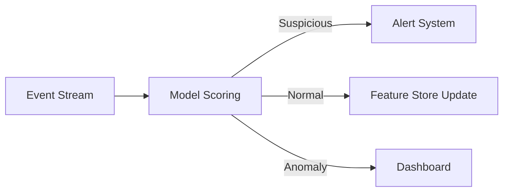
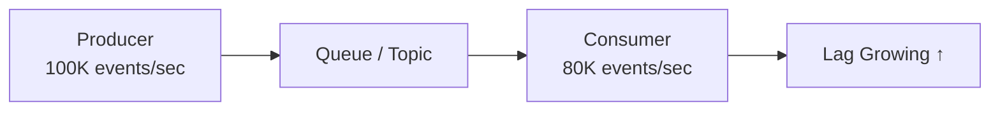

# Streaming Inference: Use Cases, Metrics, and Trade-offs

## Where Streaming Inference Shines

Streaming inference is the right tool when events arrive **continuously** and you need to **react quickly** as the stream evolves — not in response to a specific user request, but as part of an always-on monitoring and reaction system.

---

## Production Use Cases

| Domain | Stream | Model Action | Downstream Effect |
|--------|--------|-------------|-------------------|
| **Fraud / anomaly detection** | Transaction, login, or system metric events | Score each event for suspiciousness | Trigger alert or automated block |
| **Clickstream analytics** | Page views, clicks, scrolls, interactions | Detect patterns, segment users, compute real-time features | Personalization, A/B test assignment |
| **IoT / sensor data** | Device readings from machines, vehicles, sensors | Predict failure, anomaly, or state transition | Maintenance alert, autonomous action |
| **Log / security analytics** | Application, infrastructure, security logs | Flag unusual patterns, correlate across streams | Security incident response |

The pattern: continuous stream → model reacts → downstream action.

---

## Streaming-Specific Metrics

General inference metrics (latency, throughput, cost) apply, but streaming adds **domain-specific measurements**:

| Metric | Definition | Why It Matters |
|--------|------------|---------------|
| **Event-to-action latency** | Time from event occurrence to downstream action triggered by model prediction | End-to-end reaction speed |
| **Sustained throughput** | Events per second the pipeline handles over long periods (not just spikes) | Can the pipeline keep up 24/7? |
| **Lag / backlog** | How far behind processing is from the event source | Growing lag = falling behind |
| **Backpressure** | Signal that consumers cannot keep up with producers | Queue growth, increased lag |
| **Cost (24/7)** | CPU/GPU/memory cost of always-running workers | Streaming jobs never stop |

### Event-to-Action Latency

Unlike online latency (request to response), streaming measures **event-to-action**:

$$\text{Event-to-Action Latency} = t_{\text{action}} - t_{\text{event occurrence}}$$

This includes:

- Event propagation through the transport layer
- Stream processing and feature computation
- Model inference
- Sink write or alert dispatch

### Lag and Backpressure

If events arrive faster than the pipeline can process them:

- **Lag** increases (events waiting in queue)
- **Backpressure** signals that the system is overloaded
- Predictions become increasingly stale relative to reality

The goal: keep lag low, maintain stable throughput, and keep event-to-action latency within bounds.

---

## Why Choose Streaming?

| Benefit | Description |
|---------|-------------|
| **Near-real-time reaction** | React to events in seconds, not hours — catch problems early, seize short-lived opportunities |
| **Continuous view of behavior** | See how things change over time, not just static snapshots |
| **Better temporal context** | Models can use sequences of events — unusual login patterns, sudden usage shifts |

Streaming plays naturally with **event-driven architectures** where events and logs are the primary source of truth.

---

## Streaming Costs and Complexity

| Challenge | Description |
|-----------|-------------|
| **Higher complexity** | Stream processing frameworks, stateful operators, windowing, watermarks |
| **Operational overhead** | Jobs run 24/7 — monitor lag, failure rates, resource usage continuously |
| **Restart and replay** | Need strategies for recovery when something goes wrong |
| **Harder debugging** | Bugs may depend on timing, ordering, or rare event sequences |
| **Not always necessary** | If data changes slowly or hourly/daily batch is sufficient, streaming is overkill |

---

## Streaming vs Batch Freshness Comparison

| Aspect | Batch (Daily) | Streaming (Real-time) |
|--------|--------------|----------------------|
| Detection delay | Up to 24 hours | Seconds to minutes |
| Infrastructure | Simple scheduled job | 24/7 pipeline with Kafka, Flink, etc. |
| Operational cost | Low (runs once) | Higher (always running) |
| Suitable when | Data changes slowly | Events need immediate reaction |

---

## Common Pitfalls / Exam Traps

- **Trap**: "Streaming is always better than batch because it is real-time." — Use streaming only when the problem genuinely demands it; daily batch may suffice.
- **Trap**: Ignoring lag monitoring — growing lag silently degrades prediction freshness.
- **Trap**: Confusing event-to-action latency with model inference latency — the full path includes transport, processing, and sink writes.
- **Trap**: "Streaming doesn't need batching." — Mini-batch inference within stream processors is common for GPU efficiency.
- **Trap**: Underestimating operational burden — 24/7 pipelines require on-call, replay strategies, and continuous monitoring.

---

## Quick Revision Summary

- Streaming use cases: fraud detection, clickstream analytics, IoT sensors, log/security analytics
- Key metrics: **event-to-action latency**, **sustained throughput**, **lag/backpressure**, **24/7 cost**
- Lag growing = pipeline falling behind; backpressure = system overloaded
- Benefits: near-real-time reaction, continuous behavioral view, temporal sequence context
- Costs: higher complexity, 24/7 operations, harder debugging, restart/replay challenges
- Use streaming when events demand immediate reaction — not just because it sounds modern
