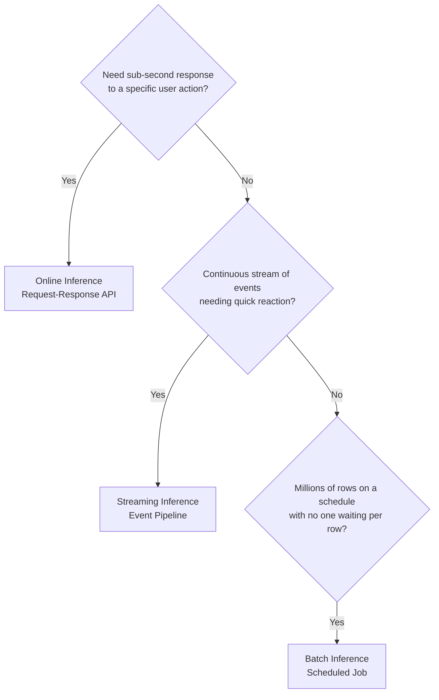
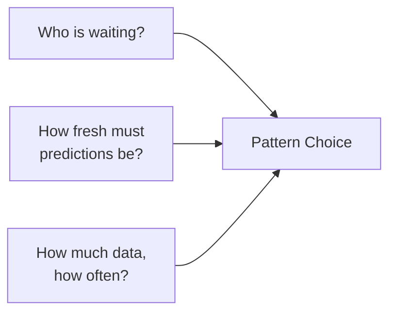

# Choosing the Right Inference Pattern: Decision Guide

## Three Questions to Determine Your Pattern

Pattern selection is not about technology fashion — it is about matching **who is waiting**, **how fresh predictions must be**, and **how much data flows how often**.

---

## Question 1: Is Someone Waiting Right Now?

> Do you need a sub-second response to a specific user action?

| Signal | Pattern |
|--------|---------|
| User clicked a button; system called an API; flow cannot proceed without prediction | **Online** |
| Payment checkout blocked until fraud decision | **Online** |
| Search results must rank before page renders | **Online** |

**Key property**: A caller is blocked. The prediction is part of a real-time interaction.

---

## Question 2: Is It a Scheduled Bulk Job?

> Are you processing millions of rows on a schedule, with no one waiting per row?

| Signal | Pattern |
|--------|---------|
| Score all customers weekly for a marketing campaign | **Batch** |
| Overnight churn predictions for entire customer base | **Batch** |
| Precompute recommendation candidates before business hours | **Batch** |

**Key property**: You care about finishing before a deadline, not per-row latency.

---

## Question 3: Is It a Continuous Event Stream?

> Do you have a continuous stream of events and want to react quickly as they arrive?

| Signal | Pattern |
|--------|---------|
| Monitor login events for suspicious patterns | **Streaming** |
| Watch transaction stream for fraud in real time | **Streaming** |
| Process IoT sensor readings continuously | **Streaming** |

**Key property**: No direct request-response to a user. You are reacting to a live event stream.

---

## Decision Framework Summary

| Question | Answer → Pattern |
|----------|-----------------|
| Who is waiting? | User/system blocked → **Online** |
| How fresh? | Hours/days acceptable, bulk data → **Batch** |
| Data shape? | Continuous events, near-real-time reaction → **Streaming** |

Think of it as three axes:

---

## Why Streaming Adds Complexity (and When It Is Worth It)

| Streaming Benefit | When Worth the Complexity |
|-------------------|--------------------------|
| Near-real-time reaction | Catching fraud within seconds, not hours |
| Continuous behavioral view | Understanding user journeys as they unfold |
| Temporal sequence context | Detecting unusual login patterns across event sequences |

| Streaming Cost | Mitigation |
|----------------|-----------|
| Stream processing frameworks (Flink, Spark Streaming) | Use managed services (Kinesis Analytics, Dataflow) |
| 24/7 operational overhead | Strong monitoring, automated recovery |
| Harder debugging (timing, ordering) | Event replay infrastructure |
| Stateful processing complexity | Start with stateless scoring; add state incrementally |

**Rule**: Use streaming when the problem **genuinely demands it**, not because it sounds modern.

---

## When Simpler Patterns Suffice

| Situation | Recommended Pattern |
|-----------|-------------------|
| Data changes slowly; daily batch is fine | **Batch** (not streaming) |
| Only need prediction when user takes action | **Online** (not streaming) |
| Need both bulk scoring and real-time serving | **Batch + Online hybrid** |

---

## Common Pitfalls / Exam Traps

- **Trap**: Defaulting to online APIs by habit — batch is simpler and cheaper when freshness tolerance is hours or days.
- **Trap**: Choosing streaming for problems that only need hourly batch — operational cost is 10–100x higher.
- **Trap**: "Real-time = online" — streaming serves continuous events without a blocking caller; online serves blocking requests.
- **Trap**: Ignoring hybrid architectures — most production systems combine patterns rather than picking exactly one.

---

## Quick Revision Summary

- Three decision questions: sub-second user response? scheduled bulk? continuous event stream?
- **Online**: caller blocked, synchronous request-response
- **Batch**: millions of rows, deadline-driven, no one waiting per row
- **Streaming**: continuous events, near-real-time reaction, no direct caller
- Decision axes: who is waiting, freshness requirements, data volume/frequency
- Use streaming only when the problem genuinely demands it — not by default
- Hybrid patterns (batch precompute + online serve) are common in production
