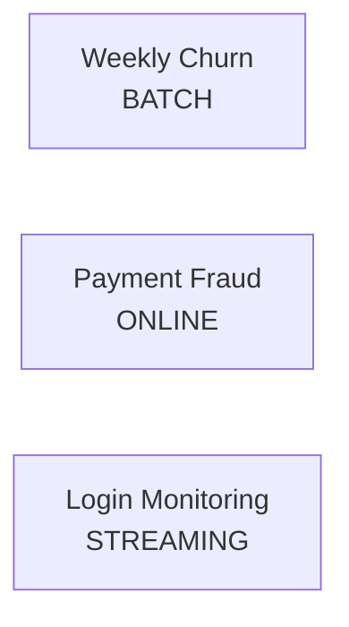

# Inference Patterns: Metrics Mapping and Scenario Guide

## Each Pattern Optimizes Different Metrics

The same ML model can sit underneath any serving pattern. What changes is **which metric you optimize** and **which engineering decisions follow**.

| Pattern | Optimize For | De-prioritize | Cost Strategy |
|---------|-------------|---------------|---------------|
| **Batch** | Throughput, total job time | Per-row latency | Off-peak scheduling, spot instances |
| **Online** | P95/P99 latency, error rate | — | Right-sized replicas, caching, auto-scaling |
| **Streaming** | Event-to-action latency, sustained throughput | — | Efficient 24/7 workers, minimize lag |

```mermaid
flowchart TB
    M[Same ML Model f(x)]
    M --> B[Batch<br/>Throughput + Job Time]
    M --> O[Online<br/>P95/P99 Latency]
    M --> S[Streaming<br/>Event-to-Action + Lag]
```

The serving pattern you choose **determines which metric matters most**, and that drives every downstream engineering decision.

---

## Metrics Dashboard by Pattern

### Batch Dashboard

| Metric | Target Example | Alert On |
|--------|---------------|----------|
| Total job time | < 4 hours for 10M rows | Job exceeds SLA deadline |
| Throughput | > 1,000 rows/sec | Throughput drops below baseline |
| Job success rate | 99.9% | Job failure |
| Per-row latency | Not monitored | — |

### Online Dashboard

| Metric | Target Example | Alert On |
|--------|---------------|----------|
| P95 latency | < 200 ms | P95 exceeds SLO |
| P99 latency | < 500 ms | P99 exceeds SLO |
| Error rate | < 0.1% | Error rate spike |
| Throughput (RPS) | Handle 5K RPS at peak | Saturation approaching limit |

### Streaming Dashboard

| Metric | Target Example | Alert On |
|--------|---------------|----------|
| Event-to-action latency | < 5 seconds | Latency exceeds threshold |
| Sustained throughput | 50K events/sec | Throughput drop |
| Consumer lag | < 1,000 events | Lag growing continuously |
| Pipeline uptime | 99.9% | Pipeline failure or restart |

---

## Concrete Scenario Walkthrough

### Scenario 1: Weekly Churn Campaign

| Aspect | Detail |
|--------|--------|
| **Business need** | Marketing team decides who to contact for retention campaign |
| **Freshness** | Weekly scores are sufficient |
| **Waiting?** | No customer needs a real-time prediction |
| **Pattern** | **Batch** — run job once a week, produce a table of churn scores |

### Scenario 2: Payment Fraud Check

| Aspect | Detail |
|--------|--------|
| **Business need** | Approve or decline payment in real time |
| **Freshness** | Must use current transaction context |
| **Waiting?** | Payment flow blocked until decision |
| **Latency** | < 200 ms |
| **Pattern** | **Online** — one request, one response, strict latency SLO |

### Scenario 3: Suspicious Login Monitoring

| Aspect | Detail |
|--------|--------|
| **Business need** | Detect suspicious login patterns (failed attempts, new device, strange location) |
| **Freshness** | React as events arrive |
| **Waiting?** | No user waiting; security team needs alerts |
| **Data** | Continuous stream of login events |
| **Pattern** | **Streaming** — pipeline watches event stream, scores each login, triggers alerts |



---

## The Core Message

> Don't default to online by habit. Match the pattern to the business needs.

| Mistake | Correct Approach |
|---------|-----------------|
| Building a 24/7 API for weekly scoring | Scheduled batch job |
| Running overnight batch for checkout fraud | Online API with P95 < 200 ms |
| Deploying Kafka + Flink for daily reports | Simple daily batch job |

---

## Lab Preview: Feeling the Trade-offs

The hands-on lab builds both a **batch client** and an **online client** against the same model API:

| Client | Metrics Measured |
|--------|-----------------|
| Batch | Total time, rows per second |
| Online | Average latency, P95 latency, requests per second |

These real numbers make the abstract trade-offs concrete. A full streaming pipeline is not built in this module, but streaming concepts reappear in later modules on event-driven systems and monitoring.

---

## The Unified Mental Model

$$\text{prediction} = f(\text{input features})$$

How you call $f$ — batch, online, or streaming — depends on:

1. **Who is waiting** for the answer
2. **How fast** they need it
3. **How much data** you are processing and how often

---

## Common Pitfalls / Exam Traps

- **Trap**: "Same model = same metrics matter." — The pattern determines metric priority, not the model.
- **Trap**: Scenario questions that describe "weekly scoring for all customers" but expect "online" as the answer.
- **Trap**: Confusing "real-time fraud at checkout" (online) with "monitoring transaction stream" (streaming) — both are real-time but different patterns.
- **Trap**: Forgetting that throughput still matters for online (peak RPS) and cost still matters for batch (spot instances).

---

## Quick Revision Summary

- Each pattern optimizes different metrics: batch (throughput/job time), online (P95/P99), streaming (event-to-action/lag)
- Scenario mapping: weekly churn = batch, payment fraud = online, login monitoring = streaming
- Don't default to online — match pattern to business needs
- Same model $f(x)$, different serving wrapper and metric priorities
- Lab measures batch (total time, rows/sec) vs online (P95 latency, RPS) to make trade-offs tangible
