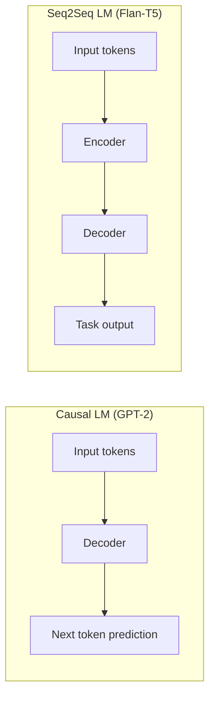
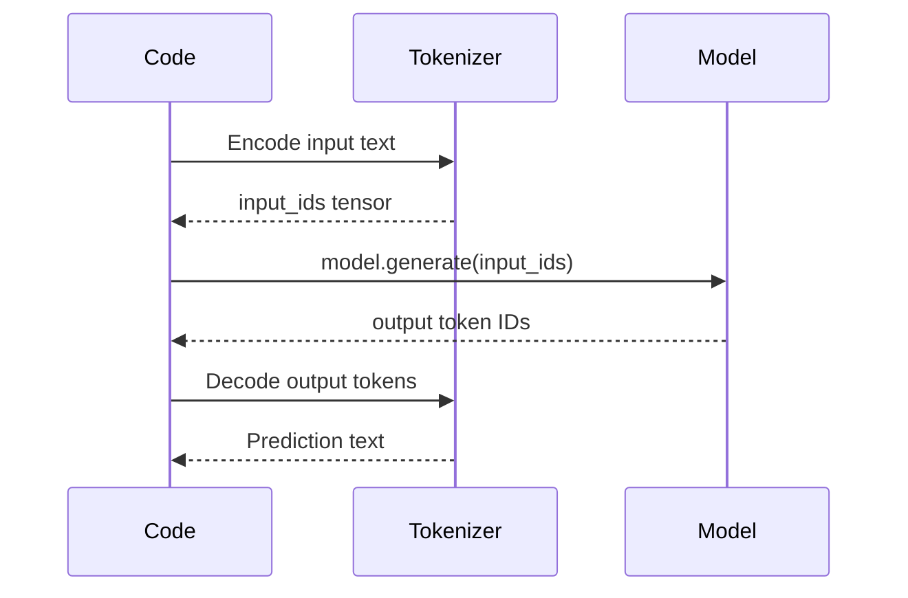

# Lab: Model Selection and Single-Request Inference

## Lab Objective

This lab moves from a basic model (DistilGPT-2) to a more capable instruction-tuned model, then establishes the foundation for measuring inference performance. The goal is to understand how model architecture affects loading and prediction, and to time a single inference call before scaling to bulk scoring.

---

## Model Selection for Inference Experiments

### Why Model Choice Matters

| Factor | Impact on Inference |
|--------|-------------------|
| **Parameter count** | Larger models need more memory and compute per prediction |
| **Architecture type** | Determines which Hugging Face `AutoModel` class to use |
| **Instruction tuning** | Models trained on tasks (translation, classification) follow prompts rather than just predicting next token |

### Model Size vs Local Hardware

| Model | Parameters | Approximate Size | Runnable Locally? |
|-------|-----------|-----------------|-------------------|
| GPT-OSS 120B | ~120 billion | ~240 GB | No — requires cloud GPU cluster |
| GPT-OSS 20B | ~20 billion | ~40 GB | No — requires multi-GPU setup |
| Flan-T5 Small | ~77 million | ~300 MB | Yes — runs on CPU |

For lab experiments, choose a model that fits local hardware while still demonstrating meaningful task performance.

---

## Causal LM vs Sequence-to-Sequence: A Critical Distinction

Hugging Face provides different `AutoModel` classes for different architectures. Using the wrong class causes loading errors.

| Architecture | Model Family | Hugging Face Class | Behavior |
|-------------|-------------|-------------------|----------|
| **Causal (decoder-only)** | GPT, GPT-2, LLaMA | `AutoModelForCausalLM` | Predicts next token autoregressively |
| **Seq2seq (encoder-decoder)** | T5, Flan-T5, BART | `AutoModelForSeq2SeqLM` | Encodes input, decodes output for a task |



**Common error**: Loading Flan-T5 with `AutoModelForCausalLM` (designed for GPT-style models) instead of `AutoModelForSeq2SeqLM`.

---

## Flan-T5 Small: Instruction-Tuned Model

Flan-T5 Small (~77M parameters) is instruction fine-tuned — trained not just on raw text but on tasks with explicit instructions.

### Prompt Format

```
translate English to French: The weather is nice today.
classify the sentiment of this review: The movie was fantastic and I loved it.
```

The model learns to **follow instructions** rather than only predict the next word.

### Supported Tasks (Lab Examples)

| Task | Input Prompt | Expected Output |
|------|-------------|-----------------|
| Translation | `translate English to French: ...` | French translation |
| Sentiment classification | `classify the sentiment of this review: ...` | `positive` or `negative` |
| Knowledge | `What type of machine learning is ...` | Explanatory text |

---

## Single-Request Inference Flow



### Measuring Single-Request Latency

```python
import time

start_time = time.time()
# tokenize → model.generate() → decode
end_time = time.time()
latency = end_time - start_time  # seconds for one prediction
```

For Flan-T5 Small on CPU, a single prediction typically takes ~0.06–0.07 seconds (60–70 ms).

---

## Setting Up for Bulk Scoring

The next step in the lab scales from one prediction to **1,000 predictions** loaded from a CSV file containing mixed tasks:

| Column | Content |
|--------|---------|
| Input text | Instruction-prefixed prompts |
| Task type | Sentiment, translation, classification, etc. |

**Sequential processing**: Loop through each row, run inference one at a time, measure total time.

This establishes the **baseline throughput** before introducing batch processing.

---

## Environment Setup Notes

| Requirement | Detail |
|-------------|--------|
| Virtual environment | Reuse the environment from Module 1 lab |
| Dependencies | `transformers`, `torch`, `pandas` (for CSV loading) |
| Model download | Hugging Face `from_pretrained()` caches locally |
| Directory structure | Separate folder for the new model artifacts |

---

## Common Pitfalls / Exam Traps

- **Trap**: Using `AutoModelForCausalLM` for T5/Flan-T5 models — must use `AutoModelForSeq2SeqLM`.
- **Trap**: Assuming larger models are always better for inference labs — they may not fit local hardware.
- **Trap**: Measuring only `model.generate()` time without including tokenization and decoding — total inference latency includes all steps.
- **Trap**: Confusing instruction-tuned models (follow prompts) with base language models (predict next token).
- **Trap**: Forgetting to use the same virtual environment and dependencies across lab sessions.

---

## Quick Revision Summary

- Model selection must balance capability with hardware constraints (Flan-T5 Small: 77M params, runs on CPU)
- **Causal LM** (GPT family) uses `AutoModelForCausalLM`; **Seq2Seq** (T5/Flan-T5) uses `AutoModelForSeq2SeqLM`
- Flan-T5 is instruction-tuned — follows task prompts like "translate" or "classify sentiment"
- Single-request inference: tokenize → generate → decode; ~60–70 ms on CPU
- Lab scales to 1,000-row CSV for bulk scoring experiments
- Always measure end-to-end latency including tokenization and decoding
