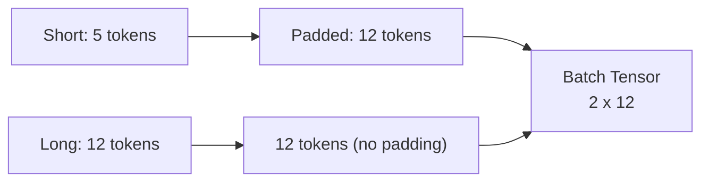
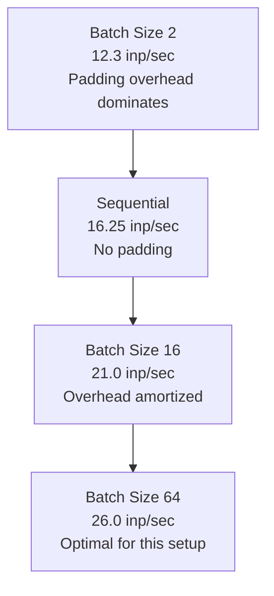

# Lab: Sequential vs Batch Inference Performance

## Lab Objective

Process 1,000 instruction-prefixed prompts from a CSV file and compare **sequential inference** (one input at a time) against **batched inference** (multiple inputs per forward pass). Measure total time, average per-input latency, and throughput (inputs per second) across different batch sizes.

---

## Input Dataset

A CSV with 1,000 rows across four task types:

| Task Type | Example Prompt |
|-----------|---------------|
| Sentiment classification | `classify the sentiment of this review: ...` |
| Translation | `translate English to French: ...` |
| Question answering | `What type of machine learning is ...` |
| Summarization | `summarize: ...` |

---

## Sequential Processing (Baseline)

Process one input at a time in a loop:

```python
total_start = time.time()
for row in df.iterrows():
    # tokenize single input → model.generate() → decode
total_time = time.time() - total_start
```

### Baseline Results (Flan-T5 Small, CPU)

| Metric | Value |
|--------|-------|
| Total inference time (1,000 inputs) | ~61 seconds |
| Average time per input | ~0.06 seconds (60 ms) |
| Throughput | ~16.25 inputs/second |

$$\text{Throughput} = \frac{\text{Number of inputs}}{\text{Total time}} = \frac{1000}{61} \approx 16.25 \text{ inputs/sec}$$

---

## Batch Inference: Processing Multiple Inputs Together

Instead of one input per forward pass, pass **multiple inputs simultaneously** by grouping them into batches.

### Why Batching?

| Benefit | Mechanism |
|---------|-----------|
| **Parallelism** | GPU/CPU processes multiple inputs in one matrix operation |
| **Hardware utilization** | Better use of vectorized compute units |
| **Amortized overhead** | Model loading and setup costs spread across batch |

### The Padding Problem

Text inputs have **variable lengths**. To process them in a batch, all inputs in a batch must have the **same tensor dimensions**.

**Padding** adds extra tokens to shorter sentences to match the longest sentence in the batch.



| Concept | Detail |
|---------|--------|
| **Padding tokens** | Special tokens added to shorter sequences |
| **Attention masks** | Tell the model to ignore padding tokens |
| **Overhead** | Padding tokens still consume compute |

---

## Batch Size Experiments

### Batch Size = 2 (Small Batch)

| Metric | Value |
|--------|-------|
| Total time (1,000 inputs) | ~81 seconds |
| Throughput | ~12.3 inputs/sec |
| vs Sequential | **Slower** than sequential (61 sec) |

**Why slower?** With batch size 2, the model performs padding 500 times (1000 / 2). On CPU, padding overhead **outweighs** the parallelism benefit of small batches.

### Batch Size = 16 (Medium Batch)

| Metric | Value |
|--------|-------|
| Total time (1,000 inputs) | ~45–46 seconds |
| Throughput | ~21 inputs/sec |
| vs Sequential | **Faster** than sequential (61 sec) |

Padding overhead is spread across 16 inputs (only 63 padding operations: 1000 / 16). Parallelism benefit now exceeds padding cost.

### Batch Size = 64 (Large Batch)

| Metric | Value |
|--------|-------|
| Total time (1,000 inputs) | ~37 seconds |
| Throughput | ~26 inputs/sec |
| vs Batch 16 | **Faster** than batch 16 (45 sec) |

Padding overhead spread across 64 inputs (16 padding operations). Highest throughput in the experiment.

---

## Results Comparison Table

| Strategy | Batch Size | Total Time | Throughput (inputs/sec) | vs Baseline |
|----------|-----------|------------|------------------------|-------------|
| Sequential | 1 | 61 sec | 16.25 | Baseline |
| Batched | 2 | 81 sec | 12.3 | **-33% slower** |
| Batched | 16 | 45 sec | 21.0 | +29% faster |
| Batched | 64 | 37 sec | 26.0 | +60% faster |



---

## The Padding Overhead Trade-off

| Factor | Small Batch (2) | Large Batch (64) |
|--------|----------------|-----------------|
| Padding operations | 500 | 16 |
| Padding cost per input | High | Low |
| Parallelism benefit | Low | High |
| Memory usage | Low | Higher (may hit limits) |
| Net effect on CPU | Slower than sequential | Significantly faster |

**Key insight**: Batching is not automatically faster. The benefit depends on whether parallelism gains exceed padding costs — and that depends on batch size, hardware, and input characteristics.

---

## How to Choose Batch Size in Practice

1. **Start small** (batch size 2–4) and measure throughput
2. **Gradually increase** batch size while measuring
3. **Stop when**:
   - Throughput stops improving, or
   - Memory limits are hit (OOM errors)
4. **Optimal batch size is data-driven** — depends on model, hardware, and workload

For this lab setup (Flan-T5 Small, CPU, variable-length text): **batch size 64** was optimal at 26 inputs/sec.

---

## Common Pitfalls / Exam Traps

- **Trap**: "Batching is always faster." — Small batch sizes on CPU can be slower than sequential due to padding overhead.
- **Trap**: Forgetting padding when batching variable-length text — inputs must be same length within a batch.
- **Trap**: Using batch size 2 and concluding batching doesn't help — the optimal size is hardware and workload dependent.
- **Trap**: Confusing **inference pattern batch** (scheduled bulk scoring) with **mini-batch processing** (grouping inputs in one forward pass) — related but different concepts.
- **Trap**: Not measuring — optimal batch size must be determined experimentally, not guessed.

---

## Quick Revision Summary

- Sequential baseline: 1,000 inputs in ~61 sec, ~16.25 inputs/sec on CPU
- Batch inference groups multiple inputs per forward pass for better hardware utilization
- **Padding** required for variable-length text; adds compute overhead
- Small batches (size 2) can be **slower** than sequential on CPU due to padding
- Large batches (16, 64) amortize padding cost and achieve higher throughput (21–26 inputs/sec)
- Optimal batch size is **data-driven**: start small, increase, measure, stop at plateau or memory limit
- Throughput = inputs / total time; the key metric for comparing inference strategies
