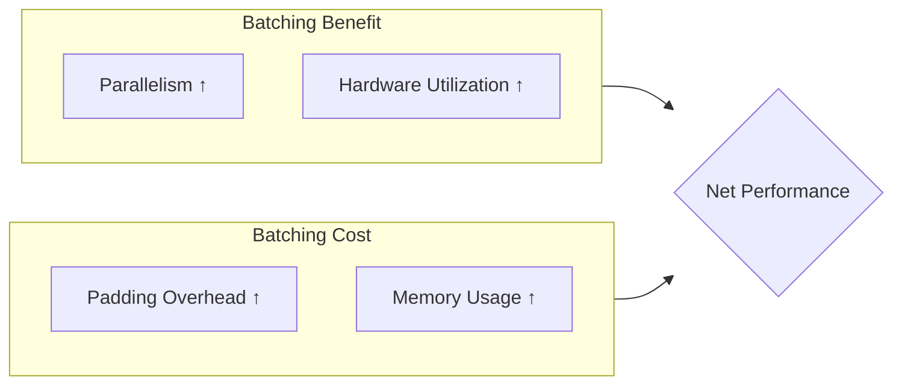
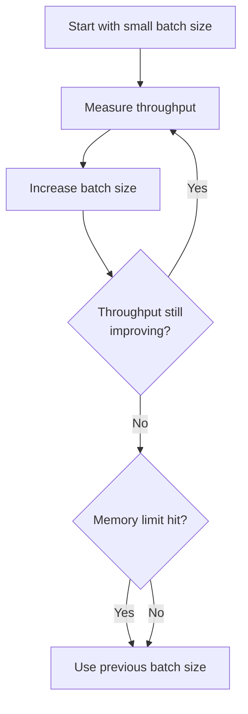

# Lab Summary: Interpreting Inference Metrics and Trade-offs

## What the Lab Demonstrated

The lab experiments processed thousands of inputs using different batching strategies and measured throughput in inputs per second. The results provide a concrete foundation for understanding when batching helps and when it hurts.

---

## Core Concepts Reinforced

### Batch Inference (Processing Pattern)

Processing multiple inputs together in a single forward pass, rather than one at a time.

| Term | Meaning |
|------|---------|
| **Batch size** | Number of inputs processed per forward pass |
| **Sequential** | Batch size = 1; one input per pass |
| **Padding** | Adding tokens to shorter inputs so all inputs in a batch have equal length |

### The Central Trade-off

| Side | Effect |
|------|--------|
| **Benefit** | Increased parallelism, improved hardware utilization |
| **Cost** | Padding adds extra computation on non-content tokens |
| **Outcome** | Performance depends on whether benefit outweighs cost |

When the balance is not achieved, batching **reduces** performance.

---

## Experimental Results Summary

| Strategy | Batch Size | Throughput (inputs/sec) | Relative Performance |
|----------|-----------|------------------------|---------------------|
| Sequential | 1 | 16.25 | Baseline |
| Batched | 2 | 12.3 | Worse than baseline |
| Batched | 16 | 21.0 | +29% over baseline |
| Batched | 64 | 26.0 | +60% over baseline (best) |

---

## Why Small Batches Performed Worst

With batch size 2:

- 500 padding operations (1000 / 2)
- Each batch of 2 requires padding shorter input to match longer one
- On CPU, padding overhead **outweighs** parallelism gains
- Result: 81 seconds vs 61 seconds sequential — **33% slower**

Sequential processing avoids padding entirely because each input is processed independently.

---

## Why Large Batches Performed Best

With batch sizes 16 and 64:

- Padding overhead **spread across many inputs** (63 and 16 padding operations respectively)
- Setup and padding costs are **shared** across the batch
- Hardware utilization improves with larger matrix operations
- Result: 26 inputs/sec at batch size 64 — **60% faster** than sequential

$$\text{Cost per input} = \frac{\text{Padding overhead} + \text{Setup cost}}{\text{Batch size}}$$

As batch size increases, cost per input decreases — until memory limits are hit.

---

## Choosing the Right Batch Size: A Practical Method

| Step | Action |
|------|--------|
| 1 | Start with small batch size (2–4) |
| 2 | Measure throughput (inputs/sec) |
| 3 | Gradually increase batch size |
| 4 | Stop when throughput plateaus or memory limits are reached |
| 5 | Select the batch size with highest throughput |

**Optimal batch size depends on**: model architecture, hardware (CPU vs GPU), input characteristics (length variance), and memory constraints.

---

## Connecting Lab Results to Inference Patterns

| Lab Concept | Production Pattern |
|-------------|-------------------|
| Sequential processing | Online inference (one request at a time) |
| Batch processing (large batch size) | Batch inference pattern (bulk scoring) |
| Throughput optimization | Primary metric for batch pattern |
| Per-input latency | Primary metric for online pattern |

The lab measured **throughput** — the key metric for comparing inference efficiency in batch-oriented workloads.

---

## Key Principles for Efficient Model Deployment

| Principle | Detail |
|-----------|--------|
| **Throughput is the comparison metric** | Use inputs/sec to compare strategies |
| **Small batches can underperform** | Padding overhead may exceed parallelism gains |
| **Padding is real overhead** | Must be accounted for in variable-length workloads |
| **Effective batching requires tuning** | Optimal size is found through measurement, not theory |
| **Hardware matters** | CPU vs GPU, memory limits, and model size all affect optimal batch size |

---

## Common Pitfalls / Exam Traps

- **Trap**: "Always use the largest batch size." — Memory limits and diminishing returns cap optimal size.
- **Trap**: Generalizing lab results to all models/hardware — optimal batch size is environment-specific.
- **Trap**: Ignoring padding when calculating theoretical speedup — padding can make batching slower.
- **Trap**: Confusing throughput (inputs/sec) with latency (time per input) — they are inversely related but not identical metrics.
- **Trap**: Assuming batching helps on CPU the same way it helps on GPU — GPUs benefit more from parallelism; CPUs are more sensitive to padding overhead.

---

## Quick Revision Summary

- Batching trade-off: parallelism benefit vs padding cost
- Sequential baseline: 16.25 inputs/sec; batch size 2 was worse (12.3); batch size 64 was best (26.0)
- Small batches fail because padding overhead outweighs parallelism on CPU
- Large batches win by amortizing padding and setup costs across many inputs
- Choose batch size empirically: start small, increase, measure, stop at plateau or memory limit
- Throughput (inputs/sec) is the key metric for comparing inference strategies
- These principles ensure efficient and scalable model deployment
