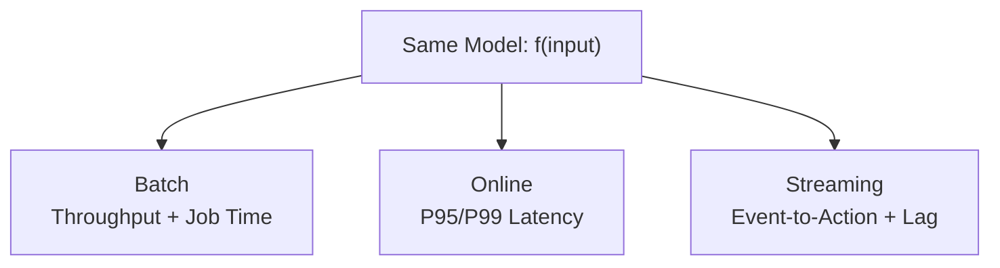

# Module 2 Summary: Model Inference Patterns

## Module Scope

Module 2 focused on the **serving side** of the ML lifecycle: what happens when a trained model is asked for a prediction, how we measure performance, and how to choose among three inference patterns.

---

## Core Concepts Covered

### 1. Model Inference Defined

| Concept | Detail |
|---------|--------|
| **Inference** | Using a trained model to produce output on new, real-world data |
| **vs Training** | Training learns parameters occasionally; inference runs continuously |
| **Production form** | A running service that receives requests, runs the model, returns predictions |
| **Core equation** | $\text{prediction} = f(\text{input features})$ |

### 2. The Inference Pipeline

Every prediction follows the same six steps regardless of pattern:

### 3. Three Core Metrics

| Metric | Definition | Key Insight |
|--------|------------|-------------|
| **Latency** | Time from request to prediction | P95/P99 matter more than average for user-facing systems |
| **Throughput** | Predictions per unit of time | Reveals scaling capacity |
| **Cost** | Compute, memory, storage, bandwidth per prediction | Compounds at scale into real cloud bills |

These three form a **trade-off triangle** — optimizing one often affects the others.

---

## Three Inference Patterns

| Pattern | When | Primary Metrics | Infrastructure |
|---------|------|-----------------|----------------|
| **Batch** | Large dataset, scheduled, no one waiting per row | Throughput, total job time | Scheduled job (Airflow, cron) |
| **Online** | User/system blocked waiting for answer | P95/P99 latency, error rate | 24/7 API with load balancing |
| **Streaming** | Continuous event stream, near-real-time reaction | Event-to-action latency, lag | Long-running pipeline (Kafka, Flink) |

---

## Decision Guide

| Question | If Yes → Pattern |
|----------|-----------------|
| Need sub-second response to a user action? | **Online** |
| Processing millions of rows on a schedule? | **Batch** |
| Continuous event stream needing quick reaction? | **Streaming** |

Don't default to online by habit. Match the pattern to business needs.

---

## Production Techniques for Online Inference

| Technique | Purpose |
|-----------|---------|
| Caching | Reduce latency and cost for frequent queries |
| Auto-scaling | Handle traffic spikes |
| Circuit breakers / timeouts | Prevent cascading failures |
| Hybrid batch + online | Precompute heavy work offline, serve light model online |

---

## Lab Learnings

| Experiment | Key Finding |
|------------|-------------|
| Sequential inference (1,000 inputs) | Baseline: ~16.25 inputs/sec on CPU |
| Batch size 2 | Slower than sequential (padding overhead) |
| Batch size 16 | ~21 inputs/sec (+29%) |
| Batch size 64 | ~26 inputs/sec (+60%) — optimal for lab setup |
| Model loading | Causal LM vs Seq2Seq — must use correct `AutoModel` class |

**Key lab principle**: Optimal batch size is data-driven — measure, don't guess.

---

## Module Progression

| Topic | Content |
|-------|---------|
| Inference definition & metrics | Latency, throughput, cost triangle |
| Batch inference | Definition, use cases, pros/cons, architecture |
| Online inference | Request-response, use cases, reliability techniques |
| Streaming inference | Event pipelines, metrics, trade-offs |
| Decision guide | Three-question framework with concrete scenarios |
| Lab | Batch vs sequential throughput experiments |

---

## The Unified Framework

Throughout Module 2, the same three metrics — **latency**, **throughput**, and **cost** — provide a consistent lens for comparing all three patterns:

| Pattern | Latency Focus | Throughput Focus | Cost Focus |
|---------|--------------|-----------------|------------|
| Batch | Total job time | Rows/sec | Off-peak, spot instances |
| Online | P95/P99 per request | RPS at peak | Replicas, caching at peak |
| Streaming | Event-to-action | Sustained events/sec | 24/7 worker efficiency |

This framework applies to every inference design decision going forward.

---

## Common Pitfalls / Exam Traps

- **Trap**: Treating inference as just `model.predict()` — the full pipeline includes validation, feature prep, and post-processing.
- **Trap**: Using average latency when SLAs specify P95/P99.
- **Trap**: Defaulting to online for all use cases — batch is simpler and cheaper when freshness tolerance allows.
- **Trap**: Choosing streaming when daily batch suffices — operational complexity is significantly higher.
- **Trap**: "Batching is always faster" — small batch sizes on CPU can be slower than sequential due to padding.
- **Trap**: Same model requiring different patterns — the function $f(x)$ stays constant; only the calling pattern changes.

---

## Quick Revision Summary

- **Inference** = applying trained model to new data via a running service; dominates the model lifecycle
- Three metrics: **latency** (P95/P99 for online), **throughput** (rows/sec or RPS), **cost** (per-prediction resources)
- Three patterns: **batch** (scheduled bulk), **online** (synchronous request-response), **streaming** (continuous events)
- Decision: who is waiting? how fresh? how much data how often?
- Online needs: caching, auto-scaling, circuit breakers, hybrid architectures
- Lab proved: batch size matters — measure throughput empirically; padding overhead can make small batches slower
- Unified framework: same three metrics compare all patterns; same model $f(x)$, different serving wrappers
